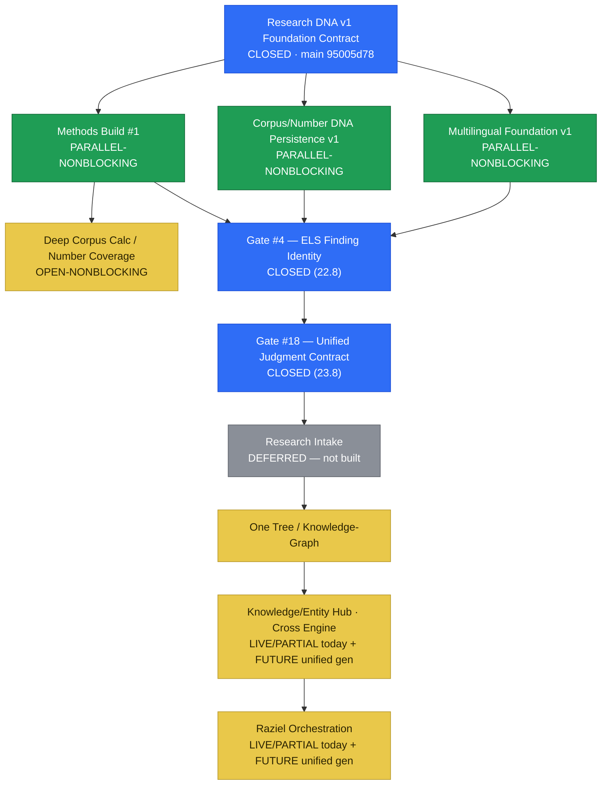

# 🧭 SOD1820 — מפת־העל התפעולית (MASTER ROADMAP) · v5.3 (Foundation Delta v2 + Live Sync Foundation, 25.8.2026)

> **🟢 v5.3 FINAL RECONCILIATION = CLOSED (25.8.2026, `V5_3_FINAL_DRIFT_CLOSURE`, ZURIEL Human-Gate — docs-only WRITE pass, בסיס: Foundation Delta v2 FROZEN + FINAL TOP-DOWN RECONCILIATION הקודם):** סבב-סגירה שתיקן 3 DRIFT-ים עובדתיים שנמצאו ב-Reconciliation הקודם (מפורטים במקומותיהם למטה: Numeric Root/Relation Engine/ELS **כבר מוזגים ופרוסים** ולא "ענף-בלבד" · PR #193 edge-bot-logging נספג ל-History · citation-precision ל-`docs/els-capability-audit.md`) — **בלי-שינוי-קנון-חדש, רק תיקון-דיוק על-מה-שכבר-קרה בפועל**. בנוסף, סבב זה **מקבע במפורש** (ר' Master State §23 — הבית הקנוני; אינו-מוכפל-כאן) את שלב-הבנייה הנוכחי: **FOUNDATION-FIRST / BOTTOM-UP REBUILD** — האתר/ה-UI הקיימים הם **Transitional/Legacy Surface** (עדות-ליכולות + baseline-תאימות-לאחור + provenance, **לא** ארכיטקטורת-היעד); העבודה-הנוכחית ממוקדת בשורשים-ובגזע (Identity/Provenance/Research-DNA/Methods/Engines/Relations/Research-Objects/Universal-Finding/One-Tree/Human-Gate); השכבה-העליונה (Number-Page-redesign/Person-Journey/Year-Journey/ELS-experiences/Research-Studio-surfaces/ניווט/מובייל/רב-לשוניות/Premium/עיצוב) **תיבנה-מחדש בהמשך מעל אותה תשתית** — **זהו תיאור-שלב, לא אישור-בנייה**. **`Return Point`: INTAKE READINESS CLOSURE** (ר' Parallel/Non-blocking Work למטה — טבלת-4-סטטוסים מעודכנת). **אין** באנר זה אישור ל: Feature חדש · DB migration · עיצוב-מחדש · Pesukim import · Security Fix · Intake Build · merge/deploy.
>
> **🔵 עדכון 25.8.2026 (v5.3 RECONCILIATION, branch `claude/live-sync-v5.3-reconciliation`, ZURIEL Human-Gate — multi-round Foundation Delta v2 challenge-pass):** v5.2 (למטה) נשאר provenance-בתוקף במלואו. v5.3 מוסיף, בלי למחוק דבר: **(1) Live State Sync Foundation** — `live_state_sync_law` (CLAUDE.md + `nodes.rule_id`), תיקון-שורש לתקרית local-checkout שהיה 154 קומיטים מאחורי `origin/main` תוך-כדי reconciliation קודם; `scripts/live-sync-check.sh` diagnostic. **(2) Foundation Delta v2** (Contributor/Finding/Methods/Person precision corrections + Year/Date=`CONTRACTED-NOT-IMPLEMENTED`+Verse/Source findings) — ר' Master State §22 לפירוט המלא. **(3) Gate חדש #21 — `OD-TIME-8`** (ר' Canonical Gate Map למטה). **אין Pesukim.docx import** בוצע — ה-pilot של GPT נותר `PAUSED BY ZURIEL`, 0 commits/0 import (Master State §22). אין schema/migration/deploy/merge-ל-main בסבב הזה.

> **🔵 עדכון 25.8.2026 (SSOT RECONCILIATION, branch `claude/relation-engine-v1`):** PR #187 **מוזג בפועל ל-`main`** — אומת ישירות מול GitHub: `state=closed`, `merged=true`, `merged_at=2026-08-24T05:05:07Z`, `merge_commit`/head `7136a2bd…`→`main` base `a665a4dc` (מקביל: קומיט-המיזוג עצמו על `main` הוא `b074eb56c6035afc92ebf335093df481dca3ef42`, מאומת-עצמאית גם ב-ELS Pass 2 `work_log actor=CLAUDE task=ELS_PASS2_IMPLEMENTATION`, מבוסס `docs/els-capability-roadmap-patch.md` §A — שני האימותים העצמאיים מסכימים). **v5.2 אינה-עוד "מועמד" — היא קנונית על `main`** (v5.1 נשאר provenance-בתוקף מתחתיה, לא-נמחק). כל אזכור-להלן של "Draft PR #187"/"טרם-מוזג"/"מועמד עד מיזוג" הוא **טקסט-היסטורי-שנשמר כפי-שהוא לפי NO-DISAPPEARING-WORK** — הסטטוס-בפועל מאותו-רגע-ואילך הוא MERGED, ר' סעיף חדש **`🧭 NUMERIC ROOT + RELATION ENGINE v1 — RECONCILIATION 25.8.2026`** למטה לפרטים המלאים (כולל Numeric Root/Relation Engine v1, שנבנו על ענפים נפרדים **אחרי** מיזוג #187 ועדיין-לא-מוזגים בעצמם).
>
> **🟡 v5.2 מועמד-קנוני על PR #187 (היסטורי — ר' עדכון-25.8 למעלה: כבר-מוזג בפועל); v5.1 נשאר קנוני ב-main עד merge.** Reconciliation 24.8 מוסיף את Research Studio v1 המאושר ואת סדר-העדיפות החדש; ההמשך ההיסטורי של v5.1 נשמר להלן כ-provenance. בסיס v5.1 נוצר בעקבות סגירת **Research DNA v1 Foundation Contract** (PR #166, **`CONTRACT: CLOSED`**, merged ל-`main` בקומיט **`95005d78e6415e52534c535ef9b93940e835cc31`**). **זו אינה v6 — אין ארכיטקטורה חדשה כאן.** v5.1 מתאמת את אותה מפה מול המצב-החי החדש ומוסיפה **Canonical Gate Map** אחד. `LAST_RECONCILED: 2026-08-22` (main SHA `95005d78`, ancestor-מאומת מול `origin/main` — אין drift; provenance: `work_log` `actor=CLAUDE task=SOD1820_MASTER_ROADMAP_V5_1_RECONCILIATION`). כל תוכן v5 (כולל v4 שמתחתיו) שלא צוין כאן במפורש כ-SUPERSEDED/עודכן נשאר בתוקף ללא-שינוי (NO-DISAPPEARING-WORK) — כולל תיקוני-PR-#165 (יעד-Persistence לא-מונח-מראש · Research-DNA-Identity נפרד מ-Gate #4/WS-ELS-IDENTITY · Entity-Hub/Raziel `LIVE`/`PARTIAL`-כבר-היום) ו-Strategic Foundation Order הקיים, המתואם כאן מול ה-Foundation הסגור (ר' §CANONICAL GATE MAP למטה). **הערת-היסטוריה v5.1:** באותו pass `ACTIVE_NOW` נשאר `WS-GEMATRIA-CORPUS-PACKAGES`; **החלטת 24.8 למעלה מחליפה זאת בניווט ל-`WS-RESEARCH-STUDIO-FOUNDATION`**, בלי לבטל את workstream הקורפוס.
>
> **מהות v5.1 במשפט אחד:** החוזה-הארכיטקטוני (Research DNA v1) נסגר; **היישום לא**. Methods/Corpus-Persistence/Deep-Scan/Intake/Cross/Raziel-implementation נשארים OPEN/PARTIAL/FUTURE בדיוק כפי-שהיו — סגירת-חוזה ≠ סגירת-בנייה. v5 קודמת (`f1503a28`, מאושרת ע"י צוריאל, "DECISION — Canonize Roadmap v5") נשארת בתוקף כבסיס; v5.1 **מוסיפה** reconciliation ולא-מוחקת דבר ממנה.
>
> **מהות (ללא-שינוי מ-v5).** מקור־הניווט התפעולי היחיד של SOD1820. המנוע מגלה ומארגן · **המפה מנווטת** · מרכז־הניהול (עתידי) **מציג** (Lens מעל הקובץ הזה) · `work_log` שומר provenance · **צוריאל מחליט**. שום דבר אינו הופך לקנוני רק משום שסוכן ביצע אותו.
>
> **סדר־סמכות:** live DB + `main` + `SOD1820_MASTER_STATE.md` (מצב קנוני) > המפה הזאת (ניווט) > זיכרון. המפה **מפנה** אל המצב הקנוני; לעולם אינה אמת מקבילה ואינה בסיס־נתונים.
>
> **v5 הוסיפה על v4 (נשמר, provenance):** ספיגת עבודה-היסטורית (ELS/Premium-Research/Legacy-Systems) שנחקרה ב-4 סבבי-READ-ONLY (Architecture Reconstruction · Legacy Reconciliation · GPT-docs cross-check · Absorption Matrix) + פתרון Decision #1 (ELS Full-Search-Space) לפי provenance קיים.

---

## 🧭 RESEARCH STUDIO v1 — RECONCILIATION 24.8.2026
> **DECISION — ZURIEL Human-Gate, 24.8.2026.** סעיף זה הוא שכבת-הניווט העדכנית של המפה ומחליף, לצורך `ACTIVE_NOW` וסדר-הבנייה, הפניות ישנות יותר ל-`WS-GEMATRIA-CORPUS-PACKAGES` כעמדה-היחידה. ההיסטוריה שמתחת נשמרת כ-provenance ואינה נמחקת. מקור: `docs/research-studio-v1-contract.md` + `docs/research-universal-finding-contract.md` + `work_log` actor=GPT/CLAUDE. **PR #187 מוזג ל-`main` (`b074eb56`) — זהו מסמך-main קנוני, לא מועמד.**
>
> **חידוד CLAUDE 24.8.2026 (אחרי ה-reconciliation המקורי, לפני מיזוג):** (1) **אחסון = שלושה בתים, לא בעיה בינארית** — מנוע/DB מקור-נטיבי = מקור-אמת; `research_items` = חברות-בסביבת-העבודה בלבד; `research_objects` (כולל `engine_verified`/`engine_detail`) = טענת-מחקר-עמידה; ה-Universal Finding הוא מעטפת+refs, **לא** בעל-בית רביעי — **אסור יצירת `research_objects` אוטומטית לכל Finding**. (2) **Research Context אינו טבלה/בעל-אחסון חדש** — חוזה לוגי בלבד (שאילתה/scope/Findings-פעילים/Dimensions/Lens/Journey-position), עשוי להפנות ל-`research_objects`/`person-ref`/מספר/נושא אך אינו אף אחד מהם אוטומטית. (3) **Topic/Convergence מקבל מיפוי-adapter נפרד משלו**, לא תחת ELS. (4) **H1 מאושר:** `NumberDNA`→"🧬 צירי ההתכנסות" (`NumberConvergences`); "Research DNA" שמור אך-ורק לארכיטקטורה החדשה. (5) **H2 מאושר, טופולוגיה היברידית:** Workspace נשאר גלובלי-קנוני; דף-מספר מקבל השלכת-Research-Surface הקשרית מעל אזור-הממצאים-הנעול הקיים — לא מחליף/מעצב-מחדש אותו. (6) **Name Journey** (NameLab/`fn_name_protocol`, חי) נבדק, אינו נעלם/ננטש, ונבדל במפורש מ-Person/Life Journey — נוסף כמיפוי-adapter נפרד (`kind="name"`), לא Finding בפני עצמו, ולא re-design של הקוד החי. פרטים מלאים: `docs/research-studio-v1-contract.md` §2/§4/§7-§13, `docs/research-universal-finding-contract.md` §1/§5/§10-§12/§18.

### ACTIVE_NOW החדש — `WS-RESEARCH-STUDIO-FOUNDATION`
**מטרה:** לחבר את המנועים והישויות הקיימים ל-Research OS אחד, בלי מנוע/Graph/Store מקביל.

**חוזה מוצר:** `Discovery → Universal Findings → Investigation → Judgment`.
- `Clean ↔ Pro` = עומק-תצוגה על אותו State, לא שתי אפליקציות.
- Journey = היסטוריית-מחקר אוטומטית עם restore מדויק, לא מוצר שלישי.
- 2D / Layered / 3D = renderers של אותו Finding/Research State; אין 3D truth נפרד.
- 2D+Focus/Fit הוא baseline מהיר; שכבות/3D lazy/on-demand; מטריצות גדולות מיועדות ל-virtualization.
- AI/Raziel מציע Candidates בלבד; Candidate ≠ Finding ≠ Fact ≠ Claim ≠ Interpretation ≠ Canonical ≠ Published.

### סדר-הבנייה המעודכן
1. **Universal Finding Contract** — חוזה זהות/provenance משותף לכל מקור, כולל `verification`/`access`/`identity.personRef`/`identity.topicRef`. `CONTRACT: APPROVED`; מימוש-ראשון קיים ב-Draft #188 (טעון תיקון-drift לפני שהופך לתבנית — ר' §18 שם: מסלול-האחסון בפועל כותב ל-`research_items` בלבד, לא ל-`research_objects.engine_detail`).
2. **Global Research Workspace / ResearchProvider** — reuse של `src/lib/research/ResearchProvider.jsx` + `research_items` (בית #2 מתוך שלושה — חברות-Workspace בלבד); אין Store/טבלה מקבילים. Research Context (§0-A למטה) אינו נשען על שכבה זו כבעל-אחסון.
3. **ELS Lens integration — Work Area מאוחד + מרשם-85-היכולות.** מנוע/state קנוני אחד מזין `Discovery → Investigation → Judgment` ואת שלושת ה-renderers `2D / Layered / 3D`. `docs/els-capability-audit.md` (ה-"78-capability gate" ההיסטורי, שוחזר) הוא מלאי-היכולות המפורט: 98 שורות-גלם → 13 כפילויות → **85 יכולות ייחודיות** (A26·B20·C5·D6·E10·F8·G10). ה-Work Area הוא מעטפת-האינטראקציה/רינדור; מרשם-85 הוא מלאי-הקבלה שממלא אותו. 2D/Layers/3D לעולם לא בעלי-אמת נפרדת. כל יכולת מקבלת disposition מפורש עם provenance (`LIVE/ABSORBED · PARTIAL · BUILDING · PARKED · SUPERSEDED · NEVER`) — יכולת לא נעלמת כי ה-UI השתנה. סטטוסי-הביקורת ההיסטוריים (18.8) הם provenance בלבד וטעונים אימות-מחדש מול main/live-state לפני שנחשבים נוכחיים. Scope-מפורש נשאר `📖 תורה` / `📜 כל התנ״ך` דרך מנוע אחד; אסטרטגיית-ביצוע יכולה להיבדל לביצועים (Pass 1: Worker/adaptive · Pass 2: Geometry Contract/FORMS/Journey — ר' `work_log actor=CLAUDE task=ELS_PASS1/PASS2_IMPLEMENTATION`). חוזה-איחוד מלא: `docs/els-capability-workarea-unification.md`.
4. **Number/Gematria Adapter + NumberHub** — מחובר רק דרך `gematria_methods` והפונקציות הקנוניות; `WS-GEMATRIA-CORPUS-PACKAGES` נשמר ואינו מבוטל, אך מוזן מעכשיו אל Research Studio במקום לעמוד כ-workstream מבודד. דף-המספר עצמו: טופולוגיה היברידית H2 — Workspace גלובלי + השלכת Research Surface הקשרית, ואזור-הממצאים-הקנוני (`NumberDNA`→**"🧬 צירי ההתכנסות"** / `NumberConvergences`) נשאר במקומו, לא מוחלף.
5. **Topic/Convergence Adapter** — מיפוי-adapter **נפרד** (לא תחת ELS): מפנה אך-ורק ל-`topic_card_id`/convergence `node_id` קיימים + provenance, לעולם לא יוצר/משכפל התכנסות; נושא רק את מחלקת-היחס לפי `equality_vs_convergence` (🔢/🤖/👤).
6. **Discovery Layer** — Cross Search, Auto Terms, AI Suggestions, EntityHub/Graph, אנשים/ישויות (Person adapter — self **וגם** family-scope, `F-1b` **LIVE** — Ledger-פרטי-בלבד, ר' ZURIEL Human-Gate 24.8.2026 למטה; `OD-F8`/הקרנת-גרף-ציבורית עדיין לא-מאושר), שמות (Name adapter — NameLab/`fn_name_protocol` חי, נפרד מ-Person, לא Finding-כ-Journey), פסוקים ומחקר קיים כ-Candidates/Findings עם provenance.
7. **Global Findings Workspace UX** — multi-Finding, compare, pin, dismiss-from-view, restore, source-neutral inspect, adapter-specific promote.
8. **Judgment Surface** — Evidence / Claim / Interpretation / confidence מוסבר + Human Gate; זו **השלכה של Gate #18 (Master State §20, Option C: Contract-over-Consolidation)**, לא מערכת-Judgment שביעית/מקבילה. `decision_ledger` נשאר יומן-ביקורת בלבד.
9. **Legacy Capability Reconciliation — ניזון ממרשם-85-ה-ELS.** עבור ELS, ההתאמה אינה מלאי-legacy לא-מוגדר: קלט-ה-provenance המוסמך-המפורט הוא `docs/els-capability-audit.md`. כל אחת מ-85 השורות ממופה לשלב-Research אחד (`Discovery/Investigation/Judgment`) ולבית-תצוגה אחד (`2D/Layered/3D/non-visual-system`), ואז מקבלת disposition חי. יכולות חסרות/בעלות-ערך נספגות ל-Work Area הקיים דרך ארכיטקטורת action/layer הגנרית; אין raw-merge של UI ישן ואין יצירת אפליקציות/מנועים נפרדים. Name Journey (NameLab/`fn_name_protocol`, חי) ממופה כ-adapter נפרד, לא Finding-כ-Journey.
10. **Depth Dimensions / Research Universe** — הרחבה על אותם contracts; depth semantics תמיד מפורשים דרך 11 הצירים של Research DNA v1 §2 (`verse/source/time/method/research-track/confidence/relation-family` וכו') — לא סט אד-הוק חדש.

### יחס לסדר-היסוד הישן
`Corpus Classification → Corpus Persistence → Research DNA → Identity/Multilingual/Numeric → Cross/ELS → Entity Hub → Raziel` **נשמר כסדר-תלויות/יסודות** ואינו נמחק. השינוי הוא בניווט-הבנייה: Research Studio Foundation הופך למעטפת המאחדת שמחברת את אותם workstreams. אין צורך "לסיים את כל הקורפוס" לפני חיבור המעטפת, וכל workstream שומר את Gate/STATE האמיתי שלו.

### מצב חי שנקלט ב-reconciliation
- `main` כולל את PR #185 (`a665a4dc`) — ELS state/Matrix/2D-Layered-3D/hidden bridge/Verse integration.
- Draft #186 = Research Journey v2 + Focus/Fit + add-Finding cross bridge; לא merged/deployed.
- Draft #187 = חוזה Research Studio + Universal Finding; docs-only. **עודכן 24.8.2026 (actor=CLAUDE)** עם חידודי-אחסון-שלושה-בתים, Context-ללא-בעל-אחסון, Convergence-adapter-נפרד, שם-מספר H1/H2, ומיפוי Name/Person — עדיין docs-only, `main` לא נגעה.
- Draft #188 = Universal Finding adapter מעל ResearchProvider + `📌 למחקר`; stacked על #186, לא merged/deployed. **דגל-drift (טרם תוקן בקוד):** נכתב כרגע ל-`research_items` בלבד; §18 של החוזה המעודכן מצפה שהשלכת-אימות תיכתב ל-`research_objects.engine_detail` כשמאמתים ב-DNA v1 — תיקון-קוד עתידי, לא חלק מ-patch המסמכים הזה.
- `ResearchProvider` קיים ב-main ומחזיק cart/saved/pinned/history/collections/journeys/mode; reuse חובה.

### NEXT_ACTION (היסטורי, 24.8 — נשמר per NO-DISAPPEARING-WORK; ר' NEXT_ACTION מעודכן בסעיף שמיד-למטה)
Human Preview ל-#188 (`📌 למחקר` persistence בלי שינוי ציר) → יישור #188 מול חוק-האחסון-המתוקן (§18: שלושה בתים, לא `research_objects` אוטומטי) → אימות callable path קנוני של Number/Gematria → Adapter שני. אין עוד הרחבת-UI אד-הוק לפני החיבור הזה.

---

## 🧭 NUMERIC ROOT + RELATION ENGINE v1 — RECONCILIATION 25.8.2026
> **SSOT RECONCILIATION BEFORE MERGE, ענף `claude/relation-engine-v1`.** docs-only (עדכון SOD1820_MASTER_ROADMAP.md + SOD1820_MASTER_STATE.md בלבד) — **אפס קוד/DB נגעו בפאס-הזה**; כל מה-שמתועד-כאן **כבר-הוכח-חי** בפאסים קודמים על אותו ענף (commits + `work_log`, provenance מפורט למטה). המקור: `git log --oneline origin/main..HEAD` על `claude/relation-engine-v1` (4 commits) + `work_log` (4 זוגות BEFORE/AFTER, 24.8.2026).

### PR #187 — MERGED (תיקון-סטטוס)
אומת ישירות מול GitHub (`pull_request_read`): `state=closed` · `merged=true` · `merged_by=zuriel337` · `merged_at=2026-08-24T05:05:07Z` · head `gpt/research-studio-v1-contract`@`7136a2bd` → base `main`@`a665a4dc`. **v5.2/§0-A הם-עכשיו קנון-על-main, לא-מועמד.** כל טקסט-היסטורי במפה/ב-Master-State שמתאר #187 כ-"Draft"/"DOCS/DRAFT"/"טרם-מוזג" נשאר **כפי-שהוא** (provenance, NO-DISAPPEARING-WORK) — הסטטוס-החי מ-24.8.2026 05:05 ואילך הוא MERGED.

### Numeric Root — IMPLEMENTED / CLOSED (ברמת-הבנייה; ענף-בלבד, לא-מוזג/לא-פרוס)
שרשרת-3-פאסים על-גבי `main` (אחרי מיזוג #187), כל אחד מאומת-חי ב-`linswmnnkjxvweumprav` עם regression מלא, שלושתם reconciled לענף אחד:
1. **Methods Dependency Metadata + Composite/Cross/Lookup** (`claude/numeric-research-root-implement`, `83427b80`, `work_log` BEFORE 12:59/AFTER 13:04) — 11 עמודות-metadata על `gematria_methods` (23/24 שורות) · `fn_dispatch_method`/`fn_composite_calc`/`fn_composite_calc_all_ops` (4 ה-Composite Research Transforms המאושרים, Decision E) · `fn_deep_cross`/`fn_deep_cross_reverse` (§18/§26.2) · `fn_number_lookup` · `fn_method_profile`. 18/18 regression.
2. **Anchor Freeze + AIQ BEKAR** (`claude/anchor-freeze-aiq-bekar`, `73f2592f`, `work_log` BEFORE 15:52/AFTER 15:56) — ר' סעיפים ייעודיים למטה. 13/13 fixture.
3. **Numeric Root Finalization** (`claude/numeric-root-finalization`, `7644cbb6`, `work_log` "NUMERIC_ROOT_FINALIZATION — AFTER" 17:37) — reconciles 1+2 (0 conflicts, ELS files untouched). Composite access `premium→public` (4/4 שורות, ה-premium-הקודם נשמר כ-provenance historical ב-`source_of_truth`) · `bidim` materialized SUM-only (+50,368 שורות = 12,592 מילים-מאושרות × 4 composites, exact, 0 duplicates; total 294,119→344,487) · `bidim_sync()` הוחלף בגרסה registry-driven (Decision K, סוף-סוף מומש — `gw_enforce_engine`/14-עמודות-Legacy-Baseline לא-נגעו) · `fn_number_lookup` הורחב (`atomic_or_composite`/`component_methods`/`component_values`/`operator`) — אותו interface, לא-נתיב-שני. 19/19 regression. DRIFT מתועד-לא-תוקן: `gw_enforce_engine` פנימיות (`ragil_calc`,`mistater_calc`,…) משכפלות מתמטית את `fn_ragil`/`fn_misratar`/… תחת שמות-שונים (זהות בכל-דגימה, ניקוי-עתידי מוצע לא-בוצע).

**סטטוס:** `IMPLEMENTED`/`CLOSED` **ברמת-הבנייה** (הפונקציונליות סגורה ומאומתת-חי, "NUMERIC_ROOT_READY_FOR_MERGE — no blocker found" per work_log) — **`BUILDING`🏗️ ברמת-ה-RELEASE PIPELINE** (Branch✅ → Review❌ → Main❌ → Deploy❌ → Live❌ → Verified❌). מיזוג/deploy דורשים אישור-Human-Gate מפורש של צוריאל, לא-בוצע.
> **🔵 עדכון `V5_3_FINAL_DRIFT_CLOSURE` (25.8.2026, אותו-יום, אחרי-כתיבת-הפסקה-שמעל):** הפסקה שמעל הייתה נכונה-לרגע-כתיבתה אך **התיישנה תוך אותו-יום** — מאומת-חי משלושה-מקורות-עצמאיים (GitHub `pull_request_read` + `git log origin/main` + Supabase חי, לא-מהזיכרון): **PR #190 `merged=true`** (`merged_by=zuriel337`, `merged_at=2026-08-25T03:37:03Z`, head `aba0a92c`→base `main@88d566dd`, מיזוג `80edf767`). **RELEASE STATE מעודכן: Branch✅ → Review✅ → Main✅ → Deploy✅ → Live✅ → Verified⚠️-חלקי** (pre-merge acceptance מלא — 18/18+13/13+19/19 regression — **וגם** post-merge live facts: `gematria_methods`=29 שורות, `bidim`=**344,487** שורות [התאמה-מדויקת למספר-שהפסקה-למעלה-עצמה מצטטת כתוצאת-מיזוג], `aiq_bekar_calc`/`fn_relation_candidate` קיימים-וחיים ב-DB; interactive-production-QA **חלקי** — ר' PR #192 body: Playwright חסום ע"י sandbox-proxy, לא-בעיית-קוד). Human-Gate-המיזוג **כן ניתן בפועל** (`merged_by=zuriel337`) — לא-נותר-ממתין. ר' Master State §21 (עדכון-מקביל) + §0-A (התיקון-המקורי-לעובדה-זו, שממנו-אומתה ההתאמה).

### Composite SUM (ציבוריים) + bidim — IMPLEMENTED
4 ה-Composite Research Transforms המאושרים (Decision E: sum/diff על-בסיס-שיטות-אטומיות-קנוניות בלבד) — `required_entitlement` שונה `premium→public` עבור התוצאה-הבסיסית/דטרמיניסטית (מעשיר דפי-מספר נדירים/גדולים עם-מעט-התאמות-אטומיות); כלים-מתקדמים מעל זה נשארים ENTITLED-capable בנפרד. `SUM` בלבד מוחסן ב-`bidim` (50,368 שורות, exact, 0 כפילויות); `DIFF` נשאר on-demand (`fn_composite_calc_all_ops`) לפי §27.4 (column/index-free כברירת-מחדל עד-שנדרש). מאומת חי: `fn_number_lookup(1820)`=146 atomic+30 composite · `fn_number_lookup(368)` מציג סבל/פחד/דחף/… כ-composite עם provenance-רכיבים מלא, מעורב עם atomic באותה קריאה.

### AIQ BEKAR (אי"ק בכ"ר) — IMPLEMENTED
שיטה-חיצונית-קלאסית מאומתת (משפחת Nine Chambers, כמו אתב"ש/אלב"ם/אח"ס-בט"ע הפעילים) — כיוון נעוץ ע"י ה-fixture המפורסם (שלום→גשסו→369, משוחזר-מדויק דרך `fn_ragil` הקנוני). `aiq_bekar_transform`/`aiq_bekar_calc` — תחלופה טהורה בלבד, ללא מנוע-שני. שורה **חדשה** ב-`gematria_methods` (לא-הייתה-קיימת קודם — DRIFT מול-הנחת-המשימה-המקורית, תועד) — `category=base`, `active=true`, `required_entitlement=public`, metadata-תלות מלאה. `bidim` אוכלס ל-12,592 שורות (קורפוס-מאושר-מלא). 13/13 fixture.

### Anchor Freeze — IMPLEMENTED
`number_anchors`: `REVOKE ALL` מ-`anon`/`authenticated` (service_role/postgres נשארו) — 35 שורות, טבלה שלמה, לא-נגעו. הצרכן-האמיתי (`getNumberAnchor()`, `src/lib/supabase.js`, נקרא מ-`EntityPage.jsx`) קוצר-מעגל ל-no-op **לפני** ה-revoke כדי-שלא-ישבר-בשקט (EntityPage כבר null-safe). שחזור-עתידי (כשצוריאל יסיר-את-ההקפאה) = שני-תיקוני-שורה מתועדים inline: re-GRANT + הסרת-ה-early-return.

### Relation Engine v1 — IMPLEMENTED (read-only candidate layer, ענף-בלבד)
`claude/relation-engine-v1`, `161f9701`, מבוסס `numeric-root-finalization`@`7644cbb6`. **לא-מוזג/לא-פרוס. 0 כתיבה ל-`edges`/`nodes`** (מאומת: ספירת-edges זהה 5099 לפני/אחרי). 5 פונקציות חדשות, כולן `STABLE`/read-only: `fn_relation_dependency_groups` · `fn_relation_noise_flags` (labels-בלבד, לעולם-לא-מוחק — Rank-Don't-Hide) · `fn_relation_independent_evidence` (edges/topic_cards/research_objects קיימים) · `fn_relation_composite_evidence` (4-ה-composites, per-candidate בלבד) · `fn_relation_candidate` (המטען הקנוני: `entity_a/b, relation_kind, engine_evidence[], composite_evidence[], independent_evidence[], noise_flags[], engine_signal, research_priority, confidence, provenance, status='candidate'` — **לעולם לא כותב edges/nodes**). Proof set שוחזר אוטומטית מנתונים-קיימים (ירושלים/שומרים · סבל/פחד=368 · יראה/רוגז=1080 · תיקוני-35-הסט). Performance: ~15ms/candidate, ~15s/1000 candidates (batch/shortlist-first, לא-מיועד-לסריקה-אינטראקטיבית-של-1000-זוגות). `fn_relation_candidate` **מוכן להזין חוזה-Number-Page עתידי; `EntityPage.jsx` עצמו לא-נגעה** — קידום-לגרף-קנוני (כתיבת-edges אמיתיים) נשאר צעד Human-Gate נפרד לכל יחס.

**סטטוס:** `IMPLEMENTED` (build) · `BUILDING`🏗️ ב-RELEASE PIPELINE (Branch✅→Review/Main/Deploy/Live/Verified❌).
> **🔵 עדכון `V5_3_FINAL_DRIFT_CLOSURE` (25.8.2026):** מוזג בפועל דרך **אותו PR #190** (הענף `claude/relation-engine-v1` כלל את Numeric-Root ו-Relation-Engine-v1 יחד) — RELEASE STATE: Branch✅→Review✅→Main✅→Deploy✅→Live✅→Verified⚠️-חלקי. `fn_relation_candidate` אומת-חי כ-`anon` על REST endpoint אמיתי אחרי תיקון-הרשאה נלווה (`fn_relation_independent_evidence` הפך ל-SECURITY DEFINER + סינון `privacy_scope='public_candidate'`, migration `20260825_relation_engine_anon_access_fix.sql`, PR #192) — verified-in-production-לצריכה-בפועל, לא-רק-סטטי. 0-כתיבה-ל-`edges`/`nodes` **נשאר-נכון** גם-אחרי-המיזוג (לא-שונה ע"י PR #192).

### NEXT_ACTION (מעודכן 25.8.2026 — מחליף/ממשיך את ה-NEXT_ACTION ההיסטורי מ-24.8 למעלה)
**Number Page Integration v1 / Research Studio wiring:** לחבר את `fn_number_lookup` (atomic+composite, כבר-מורחב) ו-`fn_relation_candidate` (Relation Engine v1) כ-**Number/Gematria Adapter** בתוך Research Studio Foundation (סדר-הבנייה §4 למעלה: "מחובר רק דרך `gematria_methods` והפונקציות הקנוניות") — טופולוגיה H2 היברידית בדף-המספר (Workspace גלובלי + השלכת Research Surface הקשרית מעל אזור-הממצאים-הקיים, `NumberDNA`→"🧬 צירי ההתכנסות"). זהו-בדיוק ה-callable-path הקנוני ש-NEXT_ACTION ההיסטורי (24.8) חיפש לאמת — **עכשיו קיים ומאומת-חי**. אין-הרחבת-UI/EntityPage בפועל בלי-שער-נפרד; אין-מיזוג/פריסה של `claude/relation-engine-v1` בלי-אישור-מפורש-של-צוריאל.

> **🔵 סגור (25.8.2026, `V5_3_FINAL_DRIFT_CLOSURE`):** ה-NEXT_ACTION שמעל **בוצע בפועל ומוזג**. PR #192 ("Number Page Integration v1") חיווט את `fn_number_lookup`+`fn_relation_candidate` בדיוק לפי-הטופולוגיה-שתוארה: `getValueFamilies()` ב-`src/lib/supabase.js` עבר מ-select-ישיר-על-`bidim` ל-`fn_number_lookup` (עדיין-אותו-מקור-נתונים, מורחב עם provenance-composite); `NumberFamilies.jsx` מקבל badge "🧩 צירוף"+פירוק-רכיבים; רכיב-חדש `RelationCandidateStrip` (בתוך `EntityPage.jsx`, לצד `BridgesStrip` הקיים) מציג-מועמד-קשר תוצף-בלחיצה-בלבד — **תוסף בלבד, לא-נגע ב-`NumberDNA`/מד-ההתכנסות-הנעולים (§10.4)**, לא-כותב `edges`/`nodes`. אושר ומוזג ע"י צוריאל (`merged_by=zuriel337`, `2026-08-25T04:40:17Z`). **NEXT_ACTION החדש:** אין-פריט-פתוח-לשלב-זה — ר' Return Point/INTAKE READINESS למטה לצעד-האסטרטגי-הבא.

---

## 🏷️ אוצר־תגיות v5 (משמש בכל טבלת-ספיגה למטה — משלים, לא מחליף, את מודל 5-הצירים)
> **שכבות-שימוש (תיקון-מבנה, לא-שינוי-עובדה):** תגיות-v5 (טור-שמאל) משמשות בתוך **כרטיסי-Workstream** (שדה `STATE`). הסקציות-העליוניות (`🔵 ACTIVE_NOW`, `🟡 PARALLEL_READY`) ממשיכות-להשתמש באוצר-המילים-המקורי (`ACTIVE_NOW`/`PARALLEL_READY`) כי אלה **ניווט-סשן**, לא סיווג-workstream. הטבלה הזו היא מפת-ההמרה הרשמית ביניהם — **אין שתי-מערכות סותרות, יש שתי-רמות (workstream-level / session-navigation-level).**

| תגית v5 | משמעות | מקביל במודל-הקיים |
|---|---|---|
| `LIVE` | חי בקוד/UI בפרודקשן, נצפה-בפועל | PROJECT=`DONE`, RELEASE=Live |
| `DB-LIVE` | חי ב-DB (טבלה/RPC נקראת-בפועל), לאו-דווקא עם UI | PROJECT=`DONE`/`EXISTING`, ACCESS משתנה |
| `BUILDING` 🏗️ | קיים בקוד/ענף, לא-פרוס/לא-שלם | PROJECT=`BUILDING` |
| `PREVIEW` | ארטיפקט-מועמד מוגדר, ממתין לשער-אדם להעלאה ל-Preview/main | PROJECT=`BUILDING`, ACCESS=`PREVIEW(admin)` יעדי |
| `OPEN-HUMAN-GATE` | דורש הכרעת-צוריאל לפני שיזוז | PROJECT=`OPEN` |
| `PARKED` | הושהה בכוונה, לא-הוחלף | PROJECT=`PARKED` |
| `SUPERSEDED` | הוחלף בהחלטה חדשה, נשמר כ-provenance | PROJECT=`SUPERSEDED` |
| `DESIGN` | מפרט/חוזה קיים, לא-נבנה | PROJECT=`DESIGN` |
| `OUTSIDE` | קיים בריפו/DB אך מחוץ-לתחום SOD1820 | — (חדש ב-v5) |

---

## 🇮🇱 חוק — עברית כברירת־מחדל (HEBREW-FIRST COMMAND CENTER)
מרכז־הניהול והמפה מוצגים **בעברית כברירת־מחדל**: כל התוויות, הסטטוסים, הניווט, ההסברים וההודעות למנהל/משתמש — בעברית. **מזהים טכניים נשארים באנגלית כ־provenance** (שם ענף Git · commit SHA · שמות פונקציות/טבלאות · שמות API · מזהים פנימיים), אך ההסבר למשתמש בעברית.

**מילון־סטטוס דו־לשוני (קנוני לכל תצוגה):**
| טכני | תצוגה בעברית |
|---|---|
| BUILDING | 🏗️ בבנייה |
| FUTURE | 🔮 בעתיד |
| PARKED | ⏸️ מושהה |
| BLOCKED | 🚧 חסום |
| LIVE | 🚀 פעיל |
| MERGED | 🔀 מוזג ל־main |
| DEPLOYED | 🌐 נפרס |
| VERIFIED | ✅ אומת |
| DONE | ✔️ הושלם (אחרי אימות) |
| ACTIVE_NOW | 🔵 עכשיו (מועמד עד אישור צוריאל) |
| PARALLEL_READY | 🟡 מוכן־במקביל |
| DESIGN | 📐 תכנון |
| SUPERSEDED | 🗄️ הוחלף (נשמר כ־provenance) |
| UNKNOWN | ❔ לא־ידוע (provenance חסר) |
| OUTSIDE | 🚪 מחוץ-לתחום (חדש, v5) |

---

## 🕒 טריות המפה (FRESHNESS)
- **LAST_RECONCILED (main canonical):** `2026-08-22` (v5.1 reconciliation; `main` HEAD **`95005d78e6415e52534c535ef9b93940e835cc31`** — Research DNA v1 Foundation Contract, PR #166, CLOSED/MERGED. אומת ancestor-של-`origin/main`, אין drift נוסף מעבר לכך בזמן-הכתיבה). v5-הקודמת (`f1503a28`) נשארת provenance-בתוקף.
- **LAST_RECONCILED (PR #187 candidate):** `2026-08-24` against main `a665a4dc` + verified work_log/PR state through #188.
- **SYNC STATUS (היסטורי, לפני-אימות-25.8):** `STALE on main` / **`RECONCILED-CANDIDATE` on PR #187** — v5.2 candidate captures verified work through 24.8.2026; main remains v5.1 until Human-Gate merge.
- **LAST_RECONCILED (ELS Pass 1/Pass 2, `2026-08-24`):** PR #187 merged to `main` (`b074eb56`), then ELS Pass 1/Pass 2 (`work_log actor=CLAUDE task=ELS_PASS1/PASS2_IMPLEMENTATION`) landed on `claude/els-pass1-direction-scope-bus` — at reconciliation time (this integration pass, `2026-08-25`) that branch is fully ported into `claude/els-integration-final` (see `🧭 ELS FINAL INTEGRATION` section below for the full commit list and status), still not merged to `main`.
- **LAST_RECONCILED (SSOT RECONCILIATION, 25.8.2026, branch `claude/relation-engine-v1`):** אומת ישירות מול GitHub — PR #187 `merged=true`, `merged_at=2026-08-24T05:05:07Z`. **SYNC STATUS מעודכן: `SYNCED on main` (v5.2 = הקנון בפועל על `main`, לא-עוד-מועמד).** בנוסף אומת ונקלט: Numeric Root Finalization + Relation Engine v1 **IMPLEMENTED, ענף-בלבד `claude/relation-engine-v1` (161f9701), לא-מוזג/לא-פרוס** — ר' סעיף ייעודי למטה. docs-only (SOD1820_MASTER_ROADMAP.md + SOD1820_MASTER_STATE.md בלבד) · אפס קוד/DB נגעו בפאס הזה.
- **כלל הטריות:** אם קיימת **עבודה מאומתת חדשה יותר מ־LAST_RECONCILED** (רשומת `work_log`, commit ב־`main`, או migration חי) → המפה **`STALE` 🟠 מיושנת** ותסומן ככזו — לעולם לא `SYNCED` ללא בסיס.
- **אין עדכון־אוטומטי־שקט:** בסוף סשן אסור לשכתב את המפה אוטומטית. יש **לזהות** drift, לסמן `STALE`, **ולהציע** את העדכון דרך חוקי ה־WRITE/Human-Gate — לעולם לא לכתוב קנון בלי שער.

---

## 👤 שחקנים / בעלות (ACTOR / OWNERSHIP)
- **צוריאל (ZURIEL)** — Human-Gate · החלטות קנוניות · אישור WRITE/merge/deploy · השחקן היחיד שהופך דבר לקנוני/פעיל/משוחרר.
- **קלוד (CLAUDE)** — בנאי · ביקורת־עומק · יישום (מבצע רק בתוך שער מפורש).
- **GPT** — מחקר · אסטרטגיה · אימות־צולב (שחקן מקביל; מציע, לעולם לא קנוני).
- תיאום בין־סוכני עובר **דרך `work_log` בלבד** (`inter_agent_coordination_law`).

---

## 🧩 מודל המצבים — חמישה צירים אורתוגונליים (לא לערבב)
הכלל החשוב ביותר למניעת בלבול: **PROJECT STATE ≠ BRANCH STATE ≠ RELEASE STATE ≠ VISIBILITY ≠ ACCESS.**

| ציר | השאלה | ערכים |
|---|---|---|
| **PROJECT STATE** (מצב העבודה) | היכן עומדת *העבודה*? | `DONE · ACTIVE_NOW · PARALLEL_READY · OPEN · BLOCKED · FROZEN · DESIGN · BUILDING · FUTURE · PARKED · SUPERSEDED · UNKNOWN` |
| **BRANCH STATE** (מצב הענף) | מה מצב הענף? | 🔨 בעבודה · 🟡 מוכן־למיזוג · 🔀 מוזג · 🗄️ נסגר/הוחלף |
| **RELEASE STATE** (מצב השחרור) | היכן בצינור־החיים? | Branch → Review → Main(MERGED) → Deploy(DEPLOYED) → Live → Verified |
| **VISIBILITY** (נראות) | האם המשתמש *רואה* שהפיצ'ר קיים? | `PUBLIC 🏗️` · `ADMIN_ONLY` · `HIDDEN` |
| **ACCESS** (גישה) | האם המשתמש יכול *להשתמש*? | `LOCKED` · `PREVIEW(admin) 👁️` · `ENABLED` |

**הגדרות PROJECT STATE (אוצר־המילים היחיד למצבי־עבודה):**
- `DONE` — הושלם **ואומת** (לעולם לא על סמך הצהרה). `LIVE` = DONE + RELEASE=Verified/Live.
- `ACTIVE_NOW` — העמדה הפעילה היחידה (**מועמד עד אישור צוריאל**).
- `PARALLEL_READY` — אפשר להתקדם עכשיו, מגודר, אך אינו העמדה הפעילה.
- `OPEN` — לא־פתור, דורש שער.
- `BLOCKED` 🚧 — **העבודה אינה יכולה להתחיל** כי תלות/שער לא־פתורים. *(שונה מ־ACCESS=LOCKED.)*
- `FROZEN` — מוקפא עד החלטה/שער **מסוים** (עצירה קצרת־טווח).
- `DESIGN` — מפרט/החלטה קיימים; לא נבנה.
- `BUILDING` 🏗️ — **קיים בקוד/ענף/preview, נבנה עכשיו; אינו DONE, אינו LIVE, אינו פתוח למשתמשים רגילים.** מצב רשמי, לא הערה.
- `FUTURE` 🔮 — **תוכנית ארוכת־טווח**, גלויה במפה, **לא פעילה/לא חסומה/לא בפיתוח עדיין**, נשמרת כדי שלא תיעלם.
- `PARKED` ⏸️ — **הושהתה בכוונה ונשמרת**, אין שער פעיל ממתין. *(שונה מ־`SUPERSEDED`: לא הוחלפה; עשויה לחזור.)*
- `SUPERSEDED` 🗄️ — הוחלף בהחלטה חדשה; נשמר כ־provenance היסטורי בלבד.
- `UNKNOWN` ❔ — provenance חסר; לעולם לא ממציאים.

**ערובות אי־סתירה:**
- `BUILDING` (עבודה) ≠ `BLOCKED` (עבודה חסומה). · `LOCKED` (גישה) ≠ `BLOCKED` (עבודה). · `FUTURE` (מתוכנן) ≠ `PARKED` (מושהה). · `LIVE` ≠ `MERGED`. · `MERGED` ≠ `VERIFIED`. · `Admin Preview` 👁️ ≠ `Production` 🚀. · `VISIBILITY` ≠ `ACCESS`. · `LIVE` נקבע **רק** מ־RELEASE=Live/Verified.

---

## ⚖️ חוקי־על (GOVERNING LAWS)

### 1. חוק BUILDING / נראות־פיצ'ר — `גלוי ≠ מופעל`
כל פיצ'ר בבנייה **גלוי** במפה, אך **אינו פעיל למשתמשים רגילים עד אישור צוריאל**. `BUILDING → LIVE` הוא Human-Gate. לעולם לא להסיק `BUILDING`/`LIVE` אוטומטית מקיום ענף/commit/prototype.

### 2. חוק פיוס־סשן (SESSION RECONCILIATION)
אמת → פייס → עדכן מפה → checkpoint. לעולם לא DONE על כוונה. לעולם לא להמציא provenance.

### 3. חוק אין־עבודה־נעלמת (NO-DISAPPEARING-WORK)
כל פריט יושב בדיוק ב־PROJECT STATE אחד. `BUILDING`/`FUTURE`/`PARKED` לעולם לא נעלמים. הושלמה→History. הוחלפה→SUPERSEDED. הושהתה→PARKED.

### 4. חוק לוגיקת־החלטה (DECISION LOGIC)
לסווג כל טענה: `FACT · INFERENCE · RECOMMENDATION · DECISION · OPEN QUESTION`. רק DECISION שאושרה ע״י צוריאל הופכת לקנון, עם provenance.

### 5. חוק בטיחות־ACTIVE_NOW
בדיוק **אחד** `ACTIVE_NOW`. מועמד עד אישור-בפועל של צוריאל.

---

## 🏛️ עקרונות־ארכיטקטורה (ARCHITECTURE PRINCIPLES LEDGER) — חדש ב-v5
> נבדקו-מחדש מול קוד+3 מסמכי-GPT+כל מה שנבדק בסשן זה — **כולם מקוימים, אפס-הפרה נמצאה.**

| עיקרון | חוק-מקור (`rule_id`) | סטטוס-קיום | הערה |
|---|---|---|---|
| **ONE ENGINE** | `els_single_engine_law`, §10.6 | `LIVE` ✅ | מאומת: מימושי-ELS מקבילים הוסרו, `gematria.js` מקור-יחיד |
| **ONE TREE** | `unified_graph_law`, §11.10 | `LIVE`-חלקי ⚠️ | `persons`/`els_records`/`relation_evidence` עדיין מחוץ ל-`nodes`/`edges` — DRIFT-ידוע, לא-נפתר ב-v5 |
| **ONE HUMAN GATE** | §12.4, §13.8 | `LIVE`-חלקי ⚠️ | ~30 מנגנוני-שיפוט/6 pipelines בפועל (Gate #18 crosswalk, 21.8) — Contract-מוביל/מועמד קיים, pipelines חיים דורשים התכנסות; אין לבנות Judgment system חדש (ר' `WS-JUDGE-UNIFICATION`, Decision Register #18) |
| provenance | §0 governance | `LIVE` ✅ | עקבי בכל commit/work_log |
| Candidate ≠ Fact | §10.0, §19-B#9 | `LIVE` ✅ | עקבי |
| HOT ≠ TRUE | §10.3.1 | `LIVE` ✅ | עקבי (`journey_seeds`, `demand_gaps`) |
| Premium ≠ Truth | §19-B#15 | `LIVE` ✅ | אין-הפרה כי אין-מימוש-בכלל (`PARKED`) |
| Canonical ≠ Published | §19-A | `LIVE` ✅ | עקבי |
| Rank, Don't Hide | §11.6 | `LIVE` ✅ | עקבי, מאושש גם ע"י `research-object-map.md`#18 |

---

## 🧠 Brain Responsibility — מאושר ✅ (Governance בלבד, לא-Implementation) — חדש ב-v5, 21.8
> provenance: החלטת-צוריאל, HUMAN-GATE DECISION — APPROVED FOR v5 (21.8.2026).
> **אין** להפעיל flags / לבנות Protocol v2 / לשנות Raziel runtime / ליצור agent/table/brain נוסף /
> implementation בעקבות זה כרגע. **טרם נכנס ל-Master State** — ממתין לשער נפרד.

**עיקרון 1 — ONE SYSTEM BRAIN · METATRON CORE · RAZIEL RESEARCH ORCHESTRATOR:**
- SOD1820 מחזיק System Brain אחד. Sources of Truth, rules, engines, methods, Graph
  (`nodes`/`edges`), Research Context והרשאות שייכים למערכת המרכזית.
- Metatron/Core = שכבת איחוד/context של אותו מוח — אינו Source of Truth מתחרה.
- Raziel אינו מוח/מאגר/מערכת-מחקר מקבילה — הוא Research Orchestrator של אותו System Brain:
  מזהה intent, מנתב למנועים/מומחים קיימים, מקבל Evidence, מצליב, מסנתז, מלווה לפי Context+הרשאות.
  הרחבות נעשות במערכת המרכזית; Raziel צורך אותן דרך ה-Core.

**עיקרון 2 — BRAIN CONTEXT BOUNDARY — Public/Private:**
- אותו Raziel פועל מעל אותו System Brain בשני Context boundaries.
- Identity/Memory/Research Context/מידע-נגיש מסוננים לפי משתמש, בעלות, הרשאה, ערוץ.
- רצף cross-channel נשמר רק לזהות מאומתת ומורשית.
- Private≠Public · Public≠Canonical · Personal Memory≠Canonical Knowledge — מידע אישי לא-מתקדם
  ל-Canonical/One-Tree מכוח Memory בלבד; כל קידום עובר Intake/Research pipeline + Human Gate
  (עקבי עם Candidate≠Fact / Canonical≠Published הקיימים).

**⚠️ יישוב ניסוחים ישנים ב-v5 (תיקון-נוסח בלבד):**
- `WS-RAZIEL`: "3 מימושים ידועים" = מימושים כפולים/לא-מסונכרנים של **אותו** תפקיד-Orchestrator —
  לא 3 מוחות מתחרים. הכפילות היא בעיית-סנכרון-implementation (שער עתידי), לא ריבוי-מוחות מאושר.
- טבלת `raziel_brain` — שם מטעה historically: קונפיג-פרסונה ל-Orchestrator, לא System Brain מתחרה.
- Gate #19 (`raziel_brain` לאכלס/להסיר) נשאר פתוח כפי-שהוא — רק הובהר שהוא פועל בתוך
  Brain-Context-Boundary (שכבת-persona), לא מחוצה-לו.

---

## 🔀 עקרון-תפעול: עבודה רוחבית + נקודת-חזרה — חדש ב-v5
> **מקור/provenance:** `work_log af29e88b` (21.8.2026) — עיקרון ניהולי-תפעולי בלבד, **לא** סטטוס חדש ו**לא** שינוי לאוצר-הסטטוסים הקיים (ר' crosswalk A/B/C/D באותה רשומה). **טרם נכנס ל-Master State** — ממתין ל-Master Reconciliation נפרד שיכריע לאיזו שכבת-Governance (אם בכלל, מעבר ל-Roadmap) הוא שייך.

- **אין חובה לסיים workstream לפני מעבר לענף אחר.** ניתן לעבוד במקביל על כמה ענפים ולעבור ביניהם לפי סדר-עדיפות המחקר של צוריאל — לא לפי סדר-פתיחה.
- **כל עצירה בענף חייבת להשאיר נקודת-חזרה מתועדת** בכרטיס ה-workstream: `STATE` · החלטות שהתקבלו · `OPEN ITEMS` · `DEPENDENCIES` · `NEXT_ACTION`. (זהו בדיוק מבנה 11-השדות של כרטיסי ה-workstream שכבר קיים ב-Roadmap — העיקרון רק מחייב לשמור אותו מעודכן בכל מעבר, לא מוסיף שדה חדש.)
- **מעבר לענף אחר אינו סגירה, נטישה, או `SUPERSEDED`.** workstream שמושהה זמנית לטובת עבודה על ענף אחר נשאר במצב-ה-PROJECT-STATE האמיתי שלו (`BUILDING`/`OPEN`/וכו') — לא זז ל-`PARKED` ולא ל-`SUPERSEDED` רק בגלל מעבר-מיקוד. `PARKED`/`SUPERSEDED` נשארים שמורים למשמעותם המקורית (הושהה-בכוונה / הוחלף-בהחלטה).

---

## 🧭 סדר-היסוד האסטרטגי (STRATEGIC FOUNDATION ORDER) — חדש, נוסף 22.8, **תוקן 22.8 (FOUNDATION_ORDER_CORRECTION, PR #165)**, **עודכן 22.8 (RESEARCH_DNA_V1_FOUNDATION_CONTRACT, PR #166)**, **מתואם עם main 22.8 (ROADMAP CONFLICT RECONCILIATION — PR #165 כבסיס + תוכן PR #166 תוסף עליו)**, **v5.1: הפרק הזה עצמו עבר reconciliation — ר' §CANONICAL GATE MAP למטה לפירוט המלא**
> **provenance:** הודעת-צוריאל 22.8 ("STRATEGIC FOUNDATION ORDER — SOD1820"). עיקרון-סדר אסטרטגי, **לא** סטטוס חדש ו**לא** workstream בפני-עצמו — קובע את סדר-ההתקדמות בין-workstreams קיימים (ובגאפים-שטרם-קיבלו-כרטיס). **טרם נכנס ל-Master State** — כמו עקרון-עבודה-רוחבית למעלה, ממתין ל-Master Reconciliation נפרד.
> **תיקון-ממוקד (22.8, אותו-יום, PR #165):** 3 תיקונים-עובדתיים בטבלה למטה (שורות 2, 4, 6-7) — לא-נקבע-מראש יעד-Persistence, לא-מוזג Research-DNA-Identity עם Gate #4/`WS-ELS-IDENTITY`, ו-Entity-Hub/Raziel מובהרים כ-`LIVE`/`PARTIAL`-כבר-היום (לא-חסומים עד-שלב 6-7). ר' `work_log` (`actor=CLAUDE task=FOUNDATION_ORDER_CORRECTION`).
> **עדכון נוסף (22.8, אותו-יום — Architecture/Contract pass, לא build, PR #166):** שלבים 1-3 עודכנו לפי `audits/research_dna_v1_foundation_contract/` — חוזה-יסוד שסוגר Corpus-Approval-Lifecycle + Method-Lifecycle + הפרדת-Claim/Calculation/Verification + Research-DNA-v1-כ-projection מעל מבנים-קיימים, **בלי** schema/persistence/aliases/method-activation בפועל. **לא-נסגר שום Human-Gate שלא-אושר בפועל; `ACTIVE_NOW` לא-שונה.**
> **ROADMAP CONFLICT RECONCILIATION (22.8, אותו-יום):** PR #166 התבסס על-ענף שהסתעף לפני מיזוג PR #165 ל-`main`, ושני ה-PRs ערכו את אותו סעיף במקביל. בהחלטת-צוריאל: **PR #165/`main` הוא הבסיס הסמכותי** לניסוח-הסעיף; **שלושת התיקונים של PR #165 נשמרים במלואם** (יעד-Persistence לא-מונח-מראש; Research-DNA-Identity נפרד מ-Gate #4/`WS-ELS-IDENTITY`; Entity-Hub/Raziel `LIVE`/`PARTIAL`-כבר-היום). תוכן-PR-#166 (חוזה-היסוד, §1-§29 + Raziel Personalization Law) **נוסף אדיטיבית מעל** אותו בסיס — לא-דורס אותו. אין-שינוי ל-`ACTIVE_NOW`, אין-סגירה/פתיחה של Gate כתוצאה מהאיחוד-הזה בלבד.
> **✅ v5.1 CLOSURE (22.8, מאוחר יותר אותו-יום):** PR #166 **מוזג ל-`main`** (`95005d78`) — Research DNA v1 Foundation Contract עצמו עכשיו **`CONTRACT: CLOSED`**. **חוזה-סגור ≠ יישום-גמור** — Methods/Corpus-Persistence/Deep-Scan/Intake/Cross/Raziel-implementation נשארים כפי-שהיו (`OPEN`/`PARTIAL`/`FUTURE`). הטבלה למטה מעודכנת בהתאם (שורה 3), ו-Multilingual Foundation v1 (שורה 4) מקבלת מיקום מפורש — ר' Canonical Gate Map.

**השרשרת (7 שלבים):**
```
Corpus Classification → Corpus Persistence → Research DNA v1 →
Identity / Multilingual / Numeric transforms → Cross & ELS Engines →
Entity Hub → Raziel Orchestration
```

| # | שלב | ה-workstream/מצב הקיים | STATE |
|---|---|---|---|
| 1 | Corpus Classification | `WS-GEMATRIA-CORPUS-PACKAGES` (ACTIVE_NOW) + `MASTER_CLASSIFICATION_v3` (work_log 22.8: 15,433/15,433 שורות מסווגות, `closed_awaiting_human_gate`, 4 פריטים ב-Human-Gate בלבד) — **עודכן 22.8 (PR #166):** שכבת-הסיווג עצמה (29 עמודות, Schema-Profile+Reconciliation+Vocabularies+Persistence-Mapping+Final-Decision-Pack, ר' `audits/master_classification_v3_persistence_mapping/`) **הושלמה-בפועל**; אין-צורך ב-re-audit כללי-נוסף. שאר-נשאר: החלטות-Human-Gate ממוקדות (32-שורות `engine_verified`→31/32 mismatch בבדיקה-חיה-מחדש, `landmark_target_flag`, `corpus_role` destination) | `ACTIVE_NOW`/**סיווג effectively-complete** — ממתין-להחלטות-Human-Gate ממוקדות, לא-לסקירה-נוספת |
| 2 | Corpus Persistence | **בסיס (PR #165, נשמר-במלואו):** **היעד המדויק (אילו שדות, אילו טבלאות) לא-מונח-מראש** שהוא `gematria_words`/שדות-corpus_role או כל-זה-בטבלה-אחת — ר' `FOUNDATION_ORDER_CORRECTION`. **תוסף אדיטיבית (22.8, PR #166):** `MASTER_CLASSIFICATION_v3` Persistence Mapping + Final Persistence Decision Pack (`audits/master_classification_v3_persistence_mapping/`) הוא בדיוק צעד-התכנון-הנפרד שה-provenance-המקורי (למעלה) הפנה-אליו — מיפה את 29 העמודות ל-3 מחלקות (Archive/Provenance·Derived-DNA·Persistent-Candidate), **מאשר-ולא-סותר** את התיקון של PR #165: התוצאה **אינה** טבלה-אחת/`gematria_words` — פזורה על-פני `research_objects`/עמודות-קיימות, **0 טבלה/עמודה חדשה**. כולל כתיבה-ראשונה-מוצעת (32 שורות ל-`research_objects` כ-candidate, `engine_verified=false`) — **טרם-בוצעה, ממתינה-לאישור-צוריאל**. ר' `MASTER_CLASSIFICATION_V3_COLUMN_DESTINATIONS.csv` לפירוט-מדויק-לפי-עמודה | `DESIGN-COMPLETE` (מיפוי-התכנון סגור, עקבי עם "יעד-לא-יחיד" של PR #165) — **הכתיבה-בפועל `OPEN-HUMAN-GATE`** (32-שורות + 764-שורות-נוספות + `corpus_role`) |
| 3 | Research DNA v1 | **בסיס (PR #165):** "Legacy → Research DNA Crosswalk" (work_log 22.8, `returned_to_zuriel_gpt_for_decision`) — הרחבת `WS-GAMMA`, derived-view לפי דרישת-צוריאל. **תוסף אדיטיבית (22.8, PR #166, סגור עד פאס 11):** חוזה-היסוד המלא נסגר בפועל ואושר ב-Human-Gate סופי של צוריאל — `audits/research_dna_v1_foundation_contract/RESEARCH_DNA_V1_FOUNDATION_CONTRACT.md` (Part I §1-§7 + Part II §8-§25 + Part III §26-§29) + `RAZIEL_PERSONALIZATION_LAW.md` + `CANONICAL_RULES_RECONCILIATION.md` (שני קונפליקטים נמצאו-ונפתרו). 11 ממדי-DNA כ-projection מעל מבנים-קיימים, Corpus-Approval-Lifecycle + Method-Lifecycle + הפרדת-Claim/Calculation/Verification (בעקבות ממצא ה-32-שורות), Preserve & Expand Law, Unified-Method-Law, Number-Coverage-Law-suite. החלטות-Access סופיות ל-D/E (משולש-מילה/הפוך=`public`, 4 ה-composites=`premium`). **זהו חוזה-ארכיטקטורה, לא build** — היישום (persistence/UI/schema/method-activation) עדיין `OPEN-HUMAN-GATE`. **✅ v5.1: מוזג בפועל ל-`main` (`95005d78`, PR #166) — `CONTRACT: CLOSED`, לא-עוד "בתהליך-סגירה". חוזה-סגור≠יישום-גמור: 0 שורות נכתבו ל-`research_objects`, 0 שיטה הופעלה, 0 migration הורצה.** | `FOUNDATION-CONTRACT-CLOSED-AND-MERGED` — Contract=`CLOSED`(main `95005d78`); **Implementation** (Methods Build #1, Corpus-Persistence write, Deep-Scan) = `OPEN-HUMAN-GATE`/`PARALLEL_READY` (ר' Canonical Gate Map, "BUILD" tier — 11 החלטות Human-Gate A-K כבר-קיימות ב-`audits/gematria_methods_unification/GEMATRIA_METHODS_HUMAN_GATE.csv`: A/B/C/D אושרו · E אושר-לקיום+tier=premium · F/G/H/I `HOLD` · J הוכרע-בלי-עמודות-חדשות · K ארכיטקטורה-אושרה/יישום-נדחה) |
| 4 | Identity / Multilingual / Numeric transforms | **שכבת Research DNA לזהות מילים/שמות/aliases/שפות/טרנספורמציות** (איך ביטוי מזוהה, מתורגם, מומר-למספר-ובחזרה) — `content_translation_law` (רב-לשוניות) + NUMERIC-DNA generation-slot (מוגדר-בעיצוב, לא-בנוי, Foundation Contract §2.3/§20-§22). **⚠️ לא-זהה ל-Gate #4/`WS-ELS-IDENTITY`** (Universal Finding Identity & Multi-Source Provenance) — זה עוסק בזהות-**ממצא-ELS** (`{corpus_id,term_norm,dir,skip,start}`) ובמקוריות/provenance שלו *בתוך המנוע*, סובסיסטם נפרד עם primitives משלו. ייתכן-שיתיישרו בעתיד לחוזה-Identity משותף — **אין-למזג את שני הסובסיסטמים כעת, ואין-תלות-חוסמת בין השניים** (מאומת v5.1: Multilingual Foundation v1 אינו-דורש-להסתיים לפני Gate #4). **✅ v5.1 — MULTILINGUAL FOUNDATION v1 ממוקם כאן במפורש:** scope = חוזה-זהות-רב-לשוני + תיוג-שפה + הפרדת translation/transliteration/spelling-variant/alias/phonetic-sound-relation/semantic-relation (Foundation Contract §2.4) — reuse של `word_aliases`/`language_bridge` הקיימים, **בלי** מנוע/schema חדשים. ראיה חיה: `audits/multilingual_corpus/` (סשן זה) — 47 ממצאים אמיתיים על 25 מקורות, 18 מועמדי-Gold-Set, decision gate=`NOT YET`; פער-מובהק-ומתועד: השכבה הפונטית (ד/ס/ט/ר root clusters) **אין לה ייצוג-טבלאי מובנה כלל היום** (לא ב-`word_aliases`, לא ב-`language_bridge`). ה-Gate של v1 הוא **"ארכיטקטורה/זהות מספיקה ל-Intake+Gate#4 הבאים"**, **לא** "כל השפות הושלמו" — אין-דרישה-לסריקת-מיליוני-מילים/קורפוס-סטטיסטי | Research-DNA-Identity שכבה: `OPEN-HUMAN-GATE`/`PARALLEL_READY` (לא-חוסם, לא-חסום). Multilingual Foundation v1 (v3+§2.4): `DESIGN-SUFFICIENT`/`PARALLEL_READY` (ארכיטקטורה קיימת מספיק ל-downstream; פער-פונטי מתועד, לא-פותר). Gate #4 עצמו — **`CLOSED` (22.8.2026, Human-Gate ZURIEL, ELS-scope בלבד — ר' Canonical Gate Map שורה 4 + Master State §17)**; ה-build הנפרד (אכיפת-DB אם-בכלל/חיווט-observations) ממשיך `OPEN`/`PARALLEL_READY`, לא-חלק מסטטוס-הסגירה |
| 5 | Cross & ELS Engines | `WS-CROSS-ENGINE` (DESIGN/FUTURE) + אשכול `WS-ELS-FSS`/`WS-ELS-WORKAREA`/`WS-ELS-IDENTITY` | `DESIGN`/`OPEN-HUMAN-GATE` (ELS: חלקים `LIVE`) |
| 6 | Entity Hub | `EntityHubRails`/`EntityPage.jsx` (קוד חי, `docs/planning/full-site-layout-state.md`) — **כבר `LIVE`/`PARTIAL` היום, לא ממתין לשלבים 1-5.** שלב 6 בשרשרת מתייחס ל**דור-המאוחד** של Entity Hub — עדשה עשירה-יותר על אותה ישות, מונעת ע"י Research DNA + `WS-CROSS-ENGINE`/ELS מלאים — **לא** לאיסור-לעבוד על ה-Entity Hub הקיים בינתיים. אין-עדיין כרטיס-workstream ייעודי (לא-לקיים, לא-לדור-המאוחד) | `LIVE`/`PARTIAL` (קיים) · `FUTURE`/`UNTRACKED` (הדור-המאוחד) |
| 7 | Raziel Orchestration | `WS-RAZIEL` + עקרון Brain Responsibility (למעלה, מאושר-Governance) — **כבר `LIVE`/`PARTIAL` היום (3 מימושים), לא ממתין לשלבים 1-5.** שלב 7 מתייחס ל**דור-המאוחד** של Raziel כ-Orchestrator מעל Research DNA + Cross/ELS המלאים — **לא** לאיסור-לעבוד על Raziel הקיים/חיווט-הזהות בינתיים | `LIVE`/`PARTIAL` (3 מימושים, קיים) · חיווט-זהות `OPEN` · `FUTURE` (הדור-המאוחד) |

**העיקרון המנחה (כלשונו):** **אין צורך להשלים כל enrichment אפשרי בקורפוס לפני התקדמות.** `MASTER_CLASSIFICATION_v3` מספק בסיס מספיק למעבר לשלב-הבא (Foundation) — לא-נדרש איפוס/שכלול-אינסופי לפני שממשיכים בשרשרת. **הרחבות-קורפוס עתידיות (עוד מקורות, עוד שיטות, עוד שפות) נכנסות דרך אותו Research DNA v1 (שלב 3) ואינן יוצרות schema/engine/tree מקביל** — מתיישר-במלואו עם `unified_graph_law`/γ ועם דרישת-ה-extensibility שכבר נרשמה ל-Research DNA v1 (work_log 22.8: "future corpus expansion, new methods, numeric-language generation, multilingual identity, without schema redesign").

**מה זה קובע בפועל:** סדר-העדיפות בין `WS-GEMATRIA-CORPUS-PACKAGES` (עכשיו, effectively-complete) ← Methods Definition & Engine v1 (**v5.1: מוכן-להתחיל — 11 החלטות Human-Gate A-K כבר קיימות**, ר' Canonical Gate Map) ← Corpus/Number DNA Persistence v1 (מיפוי-תכנון סגור, כתיבה-בפועל עדיין Human-Gate) ← Deep Corpus Calculation/Number Coverage (תלוי-ב-Methods Build) ← Multilingual Foundation v1 (**v5.1: PARALLEL_READY, אינו-תלות-חוסמת ל-Methods**) ← **(Gate #4+Gate #18 שניהם `CLOSED` — 22.8/23.8.2026 — יצאו מהשרשרת החוסמת; ELS Identity Implementation + Unified Judgment Contract build ממשיכות במקביל, non-blocking)** ← INTAKE READINESS ← Research Intake ← One Tree/Entity Hub ← `WS-CROSS-ENGINE` ← Raziel — **v5.1: Methods ו-Corpus-Persistence אינם תלויים-זה-בזה טכנית (יכולים-להתקדם-במקביל); Multilingual v1 אינו-מעכב Methods; Entity Hub/Raziel `LIVE`/`PARTIAL` כבר-היום, לא "חסומים"** (ר' Canonical Gate Map לפירוט-הבחנה בין תלות-טכנית-אמיתית לבין סדר-עבודה-מוצהר-של-צוריאל). **לא** משנה את `ACTIVE_NOW` הנוכחי (`WS-GEMATRIA-CORPUS-PACKAGES`) ולא סוגר/פותח שום Gate בפני-עצמו.

**🌳 חוק שימור-והרחבה (PRESERVE & EXPAND LAW) — נוסף 22.8, חלק מחוזה-היסוד (PR #166):** Research DNA, Corpus Persistence, Worlds ו-Cross Engine **מרחיבים** את חוויית-דף-המספר הקיימת — **אינם מחליפים או מצמצמים אותה.** כל יכולת קיימת בדף המספר נשמרת כמו-שהיא. עומק-מחקר חדש נחשף אך-ורק דרך ranking / facets / modes / progressive disclosure — **לעולם לא** ניקוי/מחיקה/עריכה של תוכן-קיים רק כדי-להתאים לטקסונומיה חדשה (הרחבה ישירה של `Rank, Don't Hide` מ-`command_center_law` ושל `unified_graph_law`, מוחלת-במפורש על משטחי-קורפוס/DNA/worlds/cross). העיקרון: **יותר שליטה, לא יותר עומס** — עומק חדש הוא opt-in (מצב/facet/הרחבה), לא ברירת-מחדל. פירוט מלא: `audits/research_dna_v1_foundation_contract/RESEARCH_DNA_V1_FOUNDATION_CONTRACT.md` §3.

**חוזה-היסוד — סגור במלואו (22.8, PR #166, 11 פאסים + פאס-תיאום עם PR #165/main):** `audits/research_dna_v1_foundation_contract/` — **Part I (§1-§7):** Claim/Calculation/Verification + ממדי-DNA (כולל **Approval** ו-**Baseline/Enrichment Provenance**) + Preserve&Expand + **§4: LEGACY BASELINE · ADDITIVE ACCESS · PREMIUM DEPTH LAW** ("Premium controls access, depth and tooling — never mathematical truth or canonical status"). **Part II (§8-§25):** **Unified Gematria Method Law** (§8, `gematria_methods` כ-registry-SSOT יחיד) · **Technical Identity ≠ Display Label** (§9) · **Full Method Profile** + **Method Profile Contract** (§10-§11) · **Method Versioning/Families/Baseline** (§12/§13/§16) · **סטטוס מפורש** לאיק-בכר/אחס-בטע/משולש-מילה/משולש-מילה-הפוך (§14) · **Atomic ≠ Composite** (§15) · **Multi-Method Cross** (§18) · **Method Consensus/Convergence** (§19) · **Negative Results Preservation Law** (§1.1) · **Numeric Language** כולל **776→"שבע שבע שש"** (§20-§22) · **Bidim/gematria_words** (§23). **Part III (§26-§29, תוסף בעקבות Human-Gate של צוריאל על Methods-Unification-pack):** **METHOD STORAGE LAW + DEEP CROSS LAW** (§26) · **Number Coverage & Deep Corpus Research law-suite** — 11 חוקים (§27) · **החלטות-Access סופיות ל-D/E** (§28: משולש-מילה/הפוך=`public`, 4 ה-composites=`premium` אחיד). **מסמך-לוואי נפרד:** `RAZIEL_PERSONALIZATION_LAW.md` (Research Preference & Raziel Personalization, כולל crosswalk מול `lead_rank`/`research_items`/`agent_user_memory` הקיימים). **מסמך-לוואי נוסף:** `CANONICAL_RULES_RECONCILIATION.md` — 58 עקרונות מוצלבים מול 253 חוקים חיים, שני קונפליקטים נמצאו-ונפתרו (method-count, lifecycle-order) בהחלטת-צוריאל. **⚠️ לא-הוחלט/לא-נבנה בשום פאס:** schema חדש (verdict: `NOT YET`, אחיד-בכל-הפאסים), כתיבת-32-השורות, aliases, הפעלת-שיטה (F/G/H/I ב-`HOLD`, K מאושר-ארכיטקטונית-אך-נדחה-ליישום), deploy. **מסמך-כיסוי:** `RESEARCH_DNA_V1_FINAL_CONTRACT_COVERAGE.md`. **הפאס האחרון בשרשרת הזו היה תיאום-הענף מול PR #165/`main`** (סעיף זה עצמו) — הצעד-הבא הוא Methods Definition & Build #1 ו-Roadmap v5.1 Reconciliation, לא-עוד-חוזה.

---

## 🔀 צינור השחרור (RELEASE PIPELINE)
```
Branch(ענף) → Review(בדיקה) → Main(🔀 מוזג) → Deploy(🌐 נפרס) → Live(🚀 פעיל) → Verified(✅ אומת)
```
- אסור להציג עבודה כ־`LIVE` רק משום שהיא קיימת בענף. אסור להציג עבודה כ־`DONE` רק משום שיש commit.
- **דוגמה חיה (ELS Step 3 client) — עודכן 21.8, Gate #3 Verified/Closed:** Branch ✅ · Review ✅ · **Main ✅** (`fc123caa`) · **Deploy ✅** · **Live ✅** · **Verified ✅** (round-trip חי על `save_els_matrix_anon`: `start_index===positions[0]`, כולל קצה `start=0`; `work_log ed5cc880`) → **LIVE וגם DONE.**
- **דוגמה חיה נוספת (`/lab/els` shell, v5):** Branch ✅ · Review ✅ · **Main ✅** (`3e77f15a`/`d245e5eb`) · Deploy ✅ · **Live ✅ (ACCESS מוגבל — ראוט קיים, אין ניווט-פנימי אליו)** · **Verified ⚠️ חלקי** (מוצהר-אינרטי במפורש: "עדיין לא הגיעה תמונת-מצב" עד שהמנוע ב-`main` ישדר `type:"state"` — זה **מחיר-מכוון** של "אל תיגע במנוע", לא תקלה).

---

## 🌌 היקום המלא (FULL UNIVERSE) — כלום לא מוסתר
- **🔵 עכשיו (NOW)** → **`WS-GEMATRIA-CORPUS-PACKAGES`** (21.8, הנחיית-צוריאל מפורשת) — ארגון חומרי-גימטריה (רשימות/חבילות) לכדי corpus מחקרי, לפני שלב **INTAKE READINESS**. Gate #3+Gate #2+**Gate #4 (22.8)**+**Gate #18 (23.8)** סגורים (History). **אין-עוד Gate ארכיטקטוני פתוח** — הבא הוא שלב-תלויות (לא-Gate), ר' Parallel/Non-blocking Work.
- **🟡 הבא (NEXT)** — **עודכן 23.8.2026 (Gate #18 נסגר, עדכון ממוקד נוסף):** לפי נקודת-החזרה שנקבעה, עם Research DNA v1 Foundation Contract (`CLOSED`, main `95005d78`) מוסיף שלב **INTAKE READINESS** (לא-Gate) לפני בניית Research Intake בפועל: **[Security Fix · decision_ledger-wiring · Canonical≠Published-decision · Methods Build #1 · Corpus/Number DNA Persistence v1 · Multilingual Foundation v1 · ELS Identity/Provenance implementation]** — כל אחד לרמת-בשלות מספקת-ל-Intake בלבד, לא "לסיים-הכול". **Gate #18 (Unified Judgment & Human-Gate Contract) `CLOSED`** (23.8.2026, Human-Gate ZURIEL — Contract-over-Consolidation/Option C, ר' Master State §20) — ה-build שלו (חיווט-decision_ledger, View מאוחד) ממשיך כפריט-מקביל-לא-חוסם. שאר-השערים-הפתוחים (ר' Canonical Gate Map): מיזוג-`els-unified-merge`-ל-main · Research-Journey/Matrix/שכבות-ELS-נוספות (Preview) · שחזור `fn_els_search` secdef · Master-State §17-אנומרציה · שאר-שערי-#5-#17,#19-#20 — כולם מתועדים ואינם חוסמים קנוניזציית v5.1 (ר' Critical Path בטבלה — **אין-עוד Gate חוסם**).
- **🔮 בעתיד (FUTURE)** → מרכז־הניהול + Feature-Control · Meta Growth OS · פלטפורמת־6־דרגות + Credits + Academy · UGC · רב־לשוניות · ELS שלב ב׳ · **מנוע הצלבות מתקדם (Cross-Research Engine, `WS-CROSS-ENGINE`, נוסף 22.8)** · **AGENT COORDINATION HARDENING / LIVE PROJECT SNAPSHOT (נוסף 23.8, FUTURE/PARALLEL·NON-BLOCKING):** Lens/coordination-layer מעל ה-SSOT הקיים (work_log/Roadmap/Master-State) — **לא** SSOT/DB/engine/tree חדש. Scope: automatic Session Bootstrap · structured work_log handoff bus · derived Live Project Snapshot · Drift Sentinel. אינו-חוסם Intake.
- **⏸️ מושהה (PARKED)** → סליקה/מנויים (Hyp) · Human-Design/Tarot/`digit_language`/`number_series`/`number_products` (schema-בלבד, מכוון-נכון).
- **🗄️ הוחלף (SUPERSEDED, provenance)** → writer-os · `CommandCenterTab.jsx` (הוחלף ע"י `WarRoomTab`) · §19-old · ELS-2 Item-1 **כענף-עצמאי** (תוכנו נספג בפועל ל-D4, ר' `WS-ELS-FSS`).
- **🚪 מחוץ־לתחום (OUTSIDE, חדש-v5)** → "מעבדה להבנת משמעות" (`/meaning-lab`, `lab_*` tables) — פרויקט-צד נפרד לגמרי, לא-שייך ל-SOD1820, לא-לגעת.

---

## 🧭 ניווט מרכז־הניהול (בעברית — למימוש עתידי)
המפה העתידית תציג: 📍 איפה אני · ❓ למה זה הצעד הבא · ⏭️ מה עושים עכשיו · 🚫 מה לא לבנות עדיין · 🕐 מה השתנה · 📜 למה התקבלה ההחלטה.

## 🗺️ CANONICAL GATE MAP — v5.1 (חדש, reconciliation ממוקד)
> **מקור-סמכות:** הטבלה הזו היא ה-**authority** על סטטוס-שערים — הדיאגרמה (§ Visual Gate Map, למטה) היא ניווט-בלבד. נבנתה ע"י ספירה-ישירה של כל אזכור "Gate #N"/"שער" במפה (סעיף `🚪 שערי-צוריאל פתוחים` + `Decision Register` + `Dependency Spine`) — **20 שערים ממוספרים אומתו-בפועל** (1-20, ר' מתודולוגיה למטה), לא-הונחו-מראש. `current_status` הוא אחד-בלבד מתוך: `CLOSED`·`OPEN-CRITICAL`·`OPEN-NONBLOCKING`·`BLOCKED`·`DEFERRED`·`SUPERSEDED`·`UNKNOWN`.
>
> **מתודולוגיה (§5 של המשימה):** נספרו כל 20 השורות בסעיף `🚪 שערי-צוריאל פתוחים (OPEN HUMAN-GATES) — ממוספר-מחדש v5` (1 עד 20, כולל 3 הראשונות שכבר `~~נסגרו~~` והועברו ל-History). **v5.3: נוסף Gate #21 — `OD-TIME-8`** (25.8.2026, ר' שורה 21 למטה + Master State §22 — מקור: Foundation Delta v2 challenge-pass, ZURIEL Human-Gate). **21 שערים ממוספרים בסה"כ נכון-לעכשיו.** **Multilingual Foundation v1** ו-**Methods Build #1** אינם שערים-ממוספרים בסכימה הזו — הם workstreams/שלבים בתוך Strategic Foundation Order (ר' למעלה), לא Human-Gates נפרדים; אין-להם שורה בטבלה הזו כדי לא-לנפח את מספור-ה-20 הקנוני ללא-provenance.

| # | שם קנוני | Workstream | current_status | criticality | blocks_what | dependencies | evidence | Human-Gate owner | next_action |
|---|---|---|---|---|---|---|---|---|---|
| 1 | Roadmap v4 → קנוני | WS-CC | `CLOSED` | — (היסטורי) | — | — | `f375327f` (main), הועבר ל-History | צוריאל (בוצע) | אין |
| 2 | ELS FSS → Preview | WS-ELS-FSS | `CLOSED` | — (היסטורי; **עודכן 25.8: אין-עוד מיזוג-פתוח — תוכן-הענף אומת מוזג-בפועל ב-main, ר' כרטיס-`WS-ELS-FSS`**) | — | PR #163 draft, `work_log ba4427e5` + `work_log WS_ELS_FSS_UNIFIED_MERGE_RECONCILIATION` (25.8) | צוריאל (בוצע) | אין |
| 3 | ELS Step 3 merge+deploy+אימות | WS-ELS-IDENTITY | `CLOSED` | — (היסטורי) | — | `fc123caa`, `work_log ed5cc880` | צוריאל (בוצע) | אין |
| 4 | Universal Finding Identity & Multi-Source Provenance (ELS Step 4) | WS-ELS-IDENTITY | `CLOSED` | — (היסטורי; Identity/Architecture Decision, **ELS-scope בלבד** — לא Research-DNA-Identity/Universal) | — (ההחלטה עצמה; ה-build ממשיך non-blocking, ר' Parallel/Non-blocking למטה) | Steps 1-3 LIVE/Verified (`fc123caa`); Human-Gate ZURIEL 22.8.2026: `FindingID={corpus_id,term_norm,dir,skip,start}` מאומץ · provenance/context (`source`/`source_ref`/`contributor`/`time`/`confidence`/`privacy_scope`/`channel`) מחוץ-לזהות · multi-observation-per-Finding כעיקרון (מנגנון-קישור=implementation) · Visibility/Privacy≠Identity, אין-שינוי-רטרואקטיבי · corpus_id/term_norm server-derived מאומת-חי (`save_els_matrix`/`_anon`) — Master State §17 מעודכן | צוריאל (בוצע) | אין — **Implementation** (אכיפת-DB אם-בכלל, חיווט-כתיבת-observations בפועל) נשאר `OPEN` כ-workstream-build נפרד, **אינו-חלק מסטטוס-הסגירה** |
| 5 | `corpus_id` תנ״ך | WS-TANAKH | `CLOSED` | — (היסטורי) | — | WS-ELS-CORPUS (LIVE) | Master State §17 (עודכן 25.8) · migration `20260825104425_els_tanakh_corpus_id_gate5.sql` | צוריאל (בוצע, 25.8, "כן תאשר את התנ״ך הזה") | אין |
| 6 | `fn_els_search` secdef/search_path שחזור | WS-ELS-REGRESSION-FN | `OPEN-NONBLOCKING` | נמוכה-בינונית (אבטחה) | — | אין | נמצא ב-capability-audit | צוריאל | ממתין |
| 7 | §17 אנומרציה + Master-State §18 | WS-MASTERSTATE | `OPEN-NONBLOCKING` | תיעודי-בלבד | Master WRITE הבא | קנוניזציית v5/v5.1 (בוצעה) | §19 A-D כבר-על-main | צוריאל | Master WRITE gate נפרד (לא כאן — ר' `DO NOT DO` §16) |
| 8 | `admin_research_review` → תכנון | WS-LEDGER-REVIEW | `OPEN-NONBLOCKING` | בינונית (מזין #18) | תכנון provenance/decision_ledger | WS-GAMMA | smoke-test PASS (19.8) | צוריאל | שער→תכנון |
| 9 | Command-Center CC-1-target | WS-CC | `OPEN-NONBLOCKING` | **v5.1: הובהר — לא-חוסם את חוזה-#18, רק את CC-2-בנייה** | §12.0 · WS-FEATURE-CONTROL · CC-2-UI-wiring-של-#18 (**לא** גוף-החלטת-#18) | אין (תלות-נכנסת) | 3 ארטיפקטים חיים (`WarRoomTab`/`RoadmapCommandCenter`/מפרט) | צוריאל | ממתין להכרעה |
| 10 | WS-FEATURE-CONTROL שער תכנון+בנייה | WS-FEATURE-CONTROL | `DEFERRED` | נמוכה | מימוש נראות-פיצ'רים | Gate #9 | מרשם-העתיד + DO-NOT-BUILD-YET | צוריאל | ממתין ל-#9 |
| 11 | Person F-1b (בני-משפחה, Ledger-פרטי) *(סופר-סד ZURIEL 24.8.2026 — ר' WS-PERSON למטה)* | WS-PERSON | `LIVE` | נמוכה | הקרנת-גרף-ציבורית (`OD-F8`) בלבד | OD-F8 | חוזה `family_identity_contract.md`, F-1a′+F-1b `LIVE`, Claim/Invitation backend `LIVE`, `PersonJourney.jsx` UI `LIVE` | צוריאל | ממתין ל-OD-F8 בלבד (הקרנה לגרף/ציבורי) |
| 12 | חיווט Raziel (`fn_raziel_turn`,`session_state`,L1-L14) | WS-RAZIEL | `OPEN-NONBLOCKING` | בינונית | Raziel אישי מלא | Brain Responsibility (Governance, מאושר) | STUB קיים, `raziel_brain` מאוכלס-חלקית | צוריאל | ממתין |
| 13 | יישום-UX Universal Research Contract | WS-URC | `OPEN-NONBLOCKING` | נמוכה-בינונית | UX פר-משטח | מפת-מסך מאושרת (§19-D) | תיעוד מלא על-main | צוריאל | שער-תכנון פר-משטח |
| 14 | רשומת-זהות OD-F10a שנותרה-בפער | WS-MASTERSTATE | `OPEN-NONBLOCKING` | נמוכה | Master WRITE | — | Change Log #26 | צוריאל | Master WRITE gate נפרד |
| 15 | ELS-capability-audit — אימות-חי 85-שורות + GAP-4/GAP-8 (נותר אחרי Pass 2) | WS-ELS-CAPABILITY-AUDIT | `BUILDING` | בינונית (מקומית) | — | WS-ELS-WORKAREA | `docs/els-capability-audit.md`, `work_log fe4a3cef`/`ELS_PASS2_IMPLEMENTATION` | — | לא-חוסם |
| 16 | Number-Language — אימוץ/גניזה | WS-NUMBER-LANGUAGE | `OPEN-NONBLOCKING` | נמוכה | חיווט 7-הטבלאות-הריקות | אין | **v5.1: ארכיטקטורה-הוכרעה** (Foundation Contract §2.3/§20-§22 — transform-slot, לא-8-טבלאות) | צוריאל | 7-הטבלאות-הישנות נשארות `PARKED`; יישום-בפועל דרך Methods-Build-Track |
| 17 | Name-Lab/Christina/Maftech פורמליזציה | WS-NAMELAB | `OPEN-NONBLOCKING` | נמוכה (תיעודי) | audit-visibility בלבד | אין | 3 כלים חיים, ללא-ייצוג | צוריאל | ממתין |
| 18 | Unified Judgment & Human-Gate Contract | WS-JUDGE-UNIFICATION | `CLOSED` | — (היסטורי; Architecture Decision: Contract-over-Consolidation, Option C) | — (ההחלטה עצמה; ה-build ממשיך non-blocking, ר' Parallel/Non-blocking למטה) | Human-Gate ZURIEL 23.8.2026: אין physical consolidation, אין Judgment system חדש; כל pipeline נשאר מקור/מחסנית בתחומו, כפוף ל-Unified Judgment Contract אחד · `decision_ledger`=append-only audit trail (מצביע-בלבד, לא-SoT) · Automation Boundary (deterministic=אוטומטי, AI/Raziel=לחקור/לדרג/להמליץ-בלבד, Canonical=Human-Gate-צוריאל-בלבד) · Raziel=צרכן/orchestrator, אין-לו חוזה-Judgment פרטי · Canonical≠Published/Visible נעול-כעיקרון, `nodes.is_active` פסול-כ-publication-flag (מנגנון-מדויק=Implementation Gate נפרד) · `admin_research_review` נשאר orphan כפי-שהוא · Security Work (3 פונקציות anon-writable + null-bypass) מאושר-לתיקון כנפרד-ודחוף-לפני-Intake-Build, לא-חלק מהחלטת-הארכיטקטורה — ר' Master State §20 | צוריאל (בוצע) | אין — **Implementation** (חיווט decision_ledger, View מאוחד ב-War Room, מנגנון Canonical≠Published, Security Work) נשאר `OPEN`, **אינו-חלק מסטטוס-הסגירה**. מעבר ל-Intake Build **אינו-אוטומטי** — עומד עכשיו שלב **INTAKE READINESS** (לא-Gate): Security Fix · decision_ledger-wiring · Canonical≠Published-decision · Methods Build #1 · Corpus/Number DNA Persistence · Multilingual Foundation v1 · ELS Identity/Provenance implementation — כל אחד לרמת-בשלות מספקת-ל-Intake בלבד, לא "לסיים-הכול" |
| 19 | `raziel_brain` — לאכלס או להסיר | WS-RAZIEL | `OPEN-NONBLOCKING` | נמוכה | היקף-Raziel-אישי | אין | 1-שורה חיה (`id=1`) | צוריאל | ממתין |
| 20 | מסגרת Research-Object-Map — לספוג ואיך | WS-RESEARCH-OBJECT-FRAMEWORK | `OPEN-NONBLOCKING` | **v5.1: היקף-צומצם** | ספיגה עתידית ל-Master State | WS-URC (חפיפה-מושגית) | ענפי-GPT, `work_log` 17.8 | צוריאל | **v5.1: השאלה-שנותרה מצומצמת ל-AI-Navigator/Budget/Challenge-Mode בלבד** — שאר-הליבה כבר-נענתה ע"י Foundation Contract §2/§11 |
| 21 | **`OD-TIME-8` — Temporal / Year / Verse-Citation projection to canonical Reality Graph** *(חדש-v5.3, 25.8.2026)* | WS-TIME-FOUNDATION | `BLOCKED` | לא-חוסם read/research/candidate | **רק** promotion של Year/Date/Verse/Event candidates ל-canonical `nodes`+`edges`. **אינו** חוסם קריאה/מחקר/עבודת-candidate ב-`research_objects`, **ואינו** קובע publication/visibility (החלטה נפרדת, downstream) | `research_objects` (R1 privacy foundation, `LIVE`) · `docs/sod1820-research-time-and-extensible-laws.md` (`APPROVED` strategic, לא-implementation) | Foundation Delta v2 (25.8.2026, ZURIEL challenge-pass) — Master State §22 | צוריאל | ממתין להכרעת-צוריאל; Canonical flow מאושר: `Source → Extraction → Research Object/Claim → Human Gate → Canonical Entity/Relation → Publication/Visibility` — אין import/promotion עד-אז |

> **עדכון ממוקד (22.8.2026, מאוחר יותר אותו-יום — Gate #4 ELS Finding Identity Decision, Human-Gate ZURIEL):** שורה 4 עודכנה ל-`CLOSED` (Identity/Architecture Decision, ELS-scope בלבד — ר' Master State §17 המעודכן). **עדכון-המשך (22.8.2026, אותו-יום, reconciliation ממוקד נוסף):** כל האזכורים העליונים של Gate #4 (`🌌 היקום המלא`, `🧭 סדר-היסוד האסטרטגי`, `ACTIVE_NOW`, כרטיסי-Workstream רלוונטיים, Dependency Spine, Session Handoff, Decision Register הישן) עודכנו לעקביות עם הסגירה — Gate #4=`CLOSED`, Gate #18 (עצמו, ללא-שינוי) = ה-`OPEN-CRITICAL` היחיד שנותר, ELS Identity Implementation=עבודת-build נפרדת non-blocking. שורות-היסטוריה מתוארכות (Decision Register #679-681, Change-Log) **לא נערכו** — נשמרות כפי-שהיו לפי `NO-DISAPPEARING-WORK`.

> **עדכון ממוקד (23.8.2026, Gate #18 Unified Judgment Contract Decision, Human-Gate ZURIEL):** שורה 18 עודכנה ל-`CLOSED` (Architecture Decision: Contract-over-Consolidation/Option C — ר' Master State §20). **אין-עוד Gate ממוספר `OPEN-CRITICAL`/`INTAKE-CRITICAL`** — הצעד-הבא אינו-Gate אלא שלב-תלויות בשם **INTAKE READINESS** (ר' Parallel/Non-blocking למטה). reconciliation מלא בוצע גם ב-`🌌 היקום המלא`, `ACTIVE_NOW`, כרטיס `WS-JUDGE-UNIFICATION`, Dependency Spine, Session Handoff, ו-`## 🚪 שערי־צוריאל פתוחים` (פריט 18) — ראה שם.

### Critical Path — רק מה שבאמת חוסם את קו-העבודה הראשי
**ריק מ-Gates ארכיטקטוניים**, החל מ-23.8.2026 (Gate #18 נסגר). כל 20 השערים הממוספרים הם כעת `CLOSED`/`OPEN-NONBLOCKING`/`BLOCKED`(מקומי)/`DEFERRED` — **אף-אחד אינו `OPEN-CRITICAL`/`INTAKE-CRITICAL` יותר**. **זה אינו מעבר-אוטומטי לבניית Research Intake** — עומד עכשיו שלב נפרד, לא-Gate, בשם **INTAKE READINESS** (ר' Parallel/Non-blocking Work למטה): רשימת-תלויות טכניות שיש-לאמת/לסגור לרמת-בשלות **מספקת-ל-Intake בלבד**, לא "לסיים-הכול", לפני שמתחילים בפועל בבנייה.

### Parallel/Non-blocking Work — יכול-להתקדם בלי לעכב (אין-עוד Critical Path לעכב)

**שלב INTAKE READINESS (לא-Gate) — תלויות-אמיתיות שיש-לסגור לרמת-בשלות מספקת-ל-Intake:**

> **🔵 עדכון `V5_3_FINAL_DRIFT_CLOSURE` (25.8.2026) — סיווג-מחדש לפי-4-סטטוסים (`DONE`/`SUFFICIENT-FOR-INTAKE`/`PARTIAL`/`BLOCKING`), לפי-המצב-החי-בפועל, לא לפי "האם-כל-Feature-בעולם-גמור-100%". הרשימה-המקורית (7 תלויות, נשמרת-מתחת-כ-provenance) עודכנה — **לא כל-השבע עדיין-פתוחות באותה-מידה**:

| תלות | Live Fact | נדרש-ל-Intake | סטטוס |
|---|---|---|---|
| **Security Fix** | ✅ **`CLOSED` 25.8.2026 (`INTAKE_FOUNDATION_CLOSURE`):** `wa_word_review` היה `EXECUTE`-פתוח ל-`PUBLIC` (ומכאן `anon`) — תוקן ל-`REVOKE ALL FROM PUBLIC` + `GRANT EXECUTE TO authenticated,service_role`, זהה-ל-ACL של `admin_research_review`/`project_contribution_to_graph`. אומת-אחרי: `anon_exec=false`. פירוט מלא: Master State §23.6 | חסימת-כתיבה-אנונימית-לפני-Intake | **`DONE`** |
| `decision_ledger` wiring | לא-אומת-מחדש-לעומק בסבב-זה; מוסכמת-הקישור (`subject_type='relation'`/`subject_ref=edges.id` + `edges.metadata.decision_ledger_id`) נקבעה 25.8.2026 | חיווט-לפייפליינים-שה-Intake-יזין-מהם בלבד | `PARTIAL` (Extension-Point contract נסגר — ר' Master State §23.6; **חיווט-בפועל נשאר build-task**, לא Foundation-gap) |
| Canonical≠Published implementation | לא-אומת-מחדש-לעומק בסבב-זה; PRIVATE-CANONICAL≠PUBLIC נוסף במפורש 25.8.2026 | החלטת-מנגנון (לא `nodes.is_active`) | `PARTIAL` (Extension-Point contract נסגר — ר' Master State §23.6; **מנגנון-בפועל טרם-נבנה**, לא Foundation-gap) |
| **Methods Build #1** | **`MERGED`+`DEPLOYED` ל-`main`/production** (PR #190/#191/#192, ר' עדכון-מתוארך למעלה) — `gematria_methods`=29, `bidim`=344,487, פונקציות-חיות | callable-path קנוני ל-Number/Gematria | **`DONE`** (ברמה-הנדרשת-ל-Intake ומעבר-לכך — כבר-בפרודקשן) |
| Corpus/Number DNA Persistence v1 | תכנון סגור (32-שורות+764-נוספות), כתיבה-בפועל לא-בוצעה | תכנון-מספיק, לא-בהכרח-כתיבה-מלאה | `PARTIAL` (ללא-שינוי — תכנון `DONE`, כתיבה `OPEN-HUMAN-GATE`) |
| Multilingual Foundation v1 | ארכיטקטורה-הוכרעה (Foundation Contract §2.3/§20-§22), פער-פונטי מתועד | ארכיטקטורה-מספיקה, לא-כל-השפות | `SUFFICIENT-FOR-INTAKE` (ללא-שינוי — כבר-הוגדר `DESIGN-SUFFICIENT` קודם) |
| **ELS Identity/Provenance implementation (Gate #4 build)** | **PR #191 ("ELS direction identity, Geometry Contract, FORMS, Research Journey") `MERGED`** ל-`main` (`71fb94d4` אב-קדמון) — Pass 1-3 חיים | FindingID-decision מיושמת ברמה-מספקת (לא-בהכרח unique-constraint מלא) | **`SUFFICIENT-FOR-INTAKE`** (שודרג מ-`OPEN` — היישום-בפועל כבר-על-main, ר' DRIFT-1) |

**מסקנה (עודכן 25.8.2026, `INTAKE_FOUNDATION_CLOSURE`):** 2×`DONE` (Security · Methods Build #1) · 2×`PARTIAL` (decision_ledger wiring, Canonical≠Published — Extension-Point contract נסגר, מימוש-בפועל נשאר build-task) · 1×`PARTIAL` (Corpus Persistence write) · 2×`SUFFICIENT-FOR-INTAKE` (Multilingual, ELS Identity). **0 `BLOCKING` פתוח.** ר' Master State §23.6 לפירוט-הסגירה (Security Fix + Extension Contract לחמשת ה-Points).

**Unified Judgment Contract build (Gate #18)** — נפרד מסטטוס-הסגירה: חיווט-`decision_ledger` + View מאוחד ב-War Room (עדשת AUTO-PROCESSED/NEEDS-ZURIEL/RESOLVED, בלי-store-חדש) — `OPEN`, `PARALLEL_READY`, לא-חוסם דבר.

- Gates #5, #6, #7, #8, #10 (תלוי-ב-#9), #11 (תלוי-בOD), #12, #13, #14, #15, #16, #17, #19, #20 — כולם עצמאיים, אין-עוד ציר-Gate שהם תלויים-בו.
- Entity Hub / Raziel (3 מימושים) — `LIVE`/`PARTIAL` **כבר-היום**, לא ממתינים לשום שלב-קודם.

### Return Point — מתי חוזרים ל-Research Intake
`Sources (Researchers/Beit-Midrash/Forum/WhatsApp/ELS) → Intake → Extraction/Classification → Deterministic Verification → Research Objects/One Tree → ZURIEL Human-Gate → Canonical/Publishable surfaces`
**נקודת-החזרה המדויקת (עודכן 23.8.2026):** `WS-GEMATRIA-CORPUS-PACKAGES (effectively-complete) → INTAKE READINESS [Security Fix · decision_ledger-wiring · Canonical≠Published-decision · Methods Build #1 · Corpus Persistence · Multilingual Foundation v1 · ELS Identity/Provenance] → Research Intake build`. Intake **עצמו לא-נבנה** ב-pass הזה או-בכל-pass-קודם — נשאר מפרט (§13 המקורי, `command_center_law` §11-B). **Gate #4 ו-Gate #18 שניהם `CLOSED`** (22.8/23.8.2026) — אין-עוד Gate-ארכיטקטוני חוסם; INTAKE READINESS הוא שלב-תלויות-טכניות, לא-Human-Gate נוסף.

> ## 🏁 v5.3 FINAL RETURN POINT (25.8.2026, `V5_3_FINAL_DRIFT_CLOSURE`)
> **v5.3 FINAL RECONCILIATION = `CLOSED`.** שלושת ה-DRIFT-ים שנמצאו ב-Reconciliation הקודם תוקנו (docs-only, provenance נשמר במלואו — ר' עדכונים-מתוארכים במקומותיהם). לא-נמצא DRIFT-חדש בבדיקת-הסגירה (ר' Phase-9 Closing Reconciliation בדוח-הסשן).
> **NEXT: INTAKE READINESS CLOSURE.** לפי טבלת-4-הסטטוסים למעלה — לטפל **רק** ב-`BLOCKING`/`PARTIAL` שבאמת-נדרש כדי-להתחיל Intake (בראש-ובראשונה: Security Fix/`wa_word_review`). **לא** לפתוח Feature-Work רק-כי-הוא-מופיע-במפה — לא-עכשיו: Person-Journey-build (מעבר-ל-Ledger-הקיים) · Pesukim · Year-Journey · UI-redesign · שפות · Premium · ELS-expansion.
> **עיקרון-הכיוון האסטרטגי (ר' Master State §23 לפירוט-המלא — לא-מוכפל-כאן):** SOD1820 נמצא בשלב **FOUNDATION-FIRST/BOTTOM-UP-REBUILD** — משלימים-שורשים-וגזע (Identity/Provenance/DNA/Methods/Engines/Relations/Research-Objects/One-Tree/Human-Gate) לפני-בניית/עיצוב-מחדש-של-השכבה-העליונה (Projection/Experience). האתר-הקיים = Transitional-Surface (עדות-יכולות, לא ארכיטקטורת-יעד). **ר' גם Master State §23.5 (`FOUNDATION EXPANSION GATE`, נוסף 25.8.2026):** לפני-שכל-domain (Number/Person/Year/Verse/Source/Contributor/ELS/Event/Place/Topic/Finding וכו') עולה מ-Foundation ל-Projection/Experience — Gate-קצר-של-12-צירים (Identity/Representations/Relations/Time/Provenance/Truth-Lifecycle/Engines/Extensibility/Human-Gate/Multilingual/Cross-domain/Privacy) שמסווג ממצאים ל-`MUST FOUNDATION NOW`/`EXTENSION POINT NOW`/`LATER` ומחזיר `FOUNDATION SUFFICIENT`/`NOT SUFFICIENT` — פירוט-מלא-רק-ב-Master-State, לא-כאן.
>
> **✅ INTAKE FOUNDATION CLOSURE (25.8.2026, `INTAKE_FOUNDATION_CLOSURE`) — §23.5 הופעל בפועל לראשונה על דומיין Research Intake, סטטוס-סיום: `FOUNDATION SUFFICIENT AFTER SECURITY`.** Security Fix נסגר (טבלה למעלה) + Extension Contract תיעודי לחמשת ה-Points (`nodes.rule_id='research_intake_foundation_contract_law'` / `project_codex.slug='research_intake_foundation_contract'`). **0 `BLOCKING` פתוח.** פירוט-מלא-וסמנטיקה: Master State §23.6 + הרול/קודקס — **לא-מוכפל-כאן** (Roadmap=status/navigation בלבד). Intake **עצמו עדיין-לא-נבנה** בסבב הזה.

### Visual Gate Map — ניווט-בלבד (הטבלה למעלה היא הסמכות על סטטוס)

**מקרא:** 🔵 כחול=`CLOSED` · 🔴 אדום=`OPEN-CRITICAL` (בלבד חוסם) · 🟢 ירוק=`PARALLEL-NONBLOCKING` · 🟡 צהוב=`OPEN-NONBLOCKING` · ⚪ אפור=`DEFERRED`. הדיאגרמה **אינה** מקור-סמכות — הטבלה למעלה (§ Canonical Gate Map) קובעת סטטוס; זו ניווט-ויזואלי-בלבד.

---

## 🔵 ACTIVE_NOW — **עודכן 21.8: מיקוד עבר לארגון חומרי-גימטריה (לפני שלב INTAKE READINESS); עדכון-ממוקד 22.8: Gate #4 נסגר · עדכון-ממוקד 23.8: Gate #18 נסגר**
> **📍 איפה אני:** `WS-GEMATRIA-CORPUS-PACKAGES` — ארגון הרשימות/חבילות-הגדולות של חומרי-גימטריה לכדי corpus מחקרי מסודר, מוכן להזנה עתידית לעץ-האחד. Gate #3 ו-Gate #2 סגורים (ר' History).
> **✅ מה קרה:** צוריאל החליט (21.8) לא-לפתור את Gate #4/#18 כרגע. שניהם שונו-שם ומוגדרים במפורש **OPEN/INTAKE-CRITICAL** (חוסמים רק בנייה-סופית של שכבת-Identity/Judgment, לא-קנוניזציית-v5), עם נקודת-חזרה מפורשת: `Gematria packages organized → Gate #4 → Gate #18 → Intake build`. Gate #18 עודכן: Contract-מוביל/מועמד קיים, pipelines חיים דורשים התכנסות ל-Unified-Judgment-Contract אחד — טרם-הוכרע אם `research_objects`/`admin_research_review` יהיה ה-canonical implementation; אין-לבנות Judgment system חדש. 2 ממצאי-אבטחה (`wa_word_review`,`project_contribution_to_graph`) הועברו ל-`WS-SEC` כמעקב-נפרד. גם עקרון **Brain Responsibility** (ONE SYSTEM BRAIN + Public/Private Context Boundary) אושר ונכנס ל-v5 כ-Governance (ר' סעיף ייעודי למעלה).
> **⏭️ מה נפתח כתוצאה:** אחרי ארגון-החומרים — שלב **INTAKE READINESS** (Gate #4+#18 שניהם נסגרו) — ELS Identity Implementation + Unified Judgment Contract build ממשיכות במקביל, non-blocking.
> **🕐 מה השתנה מאז הסשן הקודם:** Gate #4/#18 שונו-שם ומוגדרו-במפורש OPEN/INTAKE-CRITICAL עם resume-point, לפי עקרון-עבודה-רוחבית (`work_log af29e88b`) — בלי status חדש. Brain Responsibility נוסף כעקרון מאושר.
> **🆕 עדכון-ממוקד (22.8.2026, Human-Gate ZURIEL):** Gate #4 (ELS Finding Identity & Multi-Source Provenance, ELS-scope בלבד) `CLOSED` — ר' Canonical Gate Map שורה 4 + Master State §17. ELS Identity Implementation (אכיפת-DB אם-בכלל/חיווט-observations) ממשיכה כעבודת-build נפרדת, `OPEN`, non-blocking — אינה חלק מסטטוס-הסגירה.
> **🆕 עדכון-ממוקד (23.8.2026, Human-Gate ZURIEL):** Gate #18 (Unified Judgment & Human-Gate Contract) `CLOSED` — Contract-over-Consolidation/Option C, ר' Canonical Gate Map שורה 18 + Master State §20. **אין-עוד Gate ארכיטקטוני פתוח.** Unified Judgment Contract build (חיווט-decision_ledger, View מאוחד) ממשיך כעבודת-build נפרדת, `OPEN`, non-blocking. הצעד-הבא: שלב **INTAKE READINESS** (לא-Gate).

## 🟡 PARALLEL_READY (מגודר; אינו העמדה הפעילה)
- **`WS-ELS-REGRESSION-FN`** — שחזור `search_path=public` + `security definer` על `fn_els_search` החי.
- **`WS-MASTERSTATE`** — §17 אנומרציה + סנכרון-provenance.
- **`WS-ELS-FSS`** *(workstream-tag: `SUPERSEDED`)* — **עודכן 25.8:** לא-עוד שער-מיזוג — נבדק בקוד (git diff + code-comment cross-ref) שתוכן `claude/els-unified-merge`@`542c7147` כבר-הועתק-והורחב ב-main דרך Pass1/2 (25.8); הענף עצמו נשאר provenance-בלבד.
- **`WS-LEDGER-REVIEW`** *(workstream-tag: `DESIGN`/`OPEN-HUMAN-GATE`)* — `admin_research_review` מ־DESIGN לתכנון.
- **`WS-ELS-CAPABILITY-AUDIT`** *(workstream-tag: `BUILDING`, עודכן Pass 2 24.8)* — מרשם-85 אוחד עם Work Area; רוב-ה-GAPs נסגרו (ר' סעיף מלא למטה); נותר אימות-חי + GAP-4/GAP-8.

## 🚫 DO NOT BUILD YET — מה שלא מתחילים עדיין
| מה | למה לא עכשיו | מה חוסם | מה פותח אותו |
|---|---|---|---|
| ELS Step 4 (dedup/UNIQUE) | זהות חייבת להיות חיה קודם | Step 3 לא נפרס/לא אומת | פריסת+אימות Step 3 |
| KU-3D / Navigator / ELS-Matrix (כמוצר) | תלוי בזהות חיה | Finding Identity לא LIVE מקצה־לקצה | Step 3 LIVE+Verified |
| מרכז־הניהול UI (בנייה חדשה) | **עודכן v5:** לא-עוד "v4 טרם קנוני" (זה נפתר) — אלא: 3 ארטיפקטים חיים כבר-קיימים (`WarRoomTab`/`RoadmapCommandCenter`/מפרט-לא-בנוי) בלי הכרעה-איזה-הוא-CC-1 | הכרעת-CC-1-target | Human-Gate ייעודי |
| מנגנון WS-FEATURE-CONTROL | תכנון בלבד | אין ארכיטקטורת Command Center סגורה | שער design → שער build |
| Person — הקרנת-גרף-ציבורית (`OD-F8`) *(סופר-סד: השורה ההיסטורית "Person F-1b חסום ב-OD-F9a/F9b/F8" — F-1b עצמו כבר `LIVE`, ר' ZURIEL Human-Gate 24.8.2026 ו-WS-PERSON למטה)* | הקרנה ל-`nodes`/`edges`/ציבורי לא-מאושרת | OD-F8 בלבד | הכרעת-צוריאל נפרדת ל-OD-F8 |
| חיווט Raziel (`fn_raziel_turn`, `session_state`, L1–L14) | פתוח | אין שער בנייה | שער בנייה של צוריאל |
| ~~השלמת זהות תנ״ך~~ | **✅ נסגר 25.8** — `corpus_id` תנ״ך = אותו `0b022e8eef6f9c16` (§17) | — | — |
| ~~מיזוג/פריסת `els-unified-merge`~~ | **✅ נפתר 25.8** — נבדק בקוד: תוכנו כבר-מוזג/מותאם ב-main (Pass1/2), אין-מה-למזג | — | — |
| אימוץ Number-Language / Name-Lab-רשמי / איחוד-שופטים *(חדש-v5)* | כולם OPEN-HUMAN-GATE, ר' שערים #16/#17/#18 (Decision Register) | הכרעות-צוריאל נפרדות | ר' שערים 15-19 למטה |
| מנוע הצלבות מתקדם (`WS-CROSS-ENGINE`) *(חדש, 22.8)* | ספיציפיקציה בלבד, אין One-Tree-Check עדיין | Research DNA v1 טרם-הוכרעה + קורפוס עדיין-בארגון (Gate #18 **`CLOSED` 23.8** — כבר-לא-תלות) | Research DNA v1 decision → One-Tree-Check מלא |

---

## 🗂️ מרשם ה־Workstreams
*(כל workstream: WHERE_WE_ARE / WHAT_IS_DONE / WHAT_IS_OPEN / WHAT_IS_BLOCKED / HUMAN_GATE / NEXT_ACTION / DEPENDENCIES / CANONICAL_HOME / PROVENANCE / LAST_VERIFIED / STATE)*

### WS-CC — ממשל המפה + מרכז־הניהול
- **WHERE_WE_ARE:** המפה (v4) **קנונית על main**; v5 בכתיבה. מרכז־הניהול UI — **DRIFT-CORRECTED v5:** לא "לא-התחיל" — **`WarRoomTab.jsx`(1,589 שורות) ו-`RoadmapCommandCenter.jsx` שניהם `LIVE` על main כבר!** `CommandCenterTab.jsx` = `SUPERSEDED` (הוסר מהרינדור, RPC עדיין חי בלי caller).
- **WHAT_IS_DONE:** v1→v4 קנוני (`0d247a1d`→`38a8f784`→`a757eeec`→`f375327f`). `WarRoomTab`/`RoadmapCommandCenter` `LIVE`.
- **WHAT_IS_OPEN:** איזה מ-3 הארטיפקטים (`WarRoomTab`/`RoadmapCommandCenter`/מפרט-§11-§13-לא-בנוי) הוא יעד-הבנייה הרשמי של CC-1 — **ר' Gate #9** (Decision Register).
- **WHAT_IS_BLOCKED:** בנייה-נוספת של Command Center — עד הכרעת-CC-1-target.
- **HUMAN_GATE:** צוריאל — הכרעת-CC-1-target.
- **NEXT_ACTION:** ממתין להכרעה; שום בנייה נוספת.
- **DEPENDENCIES:** `WS-JUDGE-UNIFICATION` (תלוי בהכרעה זו).
- **CANONICAL_HOME:** `SOD1820_MASTER_ROADMAP.md` (main) + `src/components/WarRoomTab.jsx`/`RoadmapCommandCenter.jsx` (main).
- **PROVENANCE:** `548d4a4` (RoadmapCommandCenter deploy) · work_log `fbe34f97` ("צוריאל אמר תעלה").
- **LAST_VERIFIED:** 2026-08-21.
- **STATE:** `LIVE` (2 ארטיפקטים) · `SUPERSEDED` (1) · `OPEN-HUMAN-GATE` (הכרעת-יעד).

### WS-ELS-CORPUS — קורפוס ELS קנוני (§17) — **עודכן 25.8.2026: WS-TANAKH נסגר**
- **WHERE_WE_ARE:** קורפוס אחד קנוני וחי (`tools/els/data/tk-letters.txt`, 1,204,583 אותיות); "תורה" ו-"תנ״ך" הם שני תחומי-חיפוש (scope) על-גביו, לא שני קורפוסים. זהות שניהם מוגדרת ומיושמת.
- **WHAT_IS_DONE:** `torah_stream`=304,805 (Koren, קידומת-הקורפוס-המלא); `corpus_id 0b022e8eef6f9c16` = `sha256(הקובץ-המלא)[0:16]` (אומת-מחדש 25.8 מול הקובץ החי); `fn_els_search` 0-based. **25.8.2026:** `fn_els_corpus_id(p_scope)` עודכן כך ש-`scope IN ('torah','tanakh')` שניהם מחזירים אותו corpus_id (`20260825104425_els_tanakh_corpus_id_gate5.sql`); אומת round-trip חי דרך `save_els_matrix_anon(p_scope='tanakh')`.
- **WHAT_IS_OPEN:** אין (Gate #5 סגור). 43 רשומות `els_records` קיימות עם `scope='tanakh'` ו-`corpus_id=NULL` נשארות כך במכוון (מדיניות Gate #4 INSERT-only/אין-batch-assign) — רק שמירות חדשות מתוקנות.
- **HUMAN_GATE:** אין (סגור). Gate #5 (WS-TANAKH) **`CLOSED`** 25.8.2026 (ZURIEL, "כן תאשר את התנ״ך הזה").
- **NEXT_ACTION:** אין.
- **DEPENDENCIES:** אין תלות-נכנסת (workstream־שורש) — `WS-ELS-REGRESSION` ו-`WS-ELS-IDENTITY` תלויים-בו, לא-להיפך (ר' הכרטיסים שלהם).
- **CANONICAL_HOME:** Master State §17 + live DB.
- **PROVENANCE:** Master State §17 (עודכן 25.8) · `corpus_id 0b022e8eef6f9c16` · migration `20260825104425_els_tanakh_corpus_id_gate5.sql` · `work_log actor=CLAUDE task=WS_TANAKH_CORPUS_ID_DECISION`.
- **LAST_VERIFIED:** 2026-08-25.
- **STATE:** `DB-LIVE`.

### WS-ELS-REGRESSION — נטרול רגרסיית־קורפוס — ללא-שינוי-עובדתי (תיקון-מבנה בלבד, שוחזרו-שדות)
- **WHERE_WE_ARE:** נטרול in-place (Option A) חי ב־main.
- **WHAT_IS_DONE:** `main f5834f44` — הסרת `TRUNCATE+INSERT`, סנכרון `fn_els_search` בקובץ ל־0-based, כותר SUPERSEDED.
- **WHAT_IS_OPEN:** תכונות האובייקט החי (סעיף־משנה).
- **WHAT_IS_BLOCKED:** —
- **HUMAN_GATE:** סגור (Option A אושר).
- **NEXT_ACTION:** לוודא שאף ענף לא משחזר את הקורפוס המזוהם.
- **DEPENDENCIES:** מגן על `WS-ELS-CORPUS`.
- **CANONICAL_HOME:** `supabase/migrations/20260726_…_els_real.sql` (main).
- **PROVENANCE:** `f5834f44` · מקור `f946ed51`.
- **LAST_VERIFIED:** 2026-08-20.
- **STATE:** `LIVE` (`f5834f44`, main). תת-פריט `WS-ELS-REGRESSION-FN`: `OPEN-HUMAN-GATE`.

### WS-ELS-IDENTITY — ELS Finding Identity `{corpus_id, term_norm, dir, skip, start}` — **עודכן 21.8: Gate #3 Verified/Closed · עודכן 22.8: Gate #4 (Identity Decision) CLOSED**
- **WHERE_WE_ARE:** Steps 1–4-Identity הושלמו-כולן; client (`7045f7b3`) **מוזג+נפרס+אומת-בפרודקשן** (`fc123caa`). **עודכן 22.8: Gate #4 "ELS Finding Identity & Multi-Source Provenance" נסגר** (Identity/Architecture Decision, Human-Gate ZURIEL) — `FindingID={corpus_id,term_norm,dir,skip,start}` מאומץ, provenance/context (`source`/`source_ref`/`contributor`/`time`/`confidence`/`privacy_scope`/`channel`) מחוץ-לזהות, multi-observation-per-Finding כעיקרון (מנגנון-קישור=implementation נפרד), Visibility/Privacy≠Identity ואין-שינוי-רטרואקטיבי (ר' Master State §17 המלא). Step 4 (dedup/UNIQUE אם-בכלל, חיווט-observations) ממשיכה כ-workstream-build **נפרד**, `OPEN`, non-blocking — לא-חלק מסטטוס-הסגירה.
- **WHAT_IS_DONE:** Step 1 (LIVE) · Step 2 13-arg (LIVE) · R1 (start 0-based, `positions[0]===start`, מרחב־תורה תואם) · Step 3 DB helpers + INSERT-only + `save_els_matrix_anon` 11-arg (LIVE, `20260820023525`) · Step 3 client (`7045f7b3`, **LIVE על main `fc123caa`**). regression suite PASS (rollback, 20.8) **+ round-trip חי בפרודקשן (21.8):** `save_els_matrix_anon` עם `p_start_index=0` ו-`p_start_index=42` — `start_index===positions[0]` בשני המקרים (כולל קצה `start=0`, לא-קורס-ל-null), `corpus_id`/`term_norm` נגזרו-נכון בשרת. שורות-הבדיקה נמחקו-מיד (0 נותרו). 3 משטחי-ELS הקנוניים (`/code`,`/research?tool=els`,`/heichal.html`) — HTTP 200 ללא-regression.
- **WHAT_IS_OPEN:** אין. (זהות־תנ״ך `WS-TANAKH` **נסגרה 25.8.2026** — ר' תת-פריט למטה.)
- **WHAT_IS_BLOCKED:** אין (Step 4 עצמה עדיין דורשת שער-בנייה-נפרד — לא `BLOCKED` על Step3 יותר).
- **HUMAN_GATE:** סגור עבור merge+deploy+אימות Step 3 (בוצע). **Gate #4 (Identity Decision) סגור 22.8** (Human-Gate ZURIEL). **Gate #5 (`corpus_id` תנ״ך) סגור 25.8** (Human-Gate ZURIEL). Step 4 **build** (dedup/UNIQUE אם-בכלל, חיווט-observations) — workstream נפרד, `OPEN`, non-blocking, לא-שער.
- **NEXT_ACTION:** אין לגוף-הזהות — נסגר (כולל זהות־תנ״ך). ממתין לנקודת-החזרה: `Gematria packages organized → INTAKE READINESS → Intake build` (Gate #4+#18 שניהם סגורים, יצאו מהשרשרת החוסמת). ELS Identity Implementation (build) ממשיכה במקביל, non-blocking. הבאג הנקודתי ב-`save_els_matrix` (direction/start_index) כבר-תוקן-בנפרד (`work_log 62a36e0c`).
- **DEPENDENCIES:** `WS-ELS-CORPUS` (LIVE); `WS-TANAKH` (`CLOSED` 25.8).
- **CANONICAL_HOME:** פונקציות live DB + Master State §17 (**עודכן 25.8** — `DECIDED`+`APPLIED`, ר' §17 המלא).
- **PROVENANCE:** migrations step1/2/3 (`20260820023525`); client `7045f7b3`→merge `fc123caa`; `work_log ed5cc880` (אימות-מלא, 21.8); Gate #4 closure — `work_log actor=CLAUDE task=GATE4_ELS_FINDING_IDENTITY_CLOSURE` (22.8); Gate #5 closure — `migration 20260825104425_els_tanakh_corpus_id_gate5.sql` + `work_log actor=CLAUDE task=WS_TANAKH_CORPUS_ID_DECISION` (25.8).
- **LAST_VERIFIED:** 2026-08-25 (Gate #5 corpus_id תנ״ך applied+verified).
- **STATE:** Steps 1-4-Identity `LIVE`/`DB-LIVE` ✅ (הושלם, לא-עוד `ACTIVE_NOW`) · **Gate #4 (Identity Decision) `CLOSED`** (22.8) · **Gate #5 (`corpus_id` תנ״ך) `CLOSED`** (25.8) · Step-4-הבנייה (dedup/UNIQUE אם-בכלל) = workstream נפרד, `OPEN-HUMAN-GATE`, `PARALLEL_READY`, **לא-חלק מסטטוס-הגייט**, לא-חוסם-קנוניזציה.
- תת-פריט `WS-TANAKH` — **`CLOSED` 25.8.2026** (Human-Gate ZURIEL, "כן תאשר את התנ״ך הזה"). זהות־תורה וזהות־תנ״ך = אותו `corpus_id 0b022e8eef6f9c16` (אותו קורפוס-אחד, שני scope — ר' §17 ו-`WS-ELS-CORPUS`). לא-המצאה: התיקון רק לימד את `fn_els_corpus_id` להכיר scope שכבר-היה-נכון-מתמטית.

### WS-ELS-FSS — ELS Full Search Space — **`SUPERSEDED` (עודכן 25.8.2026: תוכן-הענף אומת מוזג-בפועל)**
- **WHERE_WE_ARE:** D4 נבחר-קנונית (`cfc995ca`, 19.8) ← Item1 grafted (`fdd94acd`) ← ניקוי-מיגרציה (`542c7147`) — **החבילה `claude/els-unified-merge`@`542c7147`**, Gate #2 Preview-Verified (21.8, `work_log ba4427e5`). **25.8.2026 — נבדק בפועל (לא-הונח): הענף מעולם-לא-מוזג ישירות, אבל תוכנו-הרלוונטי כבר-הועתק/הותאם ל-main דרך ELS_PASS1/PASS2 (25.8) — לא-פער, ספיגה-שקטה שעכשיו-מתועדת.**
- **WHAT_IS_DONE (ראיות-קוד, 25.8):** `git diff --stat origin/main origin/claude/els-unified-merge` → הענף **160 קומיטים אחורה מ-main, 69 קדימה**; מיזוג-גולמי-שלו **היה מוחק** 13,865 שורות (62+ מיגרציות ותכונות-לא-קשורות שקיימות רק ב-main: Numeric Root, Relation Engine, Research Intake, Personal Foundation, אבטחה, SEO ועוד). השוואת `tools/els/els-code.template.html` בפועל: **main עשיר-יותר בכל מדד** — Worker-offload (main=1, ענף=0) · Geometry Contract/`researchGeometry` (main=4, ענף=0, **נעדר-לגמרי מהענף**) · Journey (main=1, ענף=0) · יותר `findAll`(49 מול 20)/`crossFindMulti`(26 מול 7). המועמד היחיד ל"עדיין-ייחודי-בענף" — FORMS/Split-Join — **אומת שכבר הועתק**: הערת-קוד ב-main עצמו (`els-code.template.html` ~שורה 2280) כתובה מילולית *"FORMS — פיצול/איחוד (Pass 2, מקור: els-work-area `2dbb658f`, מותאם למבנה הנוכחי — לא raw)"* — `2dbb658f` הוא-בדיוק-הקומיט על `els-unified-merge` (`feat(els): PHASE 5B — FORMS registry + Split/Join`). State Contract (`postHost`/`emitState`, "state" messages) קיים ב-main תחת שמות-אחרים — אותה יכולת.
- **WHAT_IS_OPEN:** אין. אין-פריט-נותר לבדיקה/מיזוג.
- **WHAT_IS_BLOCKED:** —
- **HUMAN_GATE:** אין. שער-המיזוג-ל-main **לא-נדרש-עוד** — אין-מה-למזג, main כבר-מכיל-ומתקדם-מהענף.
- **NEXT_ACTION:** אין בנייה. הענף עצמו (`claude/els-unified-merge`, וכל-שרשרת `els-6jjt71`/`els2-b45k5h` וכו') **נשאר על-הדיסק כתיעוד-היסטורי בלבד**, לא-נמחק — מחיקה, אם רוצים, היא בקשה נפרדת מפורשת של צוריאל.
- **DEPENDENCIES:** חולק קורפוס+זהות עם `WS-ELS-IDENTITY`; מזין `WS-ELS-WORKAREA` (למטה) — **דרך main, לא דרך הענף**.
- **CANONICAL_HOME:** `main` (`tools/els/els-code.template.html` + `src/pages/ElsWorkAreaPage.jsx`). `claude/els-unified-merge`@`542c7147` נשאר provenance-בלבד, לא-קנוני-עוד.
- **PROVENANCE:** `cfc995ca`·`fdd94acd`·`542c7147`·`fb9c23ea` (הענף, היסטורי) · `work_log ba4427e5` (Gate #2 סגירה, 21.8) · `work_log actor=CLAUDE task=ELS_PASS1/PASS2/PASS3_IMPLEMENTATION` (25.8, ספיגת-התוכן ל-main) · `work_log actor=CLAUDE task=WS_ELS_FSS_UNIFIED_MERGE_RECONCILIATION` (25.8, הבדיקה-הזו).
- **LAST_VERIFIED:** 2026-08-25 (git diff + code-comment cross-reference, לא-רק "צוריאל אימת Preview").
- **STATE:** `SUPERSEDED` — Gate #2 Preview-Verified נשאר-בהיסטוריה (21.8) · אין-עוד שער-מיזוג-פתוח · main מכיל-הכל-ומעבר.

### WS-ELS-WORKAREA — `/lab/els` + State Contract + FORMS — **חדש-v5, מפוצל מ-WS-ELS-FSS**
- **WHERE_WE_ARE:** **פוצל לשני שכבות שונות בפריסה:** (1) **ה-shell עצמו — `LIVE` על `main`** (`3e77f15a`/`d245e5eb`, 21.8) — `ElsWorkAreaPage.jsx`, ראוט `/lab/els`, מבודד-מאומת (0 קריאות-מנוע, 0 כתיבות `els_records`, `tzofen.html`/template **לא-נגועים**, md5 זהה-ל-main). (2) **State Contract + FORMS/Split-Join — עדיין `BUILDING`🏗️ רק על `claude/els-unified-merge`** — לא-פרוסים, המנוע לא-משדר `type:"state"` עדיין.
- **WHAT_IS_DONE:** ה-shell חי; מוצהר-במפורש-אינרטי ("עדיין לא הגיעה תמונת-מצב") — זה **תוצאה-מכוונת** של "אל תיגע במנוע", לא-תקלה.
- **WHAT_IS_OPEN:** מתי (אם) לפרוס את שכבת-המנוע (`WS-ELS-FSS`) כדי שה-shell יקבל תוכן אמיתי.
- **WHAT_IS_BLOCKED:** תוכן-אמיתי ב-`/lab/els` — עד פריסת `WS-ELS-FSS`.
- **HUMAN_GATE:** תלוי-לחלוטין ב-`WS-ELS-FSS`.
- **NEXT_ACTION:** אין — ה-shell כבר-חי, ממתין-בלבד לשכבת-המנוע.
- **DEPENDENCIES:** `WS-ELS-FSS`.
- **CANONICAL_HOME:** `src/pages/ElsWorkAreaPage.jsx` (main, shell) + `claude/els-unified-merge` (מנוע, ענף).
- **PROVENANCE:** `3e77f15a`, `d245e5eb` (main) · `98d91a5b`,`2dbb658f` (state-contract/forms, ענף).
- **LAST_VERIFIED:** 2026-08-21 (git ישיר).
- **STATE:** shell=`LIVE` · מנוע=`BUILDING`🏗️/`OPEN-HUMAN-GATE`.

### WS-ELS-CAPABILITY-AUDIT — ביקורת-85-היכולות — **מעודכן Pass 2, 24.8.2026** (היה חדש-v5, 4-שאלות)
- **WHERE_WE_ARE:** מרשם-85-היכולות שוחזר/הוחזר כ-provenance ואוחד באופן פורמלי עם `WS-ELS-WORKAREA` (`docs/els-capability-workarea-unification.md`, מאושר-ZURIEL 24.8.2026); 4 השאלות ההיסטוריות נשארות פתוחות **רק** במידה שהן עדיין משנות-החלטה — רובן נפתרו/עברו-superseded בפועל ב-Pass 1/Pass 2 (ר' למטה).
- **WHAT_IS_DONE:** 85 יכולות ייחודיות שוחזרו וסווגו; מרשם הוחזר לרפו; חוזה-איחוד Work Area אושר. **9 ה-GAPs נבחנו-מחדש מול main/branches נוכחיים (לא הוחזרו כעובדה-ישנה):** GAP-1 (חלון-סטטיסטיקה≠תצוגה) ו-GAP-2/GAP-3 (`CW=min(S,80)` חותך-בלי-provenance / `ctxR` קפוא) **נסגרו ב-Geometry Contract (Pass 2)** — `researchGeometry()` מקור-אמת יחיד ל-render/search/statistics, `ctxR` פרמטר-אמיתי עם setter. GAP-5 (`els_records` חסרה-עמודות-provenance) **קיבל migration additive** (`engine_detail jsonb`, לא-מאוכלס עדיין ע"י ה-RPCs — Pass 3). GAP-6 (אין-Worker) **נסגר חלקית**: Pass 1 העביר את מנוע-החיפוש (`findAll`/`crossFindMulti`/`crossFindFree`) ל-Worker/adaptive; Pass 2 העביר גם את `loadMatrix()` (הביפאס האחרון עם סיכון-חסימה אמיתי על כל-הקורפוס); `clusterStat`/`zoneMonteCarlo` נותרו סינכרוניים במכוון — הם פועלים על חלון-קבוע-קטן (~66 שורות), לא על כל-הקורפוס, ולכן לא חשופים לאותו סיכון (נימוק מתועד, לא-דילוג-שקט). GAP-9 (FORMS/State-Contract רק-בענף) **נסגר**: State Contract כבר על main (`onElsState`/`logHistory`), FORMS/Split-Join הותאם ונוסף ב-Pass 2. GAP-4/GAP-8 (קוד-מת) לא טופלו בפאסים אלה — עדיין פתוחים.
- **WHAT_IS_OPEN:** אימות-חי (live reconciliation) של 85 השורות מול main/DB/production בפועל (טרם בוצע שורה-שורה — הפאסים תיקנו את ה-GAPs הארכיטקטוניים, לא עדכנו את כל 85 הדיספוזיציות עצמן); GAP-4/GAP-8 (קוד-מת); שאלות שנותרו-פתוחות מ-4-השאלות ההיסטוריות רק אם עדיין רלוונטיות בפועל.
- **HUMAN_GATE:** אין שער חוסם נוכחי — הפאסים בוצעו READ-ONLY-then-IMPLEMENTATION עם work_log BEFORE/AFTER; החלטות שנותרו (למשל מסלול-Research-Bus הכפול, ר' Pass 1 report) מובאות לצוריאל נקודתית, לא כשער-כללי.
- **NEXT_ACTION:** אימות-חי שורה-שורה של 85-היכולות מול main; טיפול ב-GAP-4/GAP-8 (קוד-מת); Pass 3 — Universal Finding UI-wiring מלא ל-Journey trail + אוכלוס `engine_detail`.
- **DEPENDENCIES:** `WS-ELS-WORKAREA` + חוזי-מנוע/state קנוניים.
- **CANONICAL_HOME:** `docs/els-capability-audit.md` (מלאי מפורט) + `docs/els-capability-workarea-unification.md` (חוזה-איחוד) + Master Roadmap (ניווט). **⚠️ עדכון `V5_3_FINAL_DRIFT_CLOSURE` (25.8.2026) — צוין-precision, לא-שינוי-STATE:** שני-הקבצים **אינם קיימים על `origin/main`** נכון-לרגע-זה (אומת: `git ls-tree`/`git cat-file -e origin/main:<path>` — שניהם MISS; מקור `docs/els-capability-audit.md` נמצא רק בקומיט `16f3a11e`, **לא-אב-קדמון של `origin/main`**). זה **תואם-במלואו** את ה-`STATE: BUILDING` שכבר-מתועד למטה (לא-`LIVE`) — אינו-DRIFT-חדש, רק-דיוק-ציטוט: ה-CANONICAL_HOME הוא **ענף (non-main), לא-קובץ-זמין-על-main** עד-מיזוג `WS-ELS-FSS`/`els-integration-final` הרלוונטי. אין-ייבוא-הקובץ-ל-main ואין-פתיחת-audit-מחדש במסגרת-הסבב-הזה.
- **PROVENANCE:** work_log `fe4a3cef` (18.8, ביקורת מקורית) · `work_log actor=CLAUDE task=ELS_PASS1_IMPLEMENTATION`/`ELS_PASS2_IMPLEMENTATION` (24.8, סגירת-GAPs בפועל) · `docs/els-capability-roadmap-patch.md`.
- **LAST_VERIFIED:** 2026-08-24 (Pass 2); citation-precision re-verified 25.8.2026 (`V5_3_FINAL_DRIFT_CLOSURE`, מול `origin/main` חי).
- **STATE:** `BUILDING` (התאמה בתוך ELS Lens — לא workstream נפרד/מתחרה ב-Work Area).

### WS-GEMATRIA-CORPUS-PACKAGES — ארגון חומרי-גימטריה לקורפוס-מחקרי — **חדש-v5, נפתח 21.8, עודכן-עובדתית 22.8**
- **WHERE_WE_ARE:** לפי החלטת-צוריאל (21.8): לפני שלב **INTAKE READINESS** (במקור: Gate #4/#18 — **שניהם נסגרו, 22.8/23.8**, ר' עדכון-ממוקד), המיקוד-הפעיל יורד לשכבת חומרי-הגימטריה — ארגון הרשימות והחבילות-הגדולות הקיימות (`gematria_words`, ביטויים, מסמכי-מקור) לכדי corpus מחקרי מסודר, מוכן להזנה עתידית לעץ-האחד (`nodes`/`edges`). זו "עבודה-רוחבית" לפי `work_log af29e88b`.
- **WHAT_IS_DONE (עודכן 22.8 — היה שגוי-ומיושן, תוקן עובדתית):** שכבת-הסיווג המלאה בוצעה בפועל אותו-יום: `MASTER_CLASSIFICATION_v3` (15,433/15,433 שורות, 29 עמודות, `closed_awaiting_human_gate`) + Schema-Profile + Persistence-Mapping + Reconciliation + Vocabularies + Final-Persistence-Decision-Pack (`audits/master_classification_v3_persistence_mapping/`) + Multilingual-Corpus-Inventory (47 ממצאים, `audits/multilingual_corpus/`) + Method-Mentions/Methods-Expansion/Hebrew-Identity/Numeric-Language Phases 1-5 (work_log 22.8, era1/era2 בארכיון-המחקר) + Research-DNA-v1 Crosswalk/Proof-of-Model/Foundation-Contract (`audits/research_dna_v1_foundation_contract/`). **סיווג-הקורפוס עצמו effectively-complete — אין-צורך ב-re-audit כללי-נוסף.**
- **WHAT_IS_OPEN:** לא-עוד "היקף טרם-נסקר" (זה-הושלם) — נשאר: החלטות-Human-Gate ממוקדות (32-שורות `engine_verified`-לשעבר → 31/32 mismatch בבדיקה-חיה, `landmark_target_flag`, יעד `corpus_role`, Hebrew-Identity 14-family candidates, Method-candidates ר"ת/ס"ת) + הכתיבה-בפועל (Corpus Persistence, שורה 2 למעלה) עדיין `OPEN-HUMAN-GATE`.
- **WHAT_IS_BLOCKED:** אין — עצמאי, לא-תלוי-בגייטים-אחרים.
- **HUMAN_GATE:** ריכוז-החלטות ממוקד (לא-שער-כללי-אחד) — פריטים בודדים בכל אחד מ-`audits/master_classification_v3_persistence_mapping/` ו-`audits/research_dna_v1_foundation_contract/` ממתינים-לצוריאל; שום-החלטה לא-בוצעה-אוטומטית.
- **NEXT_ACTION:** אם/כשצוריאל מאשר — הכתיבה-המוצעת-הראשונה (32 שורות ל-`research_objects` כ-candidate, `engine_verified=false`, ר' Final Persistence Decision Pack §6). אין-WRITE-אוטומטי.
- **DEPENDENCIES:** הזין את Gate #4 (Identity/Provenance, **`CLOSED` 22.8**) ואת Gate #18 (Judgment, **`CLOSED` 23.8**), וכעת גם את Research DNA v1 Foundation Contract (סגור-ארכיטקטונית, `OPEN-HUMAN-GATE` ליישום). נקודת-החזרה: `Gematria packages organized → Corpus Persistence → Research DNA v1 → INTAKE READINESS → Intake build` (Gate #4+#18 יצאו מהשרשרת החוסמת — ה-build-ים הנפרדים ממשיכים במקביל, non-blocking).
- **CANONICAL_HOME:** TBD (חומרי-מקור קיימים ב-Storage/DB; יעד-סופי = `nodes`/`edges`/`research_objects`, ר' Persistence Mapping לפירוט-מדויק-לפי-עמודה).
- **PROVENANCE:** החלטת-צוריאל, הודעת "v5 CANONIZATION PREP" (21.8.2026) · עדכון-עובדתי 22.8 (`work_log actor=CLAUDE task=RESEARCH_DNA_V1_FOUNDATION_CONTRACT`).
- **LAST_VERIFIED:** 2026-08-22.
- **STATE:** `ACTIVE_NOW` (מיקוד-פעיל לפי-הנחיית-צוריאל-מפורשת, 21.8) — **סיווג effectively-complete; המשך-המיקוד עבר בפועל להחלטות-Human-Gate ול-Corpus Persistence/Research DNA v1.**

### WS-GAMMA — γ שתי־שכבות + Universal Research Contract v1.0 — עודכן-v5 (מוזג-למיין)
- **WHERE_WE_ARE:** **§19-A/B/C/D כולם על `main`** (לא-עוד "ענף, טרם-מיין") — `6b8160b4`/`3a09b8dd` דרך `c8d3672`.
- **WHAT_IS_DONE:** γ (Atlas=`relation_evidence`/Ledger=`research_objects`) + חוזה-18-סעיפים + §19-C הבהרות + §19-D status + §0#15 Context-Integrity-Law — כולם ב-Master-State החי. **תזכורת:** Ledger (`research_objects`) הוא owner/privacy-scoped, server-only (§16/R1) — ר' `WS-JUDGE-UNIFICATION` להרחבה.
- **WHAT_IS_OPEN:** יישום-UX בפועל (Entry-Context/Focused-before-Expansion) — **עדיין `OPEN` לפי §19-D המפורש, לא `CLOSED`**.
- **HUMAN_GATE:** צוריאל — שער-בנייה נפרד לכל יישום-UX פר-משטח.
- **NEXT_ACTION:** אין בנייה — מפת-מסך-קודם אם/כשיאושר.
- **DEPENDENCIES:** מזין `WS-LEDGER-REVIEW`, `WS-URC`.
- **CANONICAL_HOME:** `SOD1820_MASTER_STATE.md` §19-A/B/C/D (main).
- **PROVENANCE:** `6b8160b4`,`3a09b8dd`,`c8d3672` (main) · `7985e0ce` (decision-record, עדיין-ענף-בלבד).
- **LAST_VERIFIED:** 2026-08-21.
- **STATE:** תיעוד `LIVE` (על main) · יישום-UX `DESIGN`/`OPEN-HUMAN-GATE`.

### WS-URC — SOD1820 Universal Research Contract v1.0 — עודכן-v5 (שוחזרו-שדות)
- **WHERE_WE_ARE:** החוזה (18-סעיפים) **תיעודו כבר על `main`** *(עודכן-v5: לא-עוד "ענף, טרם-מיין" — ר' `WS-GAMMA`)*. יישום-UX **לא-התחיל, לא-אושר**.
- **WHAT_IS_DONE:** 18-סעיפי-החוזה (Entry Context·Focused-before-Expansion·Method-Preserving Discovery·Calculation·Value Scan·Zero Navigation·Research Finding·One Knowledge Tree·Fact-separation·Contextual Intelligence·External Research·Raziel·Human-Gate·Privacy·Premium-as-gate·Future-proof·Canonical Architecture Principle·Test-Case) + §19-C הבהרות + §19-D status — כולם ב-Master-State החי (main).
- **WHAT_IS_OPEN:** יישום-UX בפועל (Entry-Context-aware navigation · Focused-result-first UI · Method-tag תמידי) בכל משטח (ELS/Number/Gematria/Cross/Beit-Midrash/Command-Center) — **טרם-אושר, טרם-תוכנן ברמת-מסך**, ועדיין `OPEN` לפי §19-D המפורש (לא `CLOSED`).
- **WHAT_IS_BLOCKED:** יישום-UX — עד מפת-מסך מאושרת פר-משטח (per `research_workspace_law`/`command_center_law`/§11.33).
- **HUMAN_GATE:** צוריאל — שער-תכנון פר-משטח, ואז שער-בנייה (שני שערים נפרדים, כמו `WS-FEATURE-CONTROL`).
- **NEXT_ACTION:** אין בנייה כעת. אם/כשצוריאל יבקש יישום — להתחיל ממשטח-בודד (למשל ELS/tzofen "Focused Before Expansion", הכי-קרוב-להשלמה כי `§CC-2` GAP-1/GAP-1A כבר-בנוי-על-branch) ולהציג מפת-מסך לפני קוד.
- **DEPENDENCIES:** `WS-GAMMA` (מספק שכבת Finding/Atlas/Ledger) · `WS-CC` (Command-Center הוא אחד המשטחים שהחוזה חל-עליו) · `WS-MASTERSTATE`. **חדש-v5:** קשר-ישיר ל-`WS-RESEARCH-OBJECT-FRAMEWORK` (למטה) — שני המסמכים חופפים-משמעותית (Entry-Context/Focused-before-Expansion ⇔ North-Star/Object-Value-Cost-Coverage-Risk) בלי-סתירה.
- **CANONICAL_HOME:** `SOD1820_MASTER_STATE.md` §19-B/C/D (main).
- **PROVENANCE:** `6b8160b4`,`3a09b8dd` (main) · Master State Change Log #29/#30 · work_log (20.8.2026).
- **LAST_VERIFIED:** 2026-08-21.
- **STATE:** תיעוד `LIVE` (main, כחלק מ-`WS-GAMMA`) · יישום-UX `DESIGN`/`OPEN-HUMAN-GATE` (§19-D: "לא CLOSED").

### WS-SEC — הקשחת אבטחה (RLS / privacy) — ללא-שינוי-עובדתי (שוחזרו-שדות)
- **WHERE_WE_ARE:** דליפות קונקרטיות נסגרו ב-live DB (19.8).
- **WHAT_IS_DONE:** `engraved_facts` P1 (#8) · `metatron_context` P2/P3/P4 (#9) · `numbers_worked`/`metatron_context` P2 identity-scoping (#10B) · `metatron_plan` REVOKE-from-public · `number_dossier_json` privacy guard (LATENT-A). כל WRITE אומת.
- **WHAT_IS_OPEN:** אימות אנומרציה ב-Master State §18. **2 ממצאי-אבטחה חדשים (נמצאו אגב Gate #18 crosswalk, 21.8, נפרדים ולא-נפתרים-כאן):** (א) `wa_word_review(p_id,p_action)` — אין-בדיקת-actor, `EXECUTE` פתוח ל-`PUBLIC`/`anon`, יכול-לשנות `gematria_words.is_verified` או-למחוק-שורות ללא-הזדהות (נקרא מ-`src/lib/supabase.js:855`). (ב) `project_contribution_to_graph(p_id)` — `GRANT`-ed ל-`PUBLIC` בלי-בדיקה-פנימית (כרגע מוגן-בעקיפין כי מגיע רק דרך `approve_contribution` המגודר — latent, לא-מנוצל-בפועל). **לא-לפתור במסגרת Gate #18 — מעקב נפרד.**
- **WHAT_IS_BLOCKED:** —
- **HUMAN_GATE:** סגור פר־פריט (מלבד 2 ממצאי-האבטחה החדשים, שממתינים-להכרעת-צוריאל בנפרד).
- **NEXT_ACTION:** אנומרציה ב-§18 ב-Master WRITE הבא. שער-נפרד לטיפול ב-2 ממצאי-האבטחה.
- **DEPENDENCIES:** `research_objects` (Ledger), metatron.
- **CANONICAL_HOME:** מדיניות live DB + Master State §18.
- **PROVENANCE:** work_log 19.8 · 2 ממצאי-אבטחה חדשים: Gate #18 Crosswalk (21.8, conversational, טרם work_log).
- **LAST_VERIFIED:** 2026-08-19 (לא אומת מחדש בסשן זה).
- **STATE:** `DB-LIVE` (פר־פריט).

### WS-LEDGER-REVIEW — admin_research_review / תכנון Ledger — ללא-שינוי-עובדתי (שוחזרו-שדות)
- **WHERE_WE_ARE:** smoke-test READ-ONLY עבר; תכנון לא התחיל.
- **WHAT_IS_DONE:** `admin_research_review` על `research_objects` (fact+relation), rollback מלא, PASS (19.8).
- **WHAT_IS_OPEN:** provenance על `node.metadata`; כתיבות `decision_ledger`; מסלולים מרובי-איברים דרך `relates`/`engine_detail`.
- **WHAT_IS_BLOCKED:** —
- **HUMAN_GATE:** צוריאל — אישור מעבר לתכנון.
- **NEXT_ACTION:** שער → תכנון provenance/decision_ledger (בלי קוד).
- **DEPENDENCIES:** `WS-GAMMA`. **חדש-v5:** תלוי גם ב-`WS-JUDGE-UNIFICATION`.
- **CANONICAL_HOME:** `research_objects`/`relation_evidence` + רשומת־החלטה עתידית.
- **PROVENANCE:** work_log 19.8 smoke-test.
- **LAST_VERIFIED:** 2026-08-19 (לא אומת מחדש).
- **STATE:** `DESIGN`/`OPEN-HUMAN-GATE`.

### WS-JUDGE-UNIFICATION — Unified Judgment & Human-Gate Contract — **עודכן 21.8: Gate #18 Crosswalk · עודכן 23.8: Gate #18 (Contract) CLOSED**
- **WHERE_WE_ARE:** Crosswalk מלא (READ-ONLY, 21.8) מצא **~30 מנגנוני-שיפוט/Promotion בפועל על-פני 6 pipelines** (לא ≥5 כבקודם) — כולל: `admin_research_review`(יתום/מת, אין caller) · `wizard_build_convergence`+`sync_convergence`(חי) · `approve_contribution`+`project_contribution_to_graph`(חי) · `admin_candidate_decide`/`moderate_els_matrix` · `admin_verify_bridge`+`project_language_bridges`(חי) · ועוד. רק **4 פונקציות בפועל כותבות ל-`nodes`/`edges`** מתוך כל-אלה. `CANONICAL≠PUBLISHED` נשאר-חוק, אך בפועל Canonical-effect ו-Publish-effect הם אותה קריאה אטומית בכל pipeline חי שנבדק. AI/Raziel אומת כ-"מציע-בלבד" ללא-סטייה בכל הנתיבים החיים.
- **WHAT_IS_DONE:** מיפוי-מלא של ~30-המנגנונים/6-ה-pipelines, אימות-קצה-לקצה של סמכות-אדם מול-AI, מיפוי כתיבות node/edge בפועל (21.8, Gate #18 crosswalk).
- **WHAT_IS_OPEN:** קיים **Contract מוביל/מועמד** (`research_objects`/Universal Research Contract v1.0, §19-A/B/C/D) — נדרשת התכנסות של ה-pipelines החיים אל **Unified Judgment Contract אחד**; **טרם-הוכרע** האם `research_objects`/`admin_research_review` יהיה ה-canonical implementation או-חלופה אחרת. **אין לבנות Judgment system חדש/מקביל** בכל מקרה. האופן המדויק של ההתכנסות — לא-הוכרע (Gate #18 עצמו). **⚠️ אילוץ-קיים לתכנון (§16/R1, Master State, 19.8):** `research_objects` כבר owner/privacy-scoped (`owner_person_id`+`privacy_scope`, ברירת-מחדל `private`) ו-**server-only** (אין GRANT ללקוח) — כל תכנון-התכנסות חייב לכבד זאת, לא להניח מצע-ציבורי/פתוח-לקריאה.
- **WHAT_IS_BLOCKED:** תלוי בהכרעת-`WS-CC` (CC-1-target, Gate #9) לפני שתיקבע היקף-הבנייה בפועל.
- **HUMAN_GATE:** צוריאל — **Gate #18 סגור 23.8.2026** (Architecture Decision: Contract-over-Consolidation, Option C — ר' Master State §20). בנייה-בפועל (חיווט `decision_ledger`, View מאוחד ב-War Room) = workstream-build נפרד, `OPEN-HUMAN-GATE`, לא-עוד-שער.
- **NEXT_ACTION:** אין לגוף-החוזה — נסגר. חיווט-בפועל (decision_ledger, View) ממשיך non-blocking. נקודת-החזרה הכללית: `Gematria packages organized → INTAKE READINESS → Intake build` (Gate #4+#18 שניהם `CLOSED`, יצאו מהשרשרת החוסמת).
- **DEPENDENCIES:** `WS-CC` (הכרעת-CC-1-target חוסמת **רק** את CC-2-UI-wiring-בפועל, לא-את-החלטת-החוזה שכבר-נסגרה) · Gate #4 (Identity) — **`CLOSED` 22.8**, כבר-לא-תלות-חוסמת.
- **CANONICAL_HOME:** `AdminPage.jsx` (מפוזר, main) · `research_objects`/Universal Research Contract (§19) — Contract-מועמד. **הוכרע (23.8): אין physical consolidation על `research_objects` — כל pipeline נשאר-מקום שלו, ר' Master State §20.**
- **PROVENANCE:** נמצא ב-Legacy-Reconciliation (21.8) + Absorption-Matrix (21.8) + Gate #18 Crosswalk (21.8, conversational, טרם work_log) + Human-Gate ZURIEL 23.8.2026 (Gate #18 Closure — ר' Master State §20, work_log actor=CLAUDE task=GATE18_UNIFIED_JUDGMENT_CLOSURE).
- **LAST_VERIFIED:** 2026-08-23 (Gate #18 closure decision applied).
- **STATE:** **Contract `CLOSED`** (23.8.2026, Human-Gate ZURIEL) · Implementation: `DB-LIVE` (~30 מנגנונים, 6 pipelines קיימים כפי-שהם, ללא-איחוד-פיזי) · `OPEN-HUMAN-GATE`/`PARALLEL_READY` (חיווט-decision_ledger+View), **לא-חלק מסטטוס-הסגירה**.

### WS-RAZIEL — תשתית Raziel + L1–L14 — עודכן-v5
- **WHERE_WE_ARE:** 3 מימושים-LLM/DB-native ידועים + **תשתית-WA-תפעולית רביעית, חדש-v5** (`raziel_unlimited`/`raziel_quota`/`raziel_dm_policy`/`raziel_link_flow` — כולם `DB-LIVE`, נקראים-בפועל ע"י `wa-raziel/index.ts`) + **`raziel_brain` — תוקן-21.8 (DRIFT-CORRECTED, ביקורת-קנוניזציה):** נקרא-חי (`number-researcher/index.ts:218`, שאילתה `raziel_brain?id=eq.1`) — **יש שורה אחת (`id=1`), מ-23.7.2026, מכילה קונפיג-פרסונה/system-prompt מלא (`voice_version=1`, `model=claude-sonnet-5`)** — הקוד **מקבל את השורה בפועל, לא `null`**, בניגוד-למה-שנטען-בטעות ב-v5-הקודמת.
- **WHAT_IS_DONE:** `fn_raziel_route`,`agent_identity`(12 שורות, לא-4),`resolve_person`/`identity_edges`(67,552) — קיימים. תשתית-WA מאומתת-חיה.
- **WHAT_IS_OPEN:** חיווט `fn_raziel_turn`(STUB); `raziel_brain` **מאוכלס-חלקית** (1-שורת-persona, לא-0) — האם-מספיק-כפי-שהוא או-דורש-הרחבה (UNKNOWN, לא-הוכרע); אף מימוש לא-קורא `resolve_person`/`identity_edges` — **החסם המדויק ל-"Raziel אישי"**, חוזר בכל משטח.
- **HUMAN_GATE:** צוריאל — (א) אישור-בניית-חיווט; (ב) `raziel_brain` כבר-מאוכלס-חלקית — להכריע אם-להרחיב או-להשאיר-כפי-שהוא (לא-עוד "לאכלס-מאפס") (ר' Gate #19, Decision Register).
- **NEXT_ACTION:** ממתין-להכרעת-צוריאל (Gate #12 חיווט-זהות + Gate #19 raziel_brain) — שום קוד-נוסף בלי-שער.
- **DEPENDENCIES:** Ledger, metatron.
- **CANONICAL_HOME:** live DB + `wa-raziel`/`number-researcher` edge functions.
- **PROVENANCE:** נמצא ב-Legacy-Reconciliation (21.8), אומת שוב באודיט-ממוקד (21.8) · תוכן-`raziel_brain` אומת ישירות (SELECT + קריאת-קוד `number-researcher/index.ts:218`) בביקורת-הקנוניזציה (21.8).
- **LAST_VERIFIED:** 2026-08-21 (תוקן).
- **STATE:** 3-variants+WA-infra=`LIVE`/`DB-LIVE` · `raziel_brain`=`DB-LIVE`(מאוכלס-חלקית)/`OPEN-HUMAN-GATE`(היקף) · חיווט-זהות=`OPEN-HUMAN-GATE`.

### WS-MASTERSTATE — ממשל/סנכרון Master State — עודכן-v5
- **WHERE_WE_ARE:** §19 A/B/C/D **כבר על main** (לא-עוד "טרם-מיין"). §17 עדיין `FROZEN`-חלקית לגבי-Finding-Identity.
- **WHAT_IS_OPEN:** §17 אנומרציה; רשומת-זהות-שנותרה-בפער (Change Log #26, OD-F10a); **אם v5 יאושר — עדכון-Master-State-מתאים נשאר `PENDING`, לא-בוצע-כאן** (per הוראה מפורשת: לא-לשנות Master State אלא-כחלק-מפורש-מאושר).
- **HUMAN_GATE:** צוריאל — Master WRITE gate נפרד.
- **NEXT_ACTION:** ממתין ל-Master WRITE gate נפרד (אחרי קנוניזציית v5) לביצוע §17-אנומרציה + Change-Log-#26/OD-F10a.
- **DEPENDENCIES:** אין תלות-נכנסת מתועדת (workstream משילי-ממשל) — UNKNOWN אם קיימת תלות-נסתרת שלא-אותרה.
- **CANONICAL_HOME:** `SOD1820_MASTER_STATE.md` (main).
- **PROVENANCE:** ר' `WS-GAMMA` (`6b8160b4`,`3a09b8dd`,`c8d3672`) עבור §19; §17-אנומרציה/Change-Log-#26 — UNKNOWN commit-ספציפי, לא-אותר במקור-נפרד.
- **STATE:** sync `LIVE` · §19 `LIVE`(main) · §17-אנומרציה `OPEN-HUMAN-GATE`.

### WS-PERSON — זהות־אדם (OD-F10a) — **סופר-סד 24.8.2026 (ZURIEL Human-Gate, ר' work_log)**
> **הטקסט ההיסטורי מתחת ("משפחה חסומה"/"F-1b OPEN-HUMAN-GATE") שוחזר-שדות בעבר אך היה שגוי-נכון-לתאריכו — הושאר למטה כ-provenance, לא נמחק. הכרעת-צוריאל 24.8.2026 (`work_log eda016ed`/`2b25632b`, אושרר `24.8.2026` DRIFT-resolution session) supersedes אותו במפורש: OD-F9a ו-OD-F9b אושרו ויושמו עבור Ledger-פרטי; OD-F8 בלבד נשאר חסום.**
- **WHERE_WE_ARE:** חוזה מאושר (design); self-ledger **וגם** family-ledger (F-1b) חיים ב-DB; Claim/Invitation backend חי; UI-צרכן ראשון (`PersonJourney.jsx`, "🧭 מסע החיים — יסוד") חי תחת `/research` (אדמין-בלבד עד-אישור-פתיחה).
- **FOUNDATION CONTRACT (25.8.2026, `PERSONAL_FOUNDATION_CANONICALIZATION`):** §23.5 Foundation Expansion Gate הופעל על דומיין Person → `FOUNDATION SUFFICIENT — CONTRACT LEVEL`. חוזה מלא: Master State §23.7 (סיכום-החלטה) · `nodes.rule_id='person_foundation_contract_law'` + `project_codex.slug='person_foundation_contract'` (סמנטיקה מלאה: Person Identity+Roles / Research Lineage-Reproducibility / Personal Data Processing — 3 MUST, נסגרו ברמת-חוזה, 0 קוד/schema). פריט-אבטחה נפרד ופתוח: `fn_mem_add`/`fn_raziel_fact` (PUBLIC-execute, ללא בדיקת-בעלות) — לא-תוקן, ממתין ל-WRITE authorization נפרד.
- **WHAT_IS_DONE:** חוזה `docs/planning/family_identity_contract.md`; **F-1a′** `fn_upsert_self_profile` LIVE; **F-1b** `fn_upsert_family_member`/`fn_upsert_family_relation`/`fn_list_family`/`fn_get_or_create_my_person` LIVE (`docs/planning/sql/fn_family_private_slice.sql`+`fn_get_or_create_my_person.sql`) — Ledger-בלבד, `research_objects`, `privacy_scope='private'`+`status='candidate'` תמיד, **0** כתיבות ל-`nodes`/`edges`; **Claim/Invitation** 7 RPCs LIVE (`fn_create_family_invitation`/`fn_redeem_family_invitation`/`fn_submit_family_claim_request`/`fn_review_family_claim`/`fn_revoke_family_claim`/`fn_reverse_family_claim`/`fn_get_family_claim_status`, `docs/planning/sql/fn_family_claims_phase{1,2}.sql`, טבלת `family_claims` — RLS פעיל, 0 policies, 0 client grants, גישה רק דרך ה-SECURITY DEFINER functions); Claim-approval **אינו** ShareGrant/RelationConfirmation — לא נותן גישה ל-`research_objects` של אדם אחר ולא כותב שום קשר-משפחה; **UI**: `src/components/PersonJourney.jsx` (self+family+relations, אדמין-בלבד, `IMPLEMENTED_TOOLS` לא `READY_TOOLS`) — נבדק חי ע"י צוריאל 24.8.2026, ואומת ישירות מול ה-DB.
- **WHAT_IS_OPEN:** `RelationConfirmation`/`ShareGrant`/`PublishRequest` (contract objects נפרדים, לא-נבנו); Claim-delivery ל-UI (email/WhatsApp) — ה-RPCs חיים, אין עדיין ממשק-משתמש; פתיחת ה-UI לציבור (עדיין אדמין-בלבד); חיבור ל-Finding-traversal Journey אמיתי (ELS/גימטריה/שמות) — F-1b הוא יסוד-זהות בלבד, לא ניווט-גרף.
- **WHAT_IS_BLOCKED:** `OD-F8` (הקרנת family data ל-`nodes`/`edges`/גרף-ציבורי) בלבד — **לא** חוסם עוד את F-1b עצמו.
- **HUMAN_GATE:** צוריאל — OD-F8 נדרש רק להקרנה-לגרף/ציבורית; F-1a′+F-1b (Ledger-פרטי) כבר עברו את השער (24.8.2026).
- **NEXT_ACTION:** אין עד הכרעת-OD-F8 (אם בכלל תתבקש הקרנה-לגרף). אין לבנות RelationConfirmation/ShareGrant/PublishRequest/Contextual Numeric Ranking/466 Test/Personal Numeric Field ללא שער-הרשאה נפרד.
- **DEPENDENCIES:** `nodes_public_read` (OD-F8 בלבד, עדיין לא-רלוונטי ל-Ledger-הפרטי), `research_objects` (R1 privacy foundation, LIVE).
- **CANONICAL_HOME:** חוזה + `research_objects` (self+family rows, `kind IN ('observation','relation')`) + `family_claims` (workflow-בלבד).
- **PROVENANCE:** F-1a′ live (session קודמת); F-1b+Claim+UI — ענף `claude/person-family-integration-v1` (מ-`claude/f1b-private-family-ledger` `8a815bcb`, `claude/family-claim-invitation-phase1` `665a8040`+`c6b6235a`, `claude/person-life-journey-v1` `7eddfc23`+`df39acbe`), `work_log` BEFORE/AFTER מתועד לכל שלב.
- **LAST_VERIFIED:** 24.8.2026 (DRIFT-resolution session — נבדק חי מול DB, לא רק מהזיכרון).
- **STATE:** חוזה `DESIGN` · F-1a′ `LIVE`/`DB-LIVE` · F-1b `LIVE`/`DB-LIVE` (Ledger-פרטי) · Claim/Invitation `LIVE`/`DB-LIVE` · UI `LIVE` (אדמין-בלבד) · OD-F8/הקרנה-לגרף `BLOCKED`/`OPEN-HUMAN-GATE`.

<details><summary>טקסט היסטורי (עד 23.8.2026, superseded — provenance בלבד, לא-נמחק)</summary>

- **WHERE_WE_ARE (היסטורי):** חוזה מאושר (design); self-ledger חי; משפחה חסומה.
- **WHAT_IS_DONE (היסטורי):** חוזה `docs/planning/family_identity_contract.md`; **F-1a′** `fn_upsert_self_profile` LIVE.
- **WHAT_IS_OPEN (היסטורי):** F-1b (בני־משפחה + parent_of).
- **WHAT_IS_BLOCKED (היסטורי):** F-1b — OD-F9a / OD-F9b / OD-F8.
- **HUMAN_GATE (היסטורי):** צוריאל — OD-F9a/F9b/F8 לפני F-1b.
- **STATE (היסטורי):** חוזה `DESIGN` · F-1a′ `LIVE`/`DB-LIVE` · F-1b `OPEN-HUMAN-GATE`.
</details>

### WS-KU3D — GPT Knowledge Universe 3D preview — ללא-שינוי-עובדתי (שוחזרו-שדות)
- **WHERE_WE_ARE:** preview חזותי בבניית GPT על ענף; לא נפרס.
- **WHAT_IS_DONE:** 3D Knowledge Universe visual preview (actor=GPT), ענף/preview בלבד.
- **WHAT_IS_OPEN:** היקף; מקור־נתונים (חייב לקרוא את הגרף האחד, לא store מקביל); שער־שחרור.
- **WHAT_IS_BLOCKED:** הפעלה כמוצר — BUILDING/LOCKED: אסור LIVE; downstream חסום עד זהות LIVE.
- **HUMAN_GATE:** צוריאל — כל deploy / הפעלה למשתמשים.
- **NEXT_ACTION:** להשאיר כ-preview גלוי בבנייה; אימות־צולב מול `unified_graph_law`.
- **DEPENDENCIES:** `WS-ELS-IDENTITY`; הגרף האחד.
- **CANONICAL_HOME:** ענף/preview של GPT.
- **PROVENANCE:** work_log 19.8 "3D Knowledge Universe visual preview (actor=GPT)".
- **LAST_VERIFIED:** 2026-08-19 (דווח ע״י GPT; לא אומת ע״י CLAUDE).
- **STATE:** `BUILDING`🏗️ (ענף/preview GPT) · הפעלה `OPEN-HUMAN-GATE`.

### WS-FEATURE-CONTROL — מרכז־ניהול נראות־פיצ'רים — עודכן-v5
- **WHERE_WE_ARE:** תכנון-בלבד, לא-נבנה (שוחזר-משדות: DO-NOT-BUILD-YET + Future-Registry). תלוי-בסגירת ארכיטקטורת-Command-Center (`WS-CC`).
- **WHAT_IS_BLOCKED:** **עודכן:** לא-עוד "v4 טרם קנוני" — אלא ארכיטקטורת-Command-Center עדיין לא-סגורה (תלוי ב-`WS-CC`/CC-1-target).
- **HUMAN_GATE:** צוריאל — שני שערים נפרדים: שער-design ואז שער-build (ר' DO-NOT-BUILD-YET).
- **NEXT_ACTION:** אין — ממתין להכרעת `WS-CC`/CC-1-target (Gate #9) לפני-פתיחת שער-תכנון.
- **DEPENDENCIES:** `WS-CC` (CC-1-target, Gate #9).
- **PROVENANCE:** מרשם-העתיד (Future Registry) + טבלת DO-NOT-BUILD-YET (v4/v5) — אין commit/work_log ספציפי-נוסף מעבר-לכך; UNKNOWN אם קיים תיעוד-מפורט יותר.
- **STATE:** `FUTURE`🔮 (מימוש) · `DESIGN`📐 (חוק/מפרט).

### WS-NUMBER-LANGUAGE — "שפת המספרים" (8 טבלאות) — **חדש-v5**
- **WHERE_WE_ARE:** `number_roots`/`digit_language`/`number_readings`/`number_series`/`number_branches`/`number_sets`/`number_products`/`number_anchors` — הערות-DB מזהות-מחבר=צוריאל, מבנה 4-שכבתי מכוון (אות→מילה→משפט→טקסט).
- **WHAT_IS_DONE:** `number_anchors` — **`DB-LIVE`, מחובר בפועל ל-`EntityPage.jsx` בכל דף-מספר** (`getNumberAnchor()`) — **תוקן-21.8 (DRIFT-CORRECTED, ביקורת-קנוניזציה):** **אינו ריק** — 35 שורות תוכן-אמיתי (למשל `333=חשכה=שכחה=קוד הבריאה`, `2701=בראשית ברא אלהים...`), נוצרו 1–23.7.2026 (לפני-v5, לא-חדש). מכיוון שהרכיב מחובר-בפועל, סביר ש-35 דפי-המספר הספציפיים-האלה **כן מציגים תוכן** כרגע — לא-אינרטי כפי-שנטען-בטעות ב-v5-הקודמת. `number_roots`/`number_branches` — קומפוננטה בנויה (`NumberTree.jsx`) + 2 פונקציות-DB (`fn_number_journey`,`fn_metatron_scan`) — **אף route לא מרכיב את הקומפוננטה.**
- **WHAT_IS_OPEN:** לאמץ (לתעד+לחווט לכל 8-הטבלאות) או להשאיר `PARKED` — כולל ההכרעה אם 35-השורות-הקיימות-ב-`number_anchors` מספיקות-כפי-שהן או-דורשות-הרחבה.
- **HUMAN_GATE:** צוריאל — ר' Gate #16 (Decision Register).
- **NEXT_ACTION:** ממתין-להכרעת-צוריאל (Gate #16) — שום חיווט/תיעוד-נוסף בלי-שער.
- **DEPENDENCIES:** אין (עצמאי, ר' Dependency Spine: "עצמאיים, לא-חוסמים").
- **CANONICAL_HOME:** live DB + `src/features/numbertree/NumberTree.jsx` (יתום).
- **PROVENANCE:** Legacy-Reconciliation (21.8) · תיקון-מספרים אומת ישירות מול live DB בביקורת-הקנוניזציה (21.8).
- **LAST_VERIFIED:** 2026-08-21 (תוקן).
- **STATE:** `number_anchors`=`DB-LIVE` (מאוכלס, 35 שורות) · `roots/branches`=`BUILDING`🏗️(יתום) · היתר=`DESIGN`/`PARKED`-מועמד · כולו `OPEN-HUMAN-GATE`.

### WS-NAMELAB — Name Lab + Christina + Maftech — **חדש-v5**
- **WHERE_WE_ARE:** 3 כלים חיים-וציבוריים, בלי-ייצוג-רשמי: Name Lab (`/name-lab`, 178 שאילתות, אחרונה 20.8 19:35) · Christina (`/research?tool=christina`) · Maftech (`/research?tool=maftech`, **חסר גם ברשימת-הכלים ב-CLAUDE.md**).
- **WHAT_IS_DONE:** שלושתם `LIVE` ופעילים.
- **WHAT_IS_OPEN:** להוסיף-כ-workstream-רשמי / לתקן רשימת-כלים ב-CLAUDE.md — ר' Gate #17 (Decision Register).
- **HUMAN_GATE:** צוריאל.
- **NEXT_ACTION:** ממתין-להכרעת-צוריאל (Gate #17).
- **DEPENDENCIES:** אין (עצמאי, ר' Dependency Spine: "עצמאיים, לא-חוסמים").
- **CANONICAL_HOME:** `NameLabPage.jsx`/`ChristinaEngine.jsx`/`MaftechShowcase.jsx` (main).
- **PROVENANCE:** Legacy-Reconciliation (21.8); §9.4 (Christina, ישן).
- **LAST_VERIFIED:** 2026-08-21.
- **STATE:** `LIVE` (שלושתם) · `OPEN-HUMAN-GATE` (פורמליזציה).

### WS-TIME-DISAMBIGUATION — Journey / journey_seeds / RevelationAxis / Timeline — **חדש-v5**
- **WHERE_WE_ARE:** "זמן" = **3 דברים לא-קשורים**: (1) Journey v1/v2 (`/journey`,`/journey-beta`) — `LIVE`, legacy-מוצהר. (2) `journey_seeds` (461 שורות) — `DB-LIVE`, admin-בלבד, מזין `CommandCenterTab`. (3) `RevelationAxis.jsx` — `LIVE`, קומפוננטה ציבורית גלובלית בסיידבר. (4) `/timeline` route — `LIVE`, עומק לא-נבדק. (5) "מרחבי הזמן" בטיקר — **שיווק-בלבד**, מצביע ל-`ComingSoonModal`, לא-פיצ'ר.
- **WHAT_IS_OPEN:** האם לאחד/לשיים-מחדש/להבהיר — Decision Register (סעיף חדש, לא-חוסם).
- **HUMAN_GATE:** צוריאל, לא-דחוף.
- **NEXT_ACTION:** אין-דחוף — ממתין-להזדמנות-נוחה להכרעת-צוריאל (לא-חוסם workstream אחר).
- **DEPENDENCIES:** אין (עצמאי, ר' Dependency Spine: "עצמאיים, לא-חוסמים").
- **CANONICAL_HOME:** מפוזר (`JourneyPage.jsx`/`V2`/`RevelationAxis.jsx`/`TimelinePage.jsx`).
- **PROVENANCE:** Legacy-Reconciliation (21.8).
- **LAST_VERIFIED:** 2026-08-21.
- **STATE:** `LIVE`/`DB-LIVE` (כל הרכיבים) · `OPEN-HUMAN-GATE` (עיצוב-מחדש, לא-דחוף).

### WS-READ-COMPOSER — Unified Context Item Contract — **חדש-v5 (תיקון: לא UNKNOWN)**
- **WHERE_WE_ARE:** נמצא — **קיים כבר כ-DESIGN גמור**, לא UNKNOWN כפי שסומן-בטעות ב-Absorption-Matrix הקודם. `work_log 61c3ee2a` (15.8): "Read-Composer × R1 — Unified Context Item Contract".
- **WHAT_IS_DONE:** חוזה-קריאה מלא (`{bucket,context_type,resolved_person_id,via,confidence,owner_person_id,privacy_scope,status,class,is_fact,epistemic,source_ref,payload}`) + מיפוי מלא ל-14-שכבות-Research-Context (L1-L14) + policy לגזירת `is_fact`.
- **WHAT_IS_OPEN:** מפת-גזירה קבועה `(kind,status,owner_person_id)→{bucket,class,epistemic,is_fact}` ששני-הצרכנים (Web+WhatsApp) גוזרים-ממנה זהה — עדיין לא-נבנתה.
- **HUMAN_GATE:** אין-שער-דחוף — DESIGN בלבד, ממתין-ליישום.
- **NEXT_ACTION:** אין-בנייה-כעת — אם/כשצוריאל-יבקש יישום, לבנות-קודם את מפת-הגזירה הקבועה `(kind,status,owner_person_id)→{bucket,class,epistemic,is_fact}` (ר' WHAT_IS_OPEN).
- **DEPENDENCIES:** קשור-ישירות ל-`els-foundation-addendum.md` §8 ("Unified Context Item Contract") — **אותו-רעיון-בדיוק**, לא-כפילות.
- **CANONICAL_HOME:** work_log `61c3ee2a` (לא-קובץ נפרד).
- **PROVENANCE:** 15.8.2026.
- **LAST_VERIFIED:** 2026-08-21 (אותר תוך-כדי resolution של Decision #1).
- **STATE:** `DESIGN` (גמור, לא-מיושם).

### WS-RESEARCH-OBJECT-FRAMEWORK — מסגרת-העל של GPT — **חדש-v5**
- **WHERE_WE_ARE:** `docs/research-object-map.md`+`els-capability-map.md`+`els-foundation-addendum.md` (GPT, 17.8) — North-Star, 20-סוגי-Research-Object, Context בן-14-שכבות, AI-Navigator/Budget/Challenge-Mode. **מעולם לא-נספג ל-Master-State** (0 אזכורים מאומתים).
- **WHAT_IS_DONE:** קריאה-מלאה+cross-check הושלמו (21.8) — **אין סתירה** מול קנון-קיים; חופף-משמעותית ל-`WS-READ-COMPOSER` (14-שכבות ⇔ Unified-Context-Contract).
- **WHAT_IS_OPEN:** האם/איך-לספוג את המסגרת-הכללית (לא רק את החלק-ה-ELS-הספציפי, שכבר-נענה דרך `WS-ELS-CAPABILITY-AUDIT`) — ר' Gate #20 (Decision Register).
- **HUMAN_GATE:** צוריאל.
- **NEXT_ACTION:** ממתין-להכרעת-צוריאל (Gate #20) — אין-ספיגה-נוספת בלי-שער.
- **DEPENDENCIES:** `WS-URC` (ר' Dependency Spine: WS-GAMMA→WS-URC→WS-RESEARCH-OBJECT-FRAMEWORK) + חפיפה-מושגית עם `WS-READ-COMPOSER` (לא-תלות-חוסמת).
- **CANONICAL_HOME:** ענפי-GPT (לא-main).
- **PROVENANCE:** work_log `346ac96c`,`56f01027`,`bbed9a30`,`d5e02c7d`,`39dd51f7` (17.8).
- **LAST_VERIFIED:** 2026-08-21.
- **STATE:** `DESIGN` (ענף-בלבד) · `OPEN-HUMAN-GATE`.

### WS-CROSS-ENGINE — מנוע הצלבות מתקדם (Cross-Research Engine) — **חדש, נוסף 22.8**
- **WHERE_WE_ARE:** ספיציפיקציה ראשונית בלבד, ממסר-צוריאל (22.8). אין קוד/schema/UI חדשים. **לא-מתחיל-מאפס** — דור-ראשון-בפועל כבר-חי בקוד: `collectionConvergences`+`persistDiscoveries` (`src/lib/deepAnalysis.js`), `getNumberCrossResonance`/`getStrongestCrossings`/`getAtlasFindingsForEntity` (`src/lib/supabase.js`, נשען על `relation_evidence`=Atlas). אלה **הגרעין** שהמנוע-המתקדם מרחיב — לא-להמציא-מנגנון-מקביל.
- **WHAT_IS_DONE:** תיעוד-הדרישה (למטה) + זיהוי-הגרעין-הקיים בקוד.
- **WHAT_IS_OPEN:** *(הדרישות כפי-שנמסרו, טרם One-Tree-Check מלא מול הגרף):*
  1. הצלבה מתמטית בין **כל** השיטות (לא-רק זוגות/רגיל-מול-רגיל).
  2. הפרדת **Fact / Claim / Candidate** מפורשת (לבדוק: האם `research_objects.status` [candidate/…] + `engine_verified` כבר-מספיקים, או-נדרשת-הבחנה-נוספת).
  3. דירוג-חוזק **מוסבר** (נימוק, לא רק רשימת-שוויונות/ערך-תואם) — הרחבה על `resonanceScore` הקיים (`deepAnalysis.js`).
  4. הצלבות לפי **עולמות · שנים · חוקרים · חבילות-מחקר · מקורות** — facets נוספים על ה-Cross הקיים.
  5. **מסלולי-Graph:** ביטוי→מספר→שיטה→חבילה→שנה/אירוע→מספר-אחר (traversal, לא-רק זוגות-בודדים).
  6. **Deep Research** שמציע הצלבות-חדשות **כ-candidate-בלבד** — זו בדיוק הרחבה של הגשר-הקיים H-1 (`persistDiscoveries`→`fn_persist_discovery`→`research_objects` candidate, ר' `WS-GAMMA`), לא-מנגנון-נפרד.
  7. **`targets` נפרד מ-`computed_value_of`** — שני-סוגי-קשת/יחס נבדלים בגרף (לאן-מצביע ≠ מה-מחושב-אליו) — טרם-ממופה ל-`edges`/`relates[]` הקיימים.
  8. עובד מעל **Research DNA + One Tree**; **אין מנוע/עץ/טבלה מקבילים** — דרישת-צוריאל מפורשת, מתיישרת עם `unified_graph_law`/γ.
  9. חזון-עתידי: לב של "מצא לי הצלבה" בדף-המספר (`EntityPage`) ובמחקר-העמוק (`ResearchCenter`).
- **WHAT_IS_BLOCKED:** כל build — עד: (א) Research DNA v1 עצמה תוכרע (derived-view, `work_log` 22.8 — עדיין `Legacy → Research DNA Crosswalk`, `returned_to_zuriel_gpt_for_decision`), (ב) `WS-GEMATRIA-CORPUS-PACKAGES` (ACTIVE_NOW) יסתיים — אין-טעם-להצליב-קורפוס-שעדיין-בארגון. **(Gate #18 `CLOSED` 23.8 — כבר-לא-תנאי-חוסם כאן.)**
- **HUMAN_GATE:** צוריאל — **מפה-קודם/מסך-קודם** (per `research_workspace_law`/`command_center_law`): נדרש One-Tree-Check מלא (כמו ה-Crosswalk שנעשה ל-Research DNA v1) לפני כל schema/build.
- **NEXT_ACTION:** אין קוד. הצעד-הבא (כשיאושר): One-Tree-Check — למפות כל 9 הסעיפים למעלה ל-primitive קיים בגרף (`nodes`/`edges`/`relates[]`/`research_objects`/`relation_evidence`) בדיוק כפי-שנעשה ל-Research DNA v1, ולסמן MISSING-מפורש איפה-שאין.
- **DEPENDENCIES:** Research DNA v1 (הרחבת-`WS-GAMMA`, `work_log` 22.8) · ~~Gate #18~~ (`WS-JUDGE-UNIFICATION`, **`CLOSED` 23.8**) · `WS-GEMATRIA-CORPUS-PACKAGES` (ACTIVE_NOW) · `WS-URC` (Method-Preserving-Discovery/Research-Finding, סעיפים חופפים).
- **CANONICAL_HOME:** TBD — מחויב-להתבסס-על `research_objects`/`relation_evidence`/`nodes`/`edges` הקיימים (γ, §19-A), **לא**-טבלה-חדשה, לפי דרישת-צוריאל המפורשת.
- **PROVENANCE:** הודעת-צוריאל 22.8 ("Cross-Research Engine / מנוע הצלבות מתקדם").
- **LAST_VERIFIED:** —
- **STATE:** `DESIGN`/`FUTURE` · `OPEN-HUMAN-GATE`.

---

## 🔮 מרשם העתיד (FUTURE REGISTRY) — **INCOMPLETE**
| תוכנית | מטרה | canonical home | dependencies | provenance | status |
|---|---|---|---|---|---|
| מרכז־הניהול + `WS-FEATURE-CONTROL` | ניהול Feature states ע״י צוריאל | Command Center | `WS-CC` (CC-1-target) | מפה + צוריאל | `FUTURE`/`DESIGN` |
| Meta Growth OS (24 שכבות) | הפיכת האתר למערכת־הפעלה | Master State + `CLAUDE.md` | Meta Graph API tokens | `CLAUDE.md` | `FUTURE` |
| פלטפורמת 6־דרגות + Credits + Academy | דרגות־גישה + מטבע | `platform_tiers_law` | `profiles`/RLS | `CLAUDE.md` | `FUTURE` |
| UGC / Collective Discovery | תרומת־תוכן קהילתית | `identity_architecture_law` | `community_hints` | `CLAUDE.md` | `FUTURE`/`DESIGN` |
| רב־לשוניות | האתר רב־לשוני | `content_translation_law` | `video-transcribe` | §15 | `FUTURE` |
| ELS `els_records` שלב ב׳ | ELS כמאגר־מחקר | ELS map | Finding Identity LIVE | `CLAUDE.md`/work_log | `FUTURE` |
| מסגרת Research-Object (GPT) *(חדש-v5)* | North-Star/AI-Navigator/Budget/Challenge | `WS-RESEARCH-OBJECT-FRAMEWORK` | Gate #20 | `gpt/research-object-map` | `FUTURE`/`DESIGN` |
| מנוע הצלבות מתקדם (Cross-Research Engine) *(חדש, 22.8)* | הצלבה מתמטית מלאה בין שיטות/עולמות/שנים/חוקרים/מקורות + Graph-traversal + Deep-Research-candidate + "מצא לי הצלבה" | `WS-CROSS-ENGINE` | Research DNA v1 · ~~Gate #18~~ (`CLOSED` 23.8) · `WS-GEMATRIA-CORPUS-PACKAGES` | הודעת-צוריאל 22.8 | `FUTURE`/`DESIGN` |

## ⏸️ מרשם המושהים (PARKED REGISTRY)
| פריט | למה מושהה | provenance |
|---|---|---|
| סליקה / מנויים (Hyp Pay) | קרדיטים פעילים כחלופה; עשוי לחזור | `CLAUDE.md` |
| Human-Design/Tarot טבלאות *(חדש-v5)* | schema-בלבד, מכוון-נכון, `fn_human_design_gate`/`fn_tarot_sos` UNKNOWN-כשיטה | Legacy-Reconciliation |
| `number_series`/`number_products`/`digit_language`/`number_readings` *(חדש-v5)* | schema-בלבד, ממתין להכרעת `WS-NUMBER-LANGUAGE` | Legacy-Reconciliation |

## ✔️ הושלם / היסטוריה (HISTORY / COMPLETED)
| עבודה | תוצאה | provenance |
|---|---|---|
| נטרול רגרסיית־קורפוס | 🔀 מוזג · 🌐 חי · ✅ אומת | `f5834f44` |
| ELS Finding Identity Step 3 (DB) | 🚀 חי · ✅ אומת | `20260820023525` |
| **ELS Finding Identity Step 3 (client) — Gate #3 Verified/Closed** *(נוסף-21.8)* | 🔀 מוזג · 🌐 חי · ✅ אומת (round-trip חי בפרודקשן, `start_index===positions[0]` כולל `start=0`; אין-regression ב-3 משטחי-ELS) | `7045f7b3`→`fc123caa` · `work_log ed5cc880` |
| γ + Universal Research Contract v1.0 → main *(עודכן-v5)* | 🔀 מוזג · 🌐 חי | `6b8160b4`,`3a09b8dd`,`c8d3672` |
| Master Roadmap v1→v4 קנוני + תיקון-header-drift *(עודכן-v5)* | 🔀 מוזג · 🌐 חי · ✅ אומת מול הבנדל-הפרוס | `0d247a1d`→`38a8f784`→`a757eeec`→`f375327f` |
| הקשחת אבטחה #8/#9/#10B/metatron/LATENT-A | 🚀 חי · ✅ אומת | work_log 19.8 |
| **ELS Full-Search-Space — D4 נבחר, Item1 grafted** *(חדש-v5)* | ✅ הוכרע ומומש טכנית | `cfc995ca`,`fdd94acd`,`542c7147` |
| **ELS Unified Preview — Gate #2 Preview-Verified** *(נוסף-21.8)* | 👁️ Preview חי ואומת (PR #163 draft) · **לא** production, **לא** Research-Journey-מושלם | PR #163 · `work_log ba4427e5` |
| **`/lab/els` Work-Area shell → main** *(חדש-v5)* | 🔀 מוזג · 🌐 חי (מעטפת אינרטית-מכוונת) | `3e77f15a`,`d245e5eb` |
| **ELS capability audit (85 יכולות) הופק** *(חדש-v5)* | ✅ נכתב; מענה-לצוריאל עדיין-פתוח | `fe4a3cef`,`e0a2247a` |
| **תיקון-שורש `all_values`: trigger קבוע + backfill מלא ל-15,453 שורות** *(נוסף-21.8, ביקורת-קנוניזציה — פעולת סשן-מקביל, לא-v5-עצמה)* | 🚀 חי · ✅ אומת ומאושר-צוריאל | `work_log 3ef4a674` · migration `20260821022454 gw_enforce_engine_maintain_all_values` |
| **`save_els_matrix` false-merge bugfix (direction/start_index)** *(נוסף-21.8)* | 🚀 חי · ✅ אומת (predicate-logic נבדק ישירות מול שורות-בדיקה זמניות ב-`els_records`); Gate #4 עצמו נשאר-OPEN | migration `els_save_matrix_match_direction_start_index` · `work_log 62a36e0c` |
| **Numeric Root + Relation Engine v1 + ELS Pass1-3 + Number Page Integration v1** *(נוסף `V5_3_FINAL_DRIFT_CLOSURE`, 25.8.2026 — ר' DRIFT-1, סעיף ייעודי למעלה)* | 🔀 מוזג · 🌐 חי (`deployed_live`) · ✅ אומת-חי (regression 18/18+13/13+19/19 + post-merge DB facts: `gematria_methods`=29, `bidim`=344,487) · ⚠️ Verified-חלקי (interactive-production QA חסום ע"י sandbox, ר' PR #192 body) | PR #190/#191/#192 (`merged=true`, `merged_by=zuriel337`) · `git log origin/main`: `80edf767`/`71fb94d4`/`2a051814` · `work_log` "Merge to main, Deploy, Smoke-Test" 04:12-04:41 |
| **PR #193 — Edge/Bot Browser-Log Sampling (1-in-10, לצמצום write amplification)** *(נוסף `V5_3_FINAL_DRIFT_CLOSURE`, 25.8.2026 — ר' DRIFT-2)* | 🔀 מוזג · 🌐 חי (`merged_deployed_baseline_captured`) · 🕐 **חלון-תצפית-24h פתוח** (baseline נלכד 05:50:43 UTC 25.8.2026; טרם-הוכרע-מחדש נכון-ל-work_log cutoff 07:23:37 UTC — כ-1.5 שעות מתוך ה-24h) | PR #193 · `git log origin/main`: `a1e5b263`/`6930cdb2` · `work_log` "EDGE_BOT_LOGGING_IO_PASS1" (AUDIT→BEFORE→AFTER→MERGED+DEPLOYED) · **NEXT_ACTION (לא-חוסם, לא-דחוף):** לסקור את נתוני-חלון-ה-24h אחרי-סיומו ולהחליט אם יחס-הדגימה (1-in-10) סופי או-דורש-כיוונון |
| **Gate #4 + Gate #18 → OPEN/INTAKE-CRITICAL, נקודת-חזרה נקבעה; Brain Responsibility (ONE SYSTEM BRAIN + Public/Private Context Boundary) אושר כ-Governance** *(נוסף-21.8)* | ✅ תועד ב-v5; לא-Master-State, לא-implementation | הודעות-צוריאל 21.8 ("v5 CANONIZATION PREP"+"HUMAN-GATE DECISION"), טרם work_log נפרד |

---

## 🧾 יומן ההחלטות (DECISIONS LOG)
| החלטה | מי / מתי | מה | מחליף | provenance |
|---|---|---|---|---|
| קורפוס קנוני (§17) | צוריאל · 18–19.8 | תורה 304,805, 0-based | קורפוס מזוהם 306,269 | §17 |
| תיקון־רגרסיה = Option A | צוריאל · 20.8 | נטרול in-place ב-main | ענף מחיקה (Option B) | `f5834f44` |
| γ שתי־שכבות | צוריאל · 20.8 | שתי שכבות + קישור־מחרוזת | §19-old | `7985e0ce` |
| ELS Finding Identity Steps 1–3 | צוריאל · 20.8 | זהות server-derived, INSERT-only | הקפאת Finding-Identity | `20260820023525` |
| Master Roadmap v1→v4 = מפת־העבודה | צוריאל · 20.8 | מסמך ניווט קנוני | — | `a757eeec` |
| חוק BUILDING/נראות + פורמט v4 | צוריאל · 20.8 | החוק + מודל־מצבים | פורמט v2/v3 | v4 |
| Universal Research Contract v1.0 | צוריאל · 20.8 | חוזה-על 18-סעיפים, תיעוד-בלבד | §19-old | §19-A/B |
| **ELS FSS: D4 קנוני, Item1 grafted-לתוכו, לא-נמזג-בנפרד** *(חדש-v5)* | צוריאל (מרומז דרך-אישור-ראשוני, 19.8) + מומש-טכנית ע"י CLAUDE | D4=superset מוכח; Item1=reference-בלבד | "שתי-חלופות" | `cfc995ca`,`fdd94acd` |
| **תיקון header-drift v4 → מוזג ל-main** *(חדש-v5)* | צוריאל · 21.8 ("אני ארצה שתמזג") | איחוד 2 נסיונות-תיקון | הכותרת-הסותרת-הישנה | `f375327f` |

---

## 🌿 מעקב הענפים (BRANCH TRACKER) — עודכן-מלא v5
| ענף | actor | העבודה | Work State | Branch State | main | deploy | verified | provenance | next action |
|---|---|---|---|---|---|---|---|---|---|
| `main` | צוריאל | production | `LIVE` 🚀 | 🔀 מוזג | ✅ | 🌐 ✅ | ✅ | `f375327f`→`3e77f15a`→`d245e5eb`→`fc123caa` | — |
| `claude/els-step3-identity` | CLAUDE | ELS Step 3 client | `LIVE` 🚀 (עודכן 21.8) | 🔀 מוזג | ✅ | 🌐 ✅ | ✅ | `7045f7b3`→`fc123caa` | — (Gate #3 Verified/Closed) |
| `claude/els-unified-merge` | CLAUDE | **מנוע-ELS-מאוחד (D4+Item1-graft+FORMS+WorkArea+ניקוי)** *(עודכן 25.8: `SUPERSEDED`, נבדק בקוד)* | `SUPERSEDED`🗄️ (25.8, היה `PREVIEW-VERIFIED` 21.8) | 🗄️ תוכנו הועתק ל-main | ❌ | 👁️ Preview (PR #163, ישן) | ✅ Preview (ישן) | `542c7147` | אין — main עשיר-ממנו בכל-מדד שנבדק (`work_log WS_ELS_FSS_UNIFIED_MERGE_RECONCILIATION`) |
| `claude/els-work-area` | CLAUDE | D4 + FORMS + Work-Area (בסיס ל-unified-merge) | `SUPERSEDED`🗄️ *(תוכן, לא ענף)* | 🗄️ הוחלף | ❌ | ❌ | ❌ | `ce148f07` | ר' `els-unified-merge` — **הענף עצמו לא-נמחק/לא-נסגר-בגיט**, כל commits שלו הם אבות-קדמונים מלאים של `els-unified-merge`; ה-`SUPERSEDED` מתייחס לתפקיד-התוכן בלבד |
| `claude/els2-b45k5h` | CLAUDE | תיקוני-רגרסיה (על-main) + capability-audit + FSS-Item1 (superseded) | חלקי | 🗄️ (רגרסיה נספגה; היתר reference | ✅(חלקי, `f5834f44`) | — | — | `fb9c23ea`,`e0a2247a` | אין — Item1 לא-נמזג-בנפרד |
| `gpt/research-object-map` | GPT | מפת-מוצר zoom-out + ELS-capability-map | `DESIGN` | 🔨 בעבודה | ❌ | — | — | `7cc48889` | Gate #20 |
| `gpt/els-foundation-integration` | GPT | חוזה-שילוב-ELS | `DESIGN`, חלק-ELS `SUPERSEDED`(נענה) | 🔨 בעבודה | ❌ | — | — | `daabf497` | Gate #20 |
| `claude/raziel-capabilities-audit-h5k9ww` | CLAUDE | γ record + roadmap v2/v3 draft | `DONE`-חלקי (γ נספג ל-main בנפרד) | 🔨 בעבודה | ❌(תוכן-כן-נספג) | — | — | `7985e0ce`,`6c16e9b3` | אין |
| `claude/premium-research-audit-bzmjop` | CLAUDE | §19-old (הוחלף ע"י γ) | `SUPERSEDED` 🗄️ | 🗄️ נסגר | ❌ | — | — | `38eed658` | אין |
| GPT 3D-preview | GPT | Knowledge Universe | `BUILDING` 🏗️ | 🔨 בעבודה | ❌ | ❌ | ❌ | work_log 19.8 | preview בלבד |

**⚠️ DRIFT-CORRECTED (v5):** בגרסאות-קודמות `claude/els-unified-merge` תויג "נטרול מחיקה (Option B) SUPERSEDED" — **שגוי**. אימות-git ישיר (21.8) מראה ש-HEAD הנוכחי (`542c7147`) הוא **המשך-ישיר** של `els-work-area`(D4)←`fdd94acd`(Item1-graft) — כלומר **חבילת-המנוע-המאוחדת**, לא "Option B". הזהות/ענף המדויקים של "Option B" ההיסטורי (המוחלף ב-`f5834f44`) — **לא אומתו מחדש כאן ונשארים UNKNOWN**; לא הומצא ענף חלופי.

**כלל:** אין להסיק `LIVE` מקיום ענף; אין להסיק `DONE` מקיום commit — `DONE` דורש `✅ אומת`.

---

## 🚪 שערי־צוריאל פתוחים (OPEN HUMAN-GATES) — ממוספר-מחדש v5
1. ~~Roadmap v4 → קנוני~~ — **✅ נסגר** (`f375327f`, main, אומת מול הבנדל-הפרוס). הועבר ל-History.
2. ~~ELS FSS → Preview~~ — **✅ נסגר Preview-Verified** (21.8, PR #163 draft, `work_log ba4427e5`). **עודכן 25.8:** Research Journey/Matrix/שכבות-ELS-נוספות **הושלמו בפועל דרך main** (Pass1/2/3, לא דרך ה-Preview) — נבדק בקוד (git diff + code-comment cross-ref, `work_log WS_ELS_FSS_UNIFIED_MERGE_RECONCILIATION`). אין-עוד שער-מיזוג-ל-main פתוח — אין-מה-למזג. הועבר ל-History.
3. ~~ELS Step 3 merge + deploy + אימות~~ — **✅ נסגר** (`fc123caa`, main, round-trip חי אומת — `work_log ed5cc880`, 21.8). הועבר ל-History.
4. ~~Universal Finding Identity & Multi-Source Provenance~~ — **✅ נסגר** (22.8.2026, Human-Gate ZURIEL — Identity/Architecture Decision, ELS-scope בלבד: `FindingID={corpus_id,term_norm,dir,skip,start}` מאומץ, ר' Master State §17 + Canonical Gate Map שורה 4). **ELS Identity Implementation** (Step 4 dedup/UNIQUE אם-בכלל + חיווט-observations) ממשיכה כ-workstream-build **נפרד**, `OPEN`, non-blocking — לא-חלק מסטטוס-הסגירה. הועבר ל-History.
5. ~~`corpus_id` תנ״ך~~ — **✅ נסגר** (25.8.2026, Human-Gate ZURIEL — "כן תאשר את התנ״ך הזה"; `corpus_id 0b022e8eef6f9c16` הוא-בעצם sha256 של קובץ-הקורפוס-המלא, תורה=קידומתו; `fn_els_corpus_id` עודכן ל-`scope IN ('torah','tanakh')`, ר' Master State §17 + `WS-ELS-CORPUS`). הועבר ל-History.
6. **`fn_els_search`** שחזור secdef/search_path.
7. **§17 אנומרציה + Master-State §18** (γ עצמה כבר-נספגה, ר' `WS-GAMMA`).
8. **admin_research_review** → תכנון.
9. **Command-Center CC-1-target** (עודכן-v5: 3 ארטיפקטים קיימים, לא "UI לא-התחיל").
10. **WS-FEATURE-CONTROL** שער תכנון+בנייה.
11. **Person — OD-F8 בלבד** (הקרנת-גרף-ציבורית; F-1b עצמו `LIVE` מ-24.8.2026, ר' WS-PERSON).
12. **חיווט Raziel** (`fn_raziel_turn`, `session_state`, L1-L14).
13. **יישום-UX Universal Research Contract** (עדיין `OPEN` per §19-D).
14. **רשומת-זהות OD-F10a שנותרה-בפער** (Change Log #26).
15. **ELS-capability-audit — נותר לאחר Pass 2** *(היה "4 שאלות", חדש-v5)* — `els-work-area` נפתר: לא merge/גניזה גורפים, ספיגה per-capability (Pass 1 report: State Contract=ABSORBED, direction-isolation-fix/scopeRange/FORMS/Journey=STILL UNIQUE→נספגו ב-Pass 1/2, `els-6jjt71`=SUPERSEDED). רשימת-78 = resolved דרך מרשם-85. `SIGNIFICANT`/`DICT` = ברירת-מחדל versioned engine/research profile, לא `nodes type='rule'` (אלא אם אושר-אחרת). GAP-5 = migration additive בוצע (`els_records.engine_detail`, לא-מאוכלס — Pass 3). נותר: אימות-חי 85-השורות מול main + GAP-4/GAP-8 (קוד-מת).
16. **Number-Language אימוץ/גניזה** *(חדש-v5)*.
17. **Name-Lab/Christina/Maftech פורמליזציה** *(חדש-v5)*.
18. ~~Unified Judgment & Human-Gate Contract~~ — **✅ נסגר** (23.8.2026, Human-Gate ZURIEL — Architecture Decision: Contract-over-Consolidation/Option C. אין physical consolidation, אין Judgment system חדש; כל pipeline נשאר מקור/מחסנית בתחומו, כפוף ל-Unified Judgment Contract אחד. `decision_ledger`=append-only audit trail, מצביע-בלבד, לא-SoT. Automation Boundary: deterministic=אוטומטי · AI/Raziel=לחקור/לדרג/להמליץ-בלבד · Canonical=Human-Gate-צוריאל-בלבד. Raziel=צרכן/orchestrator, אין-לו חוזה-Judgment פרטי. Canonical≠Published נעול-כעיקרון, `nodes.is_active` פסול-כ-publication-flag — מנגנון-מדויק=Implementation Gate נפרד. `admin_research_review` נשאר orphan כפי-שהוא. Security Work מאושר-לתיקון כנפרד-ודחוף-לפני-Intake-Build. ר' Canonical Gate Map שורה 18 + Master State §20). **Unified Judgment Contract build** (חיווט-decision_ledger, View מאוחד) ממשיך כ-workstream-build **נפרד**, `OPEN`, non-blocking — לא-חלק מסטטוס-הסגירה. מעבר ל-Intake Build אינו-אוטומטי: עומד שלב **INTAKE READINESS** (לא-Gate) — ר' Parallel/Non-blocking Work. הועבר ל-History.
19. **`raziel_brain` — לאכלס או להסיר-תלות** *(חדש-v5)*.
20. **מסגרת Research-Object-Map — לספוג ואיך** *(חדש-v5)*. **✅ v5.1 reconciliation:** רוב-הליבה-המושגית ש-#20 שאל עליה (ממדים/axes, lifecycle, provenance-fields, "one projection many lenses") **כבר נענתה** ע"י Research DNA v1 Foundation Contract's 11-הממדים (§2) + Method Profile Contract (§11) — לא-כ"ספיגה-של-מסמכי-GPT", אלא כחוזה-עצמאי-שמכסה-את-אותה-קרקע. **ה-Foundation אינו-מזכיר/סופג את `research-object-map.md`/`els-capability-map.md`/`els-foundation-addendum.md` במפורש** — לכן #20 **אינו** `SUPERSEDED` רשמית (אין provenance-ישיר לכך), אבל **היקפו-מצטמצם**: השאלה שנותרה-פתוחה-באמת היא רק לגבי היסודות-הייחודיים-של-GPT שה-Foundation לא-כיסה — AI-Navigator/Budget/Challenge-Mode (ר' `docs/research-object-map.md`). הוחזר-לצוריאל כשאלה-מצומצמת, לא-כמלוא-4-האופציות-A/B/C-המקוריות.
21. **`OD-TIME-8` — Temporal/Year/Verse-Citation projection to canonical Reality Graph** *(חדש-v5.3, 25.8.2026)*. מקור: Foundation Delta v2 challenge-pass (Master State §22). חוסם **רק** promotion ל-canonical `nodes`+`edges` עבור Year/Date/Verse/Event; **אינו** חוסם read/research/candidate-work ב-`research_objects`, **ואינו** קובע publication/visibility (החלטה נפרדת). `docs/sod1820-research-time-and-extensible-laws.md` נשאר `CONTRACTED-NOT-IMPLEMENTED` — ארכיטקטורה מאושרת, אפס-implementation. Pesukim.docx (GPT pilot) `PAUSED BY ZURIEL`, 0 commits/0 import — אין import עד הכרעת-הגייט.

## 🧬 עמוד־השדרה של התלויות (DEPENDENCY SPINE) — עודכן-v5.1
```
Research DNA v1 Foundation Contract (CLOSED, main 95005d78) ── מזין ── Methods Build #1 (PARALLEL_READY, A-K decided)
                                                              ── מזין ── Corpus Persistence write (OPEN-HUMAN-GATE, PARALLEL-to-Methods)
                                                              ── מזין ── Multilingual Foundation v1 (PARALLEL_READY, לא-חוסם Methods)
   Methods Build #1 ── מזין ── Deep Corpus Calculation/Number Coverage (תלוי-אמיתי ב-Methods)
WS-GEMATRIA-CORPUS-PACKAGES (ACTIVE_NOW, effectively-complete) ── מזין-עתידית ── INTAKE READINESS ── Intake build   [Gate #4 CLOSED 22.8 · Gate #18 CLOSED 23.8]
   (v5.1: התלות Corpus-Packages→INTAKE-READINESS היא סדר-עבודה-מוצהר-של-צוריאל, לא-חסימה-טכנית. Gate #4 (ELS Identity) ו-Gate #18 (Unified Judgment) שניהם נסגרו כהחלטות-ארכיטקטורה — ה-build של כל אחד ממשיך כפריט-מקביל, non-blocking, לא-כשער)
קורפוס (WS-ELS-CORPUS, LIVE) ── מוגן ע״י ── WS-ELS-REGRESSION (LIVE, f5834f44)
   ├── WS-TANAKH corpus_id ............................ CLOSED (25.8, ZURIEL)
   └── WS-ELS-IDENTITY  «Gate #3 Verified/Closed, 21.8 · Gate #4 (Identity Decision) CLOSED, 22.8»
          Steps 1–3 DONE/LIVE/VERIFIED (client fc123caa, נפרס+אומת-בפרודקשן)
          FindingID={corpus_id,term_norm,dir,skip,start} DECIDED (Master State §17) — Step 4 build (dedup/UNIQUE אם-בכלל)
          ממשיך כ-workstream נפרד, OPEN, non-blocking (לא-עוד-שער); עד-אז KU-3D/Navigator/ELS-Matrix נשארים BLOCKED כפי-שהיו
WS-ELS-FSS (Gate #2 Preview-Verified 542c7147, PR #163) ── מיזוג-ל-main OPEN (שער-חדש-טרם-נפתח) ── WS-ELS-WORKAREA (shell LIVE, מנוע ב-Preview)
   └── WS-ELS-CAPABILITY-AUDIT (מאוחד עם Work Area; נותר אימות-חי + GAP-4/GAP-8)
WS-GAMMA (LIVE, main) ── יישום-UX OPEN ── WS-URC (OPEN) ── WS-RESEARCH-OBJECT-FRAMEWORK (Gate #20)
WS-GAMMA ── Research DNA v1 (derived-view, work_log 22.8, OPEN) ── WS-CROSS-ENGINE (DESIGN/FUTURE, 22.8)
   └── תלוי-גם-ב ── ~~Gate #18~~ (Fact/Claim/Candidate, **`CLOSED` 23.8**) + WS-GEMATRIA-CORPUS-PACKAGES (ACTIVE_NOW)
WS-SEC (LIVE) ── §18 enumeration OPEN ── 2 ממצאי-אבטחה חדשים (wa_word_review/project_contribution_to_graph) OPEN-נפרד
WS-RAZIEL (3-variants+WA-infra LIVE, פועלים בתוך Brain-Context-Boundary) ── חיווט-זהות OPEN ── L1–L14 DESIGN ── raziel_brain OPEN
WS-PERSON: F-1a′ LIVE ── F-1b (Ledger-פרטי) LIVE ── Claim/Invitation LIVE ── OD-F8/הקרנה-לגרף BLOCKED
WS-KU3D (BUILDING preview) ── הפעלה BLOCKED
WS-CC (LIVE ×2 ארטיפקטים) ── CC-1-target OPEN ── WS-FEATURE-CONTROL FUTURE
WS-CC ── CC-2-בנייה-בלבד (UI-wiring) OPEN ┄┄ WS-JUDGE-UNIFICATION = Gate #18 "Unified Judgment & Human-Gate Contract" **CLOSED (23.8, Contract-over-Consolidation)**
   (v5.1: קו-מקווקע = תלות-UI-בלבד; החלטת-ה-canonical-pipeline של #18 עצמה **הוכרעה 23.8** ולא-הייתה-תלויה ב-CC-1-target, ר' Gate #9 reconciliation — CC-2-UI-wiring עצמו ממשיך כ-implementation נפרד)
WS-NUMBER-LANGUAGE / WS-NAMELAB / WS-TIME-DISAMBIGUATION / WS-READ-COMPOSER — עצמאיים, לא-חוסמים
מרשם העתיד (INCOMPLETE) · מרשם המושהים · הושלם/היסטוריה · SUPERSEDED (provenance)
```

---

## 📌 נקודת־בקרה לסשן (SESSION HANDOFF — כל התשובות מהמפה בלבד) — רענון-מלא v5
```
LAST_RECONCILED: 2026-08-21 (v5 קנוניזציה ל-main, f1503a28)   SYNC: SYNCED (v5 קנוני על main, לא-עוד DRAFT)

איפה אנחנו:        ELS Finding Identity Step 3 **הושלם, נפרס, אומת (Gate #3 Verified/Closed, `fc123caa`)**;
                   ELS Unified Preview (D4+Item1-graft+FORMS+State-Contract) — **Gate #2 Preview-Verified**
                   (21.8, PR #163 draft, `work_log ba4427e5`) — **לא** production, **לא** Research-Journey-מושלם;
                   v4 קנוני+מתוקן על main; /lab/els shell עלה ל-main (מעטפת-בלבד, אינרטי-מכוון);
                   URC+γ על main במלואם. Gate #16 (Number-Language) הופרד לסשן-ייעודי (`work_log 48856d02`).
                   **Gate #4 (ELS Finding Identity & Multi-Source Provenance) `CLOSED`** (22.8.2026, Human-Gate ZURIEL).
                   **Gate #18 (Unified Judgment & Human-Gate Contract) `CLOSED`** (23.8.2026, Human-Gate ZURIEL —
                   Contract-over-Consolidation/Option C, ר' Master State §20). **אין-עוד Gate ארכיטקטוני פתוח** —
                   הצעד-הבא הוא שלב **INTAKE READINESS** (לא-Gate). ELS Identity Implementation + Unified Judgment
                   Contract build ממשיכות במקביל, non-blocking.
                   **Brain Responsibility (ONE SYSTEM BRAIN + Public/Private Context Boundary) אושר כ-Governance.**
                   מיקוד-העבודה-הפעיל עבר ל-`WS-GEMATRIA-CORPUS-PACKAGES` (ארגון חומרי-גימטריה), לפי-הנחיית-צוריאל.
מה הושלם:          f5834f44(קורפוס) · Step3 DB 20260820023525 · Step3 client 7045f7b3→fc123caa (main, נפרס+אומת) ·
                   f375327f(header-fix) · 3e77f15a/d245e5eb(/lab/els shell) · cfc995ca/fdd94acd(ELS-FSS resolution) ·
                   **els-unified-merge Preview 542c7147 → Gate #2 Verified (PR #163)** ·
                   6b8160b4/3a09b8dd(URC על main) · fe4a3cef/e0a2247a(capability-audit) ·
                   all_values trigger+backfill (`20260821022454`, סשן-מקביל).
מה בבנייה:          Research Journey / Matrix / שכבות-ELS-נוספות ב-`claude/els-unified-merge` — **ממשיכות
                   כעבודה בתוך ה-Preview** (PR #163, "אזור-הנישואים") — לא-הושלמו, לא-נסגרו. GPT 3D preview.
מה מחכה:           נקודת-החזרה: `Gematria packages organized → INTAKE READINESS → Intake build` (Gate #4+#18 שניהם סגורים) ·
                   הכרעה על-מיזוג `els-unified-merge`→main (**שער חדש**) · 4-שאלות-capability-audit · CC-1-target ·
                   Name-Lab/raziel_brain/Research-Object-framework · 2 ממצאי-אבטחה
                   (`wa_word_review`,`project_contribution_to_graph`, מעקב-נפרד) · Security Fix (3 פונקציות
                   anon-writable, חובה-לפני-Intake) · חיווט-decision_ledger · Canonical≠Published-decision
                   (Number-Language עבר לסשן-ייעודי נפרד — לא-בתור-כאן).
מה חסום:           KU-3D product · Person OD-F8 (הקרנת-גרף-ציבורית בלבד — F-1b עצמו LIVE מ-24.8.2026) · תוכן-אמיתי ב-/lab/els (עד שיוחלט-על-מיזוג-המנוע). **אין-עוד Gate
                   חסום** — Gate #4+#18 שניהם `CLOSED` (22.8/23.8). שלב-INTAKE-READINESS ממתין-לתלויות-בפועל, לא-BLOCKED-ע"י-שער.
מה הצעד הבא:        `WS-GEMATRIA-CORPUS-PACKAGES` (ACTIVE_NOW, הנחיית-צוריאל 21.8) — ואז שלב **INTAKE READINESS**
                   (Gate #4+#18 שניהם כבר-נסגרו).
למה זה הצעד הבא:    החלטת-צוריאל מפורשת (21.8): לפני חזרה לשני השערים הארכיטקטוניים, להכין corpus מחקרי מסודר
                   מחומרי-הגימטריה להזנה עתידית לעץ-האחד.
מה אסור לבנות:      **(Gate #4 סגור 22.8 — Step-4-build יצאה מ"אסור-עד-שער"; תזמון-build בפועל לא-הוכרע כאן)** · Judgment system חדש/מקביל (**איסור-קבוע** — Gate #18 קבע Contract-over-Consolidation, 23.8, לא-רק-"עד-שער") · KU-3D product ·
                   Command-Center-UI-חדש (יש-כבר-2-חיים) · Feature-Control · Person: `RelationConfirmation`/`ShareGrant`/`PublishRequest`/הקרנה-לגרף-ציבורית (`OD-F8`)/Contextual-Numeric-Ranking/466-Test/Personal-Numeric-Field-implementation (F-1b עצמו — Ledger-פרטי — כבר `LIVE` מ-24.8.2026, אינו-אסור-עוד) · Raziel-wiring/runtime
                   (Brain Responsibility = Governance-בלבד, אין-implementation) ·
                   פתרון 2-ממצאי-האבטחה (מעקב-נפרד, לא-כאן) ·
                   שום-קוד-נוסף ב-ELS-engine בלי-שער.
מה בעתיד:           Command Center+Feature-Control · Meta Growth OS · Platform-tiers+Credits+Academy ·
                   UGC · רב־לשוניות · ELS שלב ב׳ · מסגרת-Research-Object (FUTURE REGISTRY=INCOMPLETE).
אילו החלטות:        ראה יומן ההחלטות + Decision Register (Gate #4 ו-Gate #18 כעת שניהם `CLOSED`).
provenance:        main fc123caa (היה d245e5eb) · Step3 client 7045f7b3→fc123caa (Gate #3 closed) ·
                   els-unified-merge 542c7147, PR #163 (Gate #2 closed) · capability-audit e0a2247a ·
                   γ/URC 6b8160b4/3a09b8dd · work_log 48856d02(Gate#16 deferral)/ed5cc880(Gate#3)/
                   ba4427e5(Gate#2 code-verification)/8f926aa4(Gate#2 closure)/62a36e0c(save_els_matrix bugfix) ·
                   Gate#4/#18 renames+Brain-Responsibility: הודעות-צוריאל 21.8 ("v5 CANONIZATION PREP" +
                   "HUMAN-GATE DECISION") · v5 קנוניזציה ל-main: merge f1503a28 מ-0249fece,
                   work_log 7614ce69 (actor=CLAUDE).
ROADMAP:           קנוני על main = v5.1 (Gate #4+#18 closures, 22-23.8 — ר' Canonical Gate Map). **Gate #4 ו-Gate #18
                   שניהם `CLOSED`** — אין-עוד Gate ארכיטקטוני פתוח; יתר השערים הפתוחים (`OPEN-NONBLOCKING`) מתועדים
                   ואינם חוסמים קנוניזציית v5. הצעד-הבא: שלב INTAKE READINESS (לא-Gate).
```

---

## 🎯 Decision Register — v5 (הרחבת-A/B/C לשערים קיימים — **תיקון-מבנה:** אינו-מספור-עצמאי-נפרד. כל שורה = הרחבה של Gate-מספר-מ-OPEN-HUMAN-GATES למעלה, אותו-מספר-בדיוק, לא-שני-רישומים-נפרדים)
| Gate # | Decision | A/B/C | למה מהותי | מה משתנה A מול B |
|---|---|---|---|---|
| — | ~~ELS FSS D4/Item1~~ | — | **✅ נפתר בסשן זה** לפי provenance קיים (Gate-הקודם #1-הישן נסגר; שער-ההמשך = **Gate #2**, ר' שורה הבאה) | D4+Item1-graft = הקנון; `els-unified-merge`@`542c7147` = Preview-מועמד |
| ~~#2~~ | ~~פריסת-Preview ל-`els-unified-merge`@`542c7147`~~ | — | **✅ נסגר 21.8 — Preview-Verified** (A נבחר בפועל: Preview חי, אומת ע"י צוריאל + code-review). **אינו-אישור-Research-Journey/Matrix** — אלה ממשיכים כעבודה ב-Preview | מיזוג-ל-main = שער-נפרד-עתידי, טרם-נפתח |
| ~~#4~~ | ~~ELS Finding Identity & Multi-Source Provenance (היה "ELS Step 4")~~ | — | **✅ נסגר 22.8 — Identity/Architecture Decision** (Human-Gate ZURIEL): `FindingID={corpus_id,term_norm,dir,skip,start}` מאומץ, ELS-scope בלבד; provenance/context מחוץ-לזהות; multi-observation-per-Finding כעיקרון; Visibility≠Identity, אין-שינוי-רטרואקטיבי (ר' Master State §17) | ELS Identity Implementation (dedup/UNIQUE אם-בכלל, חיווט-observations) = workstream-build נפרד, `OPEN`, non-blocking — לא-חלק מסטטוס-הסגירה |
| **#9** | Command Center — איזה ארטיפקט = CC-1? | A=`WarRoomTab` · B=`RoadmapCommandCenter` · C=שלישי-לפי-מפרט | חוסם §12.0. **✅ v5.1 — תלות מול Gate #18 הובהרה (per task-instruction לבדוק אם #9 באמת חוסם):** #9 **אינו** חוסם את **החלטת-החוזה** של #18 (איזה pipeline/backend הוא ה-canonical Judgment implementation — שאלת-data-model, בלתי-תלויה-ב-UI-shell). #9 **כן** חוסם רק את **שלב-הבנייה** CC-2 (חיווט `admin_research_feed`/`admin_research_review` לקליינט בתוך Command-Center שנבחר) — כלומר תלות-UI-אמיתית, לא תלות-ארכיטקטונית. #18 יכול-להתקדם ולהכריע את שאלת-ה-canonical-pipeline **בלי** להמתין ל-#9; רק ה-*יישום-הסופי-בקליינט* ממתין | קובע-כיוון-בנייה. **v5.1:** לא-עוד "תלות-גורפת" — התלות מוגבלת-לשלב-הבנייה (CC-2), לא לגוף-ההחלטה |
| **#15** | ELS capability-audit — אימות-חי + GAP-4/GAP-8 (`fe4a3cef` + Pass 2) | ר' פירוט ב-`WS-ELS-CAPABILITY-AUDIT` | לא-חוסם | — |
| **#16** | Number-Language — לאמץ או לגנוז? | **v5.1: הוכרע-חלקית — לא-A-הישנה, לא-B-הישנה, אלא C=ארכיטקטורה-אומצה/יישום-לא-התחיל** | **תוקן-21.8:** `number_anchors` **אינו** ריק — 35 שורות תוכן-אמיתי כבר-מוצגות על דפי-מספר ספציפיים מ-23.7.2026 (DRIFT-CORRECTED); שאר-7-הטבלאות עדיין ריקות/יתומות. **✅ v5.1 (סשן-ייעודי 22.8, `work_log 48856d02`→הופק כ-era2-numeric-language-phase1-5 + era2-strong-numbers):** שאלת ה"8-טבלאות/schema" **נפתרה ארכיטקטונית ע"י Research DNA v1 Foundation Contract §2.3/§20-§22** — הפתרון **אינו** בניית-שאר-7-הטבלאות ("אימוץ-A" הישן), אלא **transform/generation-slot בתוך `engine_detail` הקיים** (`method:'number_to_word'`\|`'word_to_number'`) — **לא** טבלת-מספרים-שנייה. הממצא-הדגל: 776→"שבע שבע שש" השתחזר-באופן-בלתי-תלוי מטקסט-קורפוס-גולמי (לא-רק-נוצר), התאמה-ביט-לביט לצורת-Phase-1. **מצב-מדויק:** כיוון NUMBER→WORDS אמין; כיוון WORDS→NUMBER רק 46.7% כיסוי על מדגם-570-שורות — Phase-5 verdict מפורש: **`NOT YET`** למודל דו-כיווני-מלא. **מה-זה-אומר בפועל ל-#16:** ה"8-הטבלאות" (`digit_language`/`number_readings`/`number_series`/`number_branches`/`number_sets`/`number_products`) **נשארות `PARKED`** (B הישנה, לא-מוחלפות בטבלאות) — אבל `number_anchors` (35-שורות, כבר-חי) נשאר Legacy-Baseline כפי-שהוא, וה"אימוץ" האמיתי קורה **דרך Research DNA v1 (transform-slot), לא דרך שאר-7-הטבלאות**. Gate #16 עובר מ-"A מול B" ל: **ארכיטקטורה מוכרעת (transform-slot) · יישום `OPEN-NONBLOCKING` (Methods-Build-Track) · 7-הטבלאות-הישנות נשארות `PARKED`** | הישן: A=תוכן+חיווט-מלא-לכולם. B:35-הדפים-הקיימים ממשיכים-כפי-שהם, השאר-נשאר-ריק. **v5.1:** לא-A/לא-B — ר' עמודה שלישית |
| **#17** | Name-Lab/Christina/Maftech — workstreams רשמיים? | A=כן · B=להשאיר-שקוף | חיים-בלי-ייצוג | A:נראים-לכל-audit. B:ממשיכים-להיעלם |
| ~~#18~~ | Unified Judgment & Human-Gate Contract — קיים Contract-מוביל/מועמד (`research_objects`); נדרשת התכנסות ל-Unified Judgment Contract אחד; **טרם-הוכרע** אם `research_objects`/`admin_research_review` יהיה ה-canonical implementation; אין-לבנות Judgment system חדש | `OPEN`/`INTAKE-CRITICAL`. **v5.1: תלות-ב-#9 מצומצמת ל-CC-2 (בנייה) בלבד — לא לגוף-החלטת-ה-pipeline** (ר' #9 למעלה + Open Human-Gates #18) — אופן-ההתכנסות עצמו עדיין-טרם-הוכרע | ~30 מנגנונים/6 pipelines בפועל (לא 5, תוקן 21.8). **v5.1:** עקרונות/אוצר-מילים כבר-סגורים ע"י Research DNA v1 Foundation Contract §1 + `CORPUS_APPROVAL_LIFECYCLE.md` — לא-עוד-נדרש-לנסח-מאפס | קובע-היקף-CC-2; נקודת-חזרה (היסטורי, עד 22.8): `Gematria packages organized → Methods Build/Corpus Persistence/Multilingual v1 → Gate #4 → Gate #18 → Intake build` (עודכן v5.1). **עדכון-מאוחר (23.8.2026, Human-Gate ZURIEL): Gate #18 CLOSED — Option C/Contract-over-Consolidation אומץ, ר' Canonical Gate Map שורה 18 + Master State §20. נקודת-החזרה המעודכנת: שלב INTAKE READINESS (לא-Gate).** |
| **#19** | `raziel_brain` — לאכלס או להסיר-תלות? | A=לאכלס · B=להסיר | **תוקן-21.8:** יש-כבר 1-שורה חיה (`id=1`, persona, מ-23.7.2026) — קוד-הפרודקשן (`number-researcher/index.ts:218`, `id=eq.1`) **מקבל את השורה, לא `null`**, בניגוד-למה-שנטען-קודם. אפשר-שהאופציות A/B יתפרשו-כעת כ"להרחיב" מול "להשאיר-כפי-שהוא" — ההכרעה עצמה נשארת-פתוחה-לצוריאל, לא-שונתה כאן | A:זהות-מרכזית/הרחבה. B:נשאר-כפי-שהוא |
| **#20** | לספוג את `research-object-map.md` ל-Master-State? | A=מלא(§20) · B=רק-עקרונות(כמו §10.0) · C=לא-עכשיו. **v5.1: היקף-השאלה-מצטמצם** — רוב-הליבה-המושגית (ממדים/lifecycle/provenance) כבר-נענתה ע"י Research DNA v1 Foundation Contract (§2/§11), ללא-אזכור-ישיר של מסמכי-GPT. השאלה-שנותרה: רק AI-Navigator/Budget/Challenge-Mode (יסודות-ייחודיים-ל-GPT שה-Foundation לא-כיסה) | קובע אוצר-מילים-חדש (Research-Object/Axis/Cluster). **v5.1:** רוב-האוצר-כבר-קיים דרך Foundation Contract §2's 11-הממדים — לא-נדרש-אוצר-שני | A:שינוי-גדול. B:תוספת-קטנה. C:נשאר-בענף. **v5.1: B-מצומצם (רק AI-Navigator/Budget/Challenge-Mode) הוא-ההיקף-הריאלי-שנותר** |

> **הערה:** מספור-Gate הוא **המספור היחיד-הקנוני** לכל 8 ההחלטות הפתוחות. הטבלה הזו רק **מוסיפה עמודות A/B/C/למה/מה-משתנה** לשערים שכבר-קיימים ברשימת ה-OPEN HUMAN-GATES — היא **אינה** יוצרת סט-שני-של-מזהים.

---

**עיקרון־על:** המנוע מגלה ומארגן · **המפה מנווטת** · מרכז־הניהול מציג · `work_log` שומר provenance · **צוריאל מחליט** · שום דבר אינו הופך לקנוני/פעיל/משוחרר רק משום שסוכן ביצע אותו.

---

## ✅ v5.1 SELF-VALIDATION (per המשימה §19) — נבדק לפני-סיום
- **אין סתירה מול Research DNA Foundation:** כל עדכון כאן מצטט את `audits/research_dna_v1_foundation_contract/` ישירות, לא-ממציא-פרשנות.
- **אין סתירה מול Master State:** לא-נגעתי ב-`SOD1820_MASTER_STATE.md` (§16 DO-NOT-DO) — שינויים-נדרשים-שם (§17 אנומרציה, Change-Log) נשארים `PENDING` כפי-שכבר-תועד.
- **שום Gate לא-סומן CLOSED בלי-ראיה:** #1-3 בלבד `CLOSED` (provenance קיים מ-v5); #16/#20 קיבלו-הבהרה/צמצום-היקף, **לא**-`CLOSED` מלא.
- **שום workstream חדש לא-משכפל מערכת קיימת:** Methods-Build/Corpus-Persistence/Multilingual-v1 הם workstreams-בתוך Strategic-Order הקיים, לא-מערכת מקבילה.
- **`ACTIVE_NOW` לא-שונה** — `WS-GEMATRIA-CORPUS-PACKAGES`, ללא-הצדקה-לשינוי, כנדרש.
- **כל אזכור-ספירת-שיטות מכאן-ואילך מוצג-כמצוטט-מהחוזה** (11 החלטות A-K, 14 עמודות legacy — אומתו-חיות מול `information_schema.columns`), **לא** כמספר-קנוני-קבוע — עקבי עם Conflict #1 שכבר-הוכרע.
- **Gate #4 ו-Multilingual Identity נשארו נבדלים** — הובהר-מפורש בשורה 4 של Strategic Order + Canonical Gate Map.
- **Entity Hub/Raziel נשארו `LIVE`/`PARTIAL`-היום** — לא סומנו "חסומים" באף מקום ב-pass הזה.

_v5.1 — Roadmap Reconciliation ממוקד, per הרשאת-צוריאל ("SOD1820 MASTER ROADMAP v5.1 RECONCILIATION + CANONICAL GATE MAP"). זו אינה v6 — אין ארכיטקטורה חדשה. מיזוג ל-`main` הוא Human-Gate **נפרד**, כמו כל גרסה קודמת. 0 DB-writes · 0 method-activation · 0 alias-inserts · 0 identity-edges · 0 corpus-persistence · 0 Deep-Scan · 0 Intake-implementation · 0 Raziel-implementation · 0 deploy בכתיבה הזו. שינוי-Master-State הנדרש נשאר `PENDING` — לא בוצע כאן, כמבוקש במפורש._
