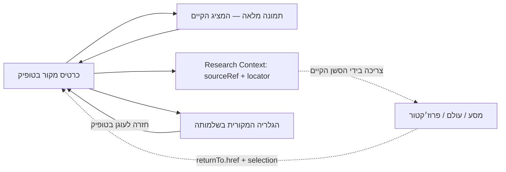

# מסירת חיבור המקורות: הודו, הקפטן וכיסוי 1237

מימוש תחום בענף `codex/topic-source-context-20261009`, על בסיס `origin/main` ‏`8e939d3b092f267e40d74953b9103711322276d2`. אין שינוי נתוני מוצר, תיוג, אישורי פרסום, OCR, מיזוג או פריסה. זהו מסמך מסירה של המימוש, לא Roadmap או חוזה סמכות נוסף.

מיפוי המקור: `work_log:e04a35a0-6083-46b4-9fc2-c5fce4073f43`. ACK לפני כתיבה: `9a53cbf2-8456-41f0-af19-85b4a43946f6`. סעיף 8A נקרא מתוך PR #1013, ענף `gpt/journey-foundation-plan-20261009`, commit `ccab371c46b813260f8c698dc698e0d292ba6631`; הוא נשאר הרחבה בטיוטה. המימוש נשען על main והבעלים החיים: Reality v8, Intake v13, Writer Material v6, Truth Axes v3, Workspace v5, Experience v9, Coordination v13. אין העברת בעלות.

בקשת הצרכן אומתה ב־work_log: ‏`121b20da-71d1-467b-99a4-119fcf88461c` ו־`e4714c97-6796-47bc-942f-f9fff8564507`. סשן המסעות עובד ב־PR #1014 ומבקש `selection.sourceRef/locator/versionRef` ו־`returnTo.href` קיים. הוא אישר שקבצי המקורות מוחרגים מתחומו. עצם מסירה זו אינה טענה שנפתחה או הופעלה משימה נוספת.

## מה מומש

`fetchTopicSourceContext({ topicSlug })` ב־Entity Hub קורא את `topic_cards_public`, את מזהי התמונות שכבר נשמרו בטופיק ואת הופעותיהם של אותם אובייקטי אחסון. הוא מחזיר את `galleryMediaEnvelope` הקיים עם שכבות היסטוריה, קשרים ופתיחה. `fetchEntityHubProjection({ ..., topicSourceSlug })` מרכיב את אותו קורא לפי בקשה מפורשת; פרופיל הקריאה של Number, Posts ו־World לא הורחב.

Topic Golden שומר עכשיו את המעטפת בשלמותה. תצוגת Topic מציגה את המקורות בחלון הקריאה, ללא הקיטום הקודם ל־8 ואחר כך ל־4 תמונות. לכל פריט הסבר קשר, פתיחת תמונה מלאה באמצעות המציג הקיים, כיתובים ומיקומים מקוריים, ניווט למקור הבא/הקודם ועוגן שמחזיר לכרטיס אחרי חזרה או רענון.

אין שינוי ב־`topic2029Projection`: הזהות והשיוכים הקיימים נשארו בבעלותו. הקורא החדש מאמת אותם דרך התצוגה הציבורית ואינו נותן למערך מזהים מהלקוח סמכות פרסום.

## מצב מאומת מול הקורא הציבורי

המספרים הם תוצאת הבדיקה ב־9 באוקטובר 2026, לא קבועים בממשק.

| טופיק | שיוכים שמורים | שיוכי תמונה ציבוריים | מקורות מוצגים | הופעות מתועדות |
|---|---:|---:|---:|---:|
| `india-axis` — הציר ההודי | 15 | 13 | 14, כולל הקפטן | 15 |
| `hodu` — הודו, נקודת היראה | 2 | 2 | 1 | 2 |
| `1237` — קורונה, תשובה, דוד | 6 | 6 | 6 | 8 |

שתי תמונות בציר ההודי שבמצב `published=2` אינן מוצגות. בכל קריאת תמונות נדרשים `published=1`, ‏`min_tier=0` ו־`curator_hidden=false/null`, הן בשאילתה והן במתאם. הדבר נדרש משום שמדיניות SELECT הקיימת בגלריות אינה מסננת שדות אלה. אין שינוי RLS.

הקורא מוגבל ל־64 שיוכים ול־256 הופעות של כתובות מקור מדויקות. מצב קיטום מדווח ב־`coverage`; הוא אינו מוצג כהשלמת כל החומר. כשל קריאה מוצג במפורש. אין חיפוש לפי מספר, שם קובץ, OCR, טקסט דומה או טופיק משוער.

## דוגמאות מקור מדויקות

### הקפטן בפוסט המטוס

- פוסט `5112`, slug ‏`flydubai-fz1073-363-14000-remzei-geula`.
- מקור: `post:flydubai-fz1073-363-14000-remzei-geula#source-region-smit-machchhar`.
- זהות ההופעה: `media:post:5112:source-region-smit-machchhar`; אין `galleryImageId` או node מומצאים.
- תמונה: `https://linswmnnkjxvweumprav.supabase.co/storage/v1/object/public/gallery/sod1820/posts/fz1073/smit-machchhar-source-20261001.jpg`.
- בסיס הקשר: הכיתוב באותו `figure` בפוסט מכנה את הקפטן במפורש „אזרח הודי”. ההמשך על פציעה והצלה מוצג כטענת המקור המצולם, לא כאימות של האירוע.
- סוג הקשר: `documented_source_mention`; מצב: `read_time_source_context_not_stored_graph_or_topic_tag`. זו הקרנה של המקור שמופה, לא טענה שנשמר edge או תיוג חדש.
- הקורא דורש בכל פתיחה את הפוסט המדויק, את כתובת התמונה ואת הכיתוב המדויק מהמסירה. שינוי באחד מהם משמיט את החיבור ומדווח `source_unavailable_or_changed`. הוא אינו קורא את ה־research_object שבמצב `public_candidate`. תגיות טיוטה/פורום מונעות את הצגת הדוגמה.
- חזרה לטופיק: `/topic/india-axis#topic-source-media-post-5112-source-region-smit-machchhar`.
- יעד הפוסט: `/post/flydubai-fz1073-363-14000-remzei-geula#source-region-smit-machchhar`. **מגבלה מאומתת ב־main:** העוגן נמצא בתוך גוף מקור מוסתר. `postRoutePrecision=post_only_with_source_region_locator`; הממשק מבטיח פתיחת הפוסט בלבד. הפעלת הקטע לעין נשארת אצל בעל Posts, שהוחרג מהכתיבה בסשן זה.

### אותה רכבת בשתי גלריות

אובייקט אחד: `https://linswmnnkjxvweumprav.supabase.co/storage/v1/object/public/media/uploads/2019/08/rkbt-216.jpg`.

| מזהה `gallery_images` | מזהה תמונה היסטורי | גלריה מקורית | `ordering` המקורי |
|---|---:|---|---:|
| `8940efb2-8423-4a27-a10a-d3fdd07cf595` | 1516 | 28 — רמזים בחדשות תשעח-ט | 0 |
| `4d0b8d36-0801-449b-a0a6-0c7ff543c5b0` | 2298 | 54 — גלרית 14 | 6 |

ב־`hodu` נשמרו שני שיוכים, ושניהם נשמרים ב־`contextRelations`. בציר ההודי נשמר רק השיוך לתמונה 1516; הופעתה בגלריה 54 נשמרת כהיסטוריית אותו מקור ואינה מקבלת שיוך להודו. הכיתובים בשתי ההופעות שונים גם בתווי escaping: שניהם נשמרים כלשונם, בלי בחירת „כיתוב מתוקן”.

הכרטיס נספר כמקור אחד. `sourceIdentity.ref` הוא כתובת אובייקט האחסון המדויקת עם מקור השרת; כל `mediaId` היסטורי נשאר ב־`occurrences`. זהו איחוד תצוגה בלבד. אין מיזוג רשומות או בחירת owner קנוני חדש. כתובת חתומה/מעובדת, שם קובץ משותף או מספר משותף אינם בסיס לאיחוד.

### 1237: מקור משותף והופעות נוספות

התמונה `5579cca1-ff12-4a9a-87ee-e32e89ca9af3`, מזהה היסטורי `2742`, שייכת לגלריה 70 — „גלרית 14 - 6”, במיקום `23`. היא מופיעה גם ב־`india-axis` וגם ב־`1237`. הזהות וה־`intrinsic` זהים, ואילו הקשר מפנה לכל שיוך שמור בנפרד:

- הודו: `topic_cards:95945c0d-7b7b-482f-a2f9-a5a097621452#image_ids/3`.
- 1237: `topic_cards:96885dc7-b6a4-43b1-8d64-b4ceac4e899b#image_ids/4`.
- חזרה: `/topic/1237#topic-source-5579cca1-ff12-4a9a-87ee-e32e89ca9af3`.

הסבר ברירת המחדל הוא „שיוך שמור”, והכיתוב ההיסטורי מובא בנפרד. אין הסקת זהות אירוע ממספר 1237. השדה `occurred_at=2021-06-01` מסומן במקור `date_derived=path`; מוצג כתאריך שנגזר מתיקייה, לא כתאריך אירוע מאומת.

קריאת כתובות המקור המדויקות מצאה עוד שתי הופעות קיימות, ללא מיפוי קורפוס מחדש:

| מקור שכבר משויך ל־1237 | הופעה נוספת | מיקום |
|---|---|---|
| `467caeeb-85d9-40f8-acc5-3cb25c6ba873`, גלריה 29 / 47 | `1734929c-5b78-43b4-b7af-13e757f65814`, תמונה 2408 | גלריה 57 / 3 |
| `c63c64fa-944b-4e4d-884a-8f9fc806b903`, גלריה 54 / 18 | `f4b74734-b179-4dbc-a111-39e9e9a5bce4`, תמונה 2235 | גלריה 29 / 53 |

מכאן שישה מקורות ושמונה הופעות, ולא שמונה ראיות.

## חוזה צריכה לסשן המסעות

```js
import { fetchTopicSourceContext } from "../src/lib/research/entityHubProjection.js";
import { topicSourceContextPatch } from "../src/lib/research/topicSourceContext.js";

const sources = await fetchTopicSourceContext({ topicSlug: "india-axis" });
const source = sources.items.find(item => item.mediaId ===
  "media:post:5112:source-region-smit-machchhar");
// topic is the existing buildTopic2029Projection output; its anchor remains orientation.
const patch = topicSourceContextPatch(source, topic);
// Use the existing context API. Preserve the current Journey; do not create one on click.
research.updateResearchContext({
  ...patch,
  dimensions: { ...research.context.dimensions, ...patch.dimensions },
});
// An explicitly started/continued Journey can store the SAME native source selection.
const returnTo = {
  href: source.reopen.topicHref,
  subject: { id: topic.slug, type: "topic", label: topic.title, href: topic.canonicalPath },
  selection: patch.selection,
  lens: "topic",
  dimensions: { ...research.context.dimensions, ...patch.dimensions },
  journey: research.context.journey,
};
```

`selection` משתמש רק בשדות קיימים: `entityId`, ‏`entityType=image`, ‏`sourceRef`, ‏`locator`. אין מזהה גרסה מומצא כאשר המקור אינו מספק גרסה. `sourceIdentity`, ‏`occurrences`, ‏`contextRelations`, ‏`access`, ‏`sequence` ו־`reopen` נמסרים במעטפת הקריאה; אין לשמור עותק שלהם כמאגר עובדות במסע. בפתיחה חוזרת יש לקרוא שוב דרך הקורא הציבורי ולהחיל את הרשאות היעד.

בחירה בכרטיס מסירה את `readingFocus` והחיבורים של פוסט קודם, כדי שלא יוצגו בטופיק כהקשרים חדשים. ה־rail הקיים ממשיך להתמצא בטופיק ובמספר העוגן הקיים שלו; הוא אינו מעניק לתמונה זהות מספרית. ה־source המדויק נמצא ב־selection, והסברו ב־surfaceFocus.reason/reference/locator. אין שינוי ב־SystemFrame או בתשתית המסעות.



קישור הגלריה הקיים הוא `/archive?tab=galleries&gal=<wpGalleryId>`. הוא פותח אוסף, לא תמונה ממוקדת, וכפוף לשער הגלריה הקיים. `reopen.galleries[].routePrecision=gallery_only` מציין זאת במפורש. `selection` שבתוכו מכיל `galleryId/wpGalleryId/galleryImageId/wpImageId/ordering` מדויקים לצרכן שיממש מיקוד. לא נוסף פרמטר URL שהגלריה אינה צורכת.

## גבולות מסירה ותנאי קבלה

| אחריות קיימת | מה מוכן בענף זה | מה נשאר אצל הצרכן / הבעלים |
|---|---|---|
| GPT, נתיב source-mapping תחת Reality / Intake / Writer Material / Truth / Experience | קריאה תחומה, שימור מקור והופעות, פרטיות, Topic, fixtures ובדיקות | שחרור תחום הכתיבה לאחר PR ומסירת work_log |
| Workspace / סשן המסעות, PR #1014 | sourceRef/locator ויעדי חזרה תואמים לחוזה שביקש | לאמת המשך/שמירה/רענון/חזרה במסע קיים עם המקורות האלה, בלי לכתוב בקבצי המקור |
| Posts, המשימה הקיימת `GOLDEN_POSTS_POST_ONLY_RECONCILE_V2` | יעד מדויק לקטע הקפטן, גוף המקור ותמונתו נגישים במעטפה | להפוך את יעד הקטע לנראה בעת פתיחה; אין לייחס PASS לתצוגה המוסתרת הנוכחית |
| Legacy Content / Experience | שמות, כיתובים, קרדיטים, סדר וכל מיקום גלריה | מיקוד תמונה בתוך Archive וחזרה ממנה דרך השער המורשה, אם ייכלל בהמשך התחום |
| World / Projector תחת Workspace / Experience | אותו קורא ואותה זהות מקור, ללא תלות ב־Journey חדש | לחבר את הצריכה במשטחים שלהם; בעולם להשתמש ב„רמזי גאולה”. אין לעכב זרם חומר מורשה עד שיוך לטופיק |

תנאי הקבלה של הענף: הודו 13 תמונות ציבוריות והקפטן; „הודו” כרטיס אחד ושתי הופעות; 1237 שישה מקורות ושמונה הופעות; כיתובים/קרדיטים/סדר מקור ללא שינוי; תמונה מלאה; מקור מספרי משותף אינו קשר אירוע חדש; עוגן Topic ובחירת מקור נשמרים בחזרה וברענון; פריטים שאינם מורשים או שמקורם השתנה אינם נחשפים.

תנאי הקבלה של המסלול המלא בין משטחים נשארים נפרדים: הפעלת יעד הפוסט המוסתר, מיקוד בתוך הגלריה, ו־Path save/resume דרך API המסעות הקיים. השמירה האישית אינה הוכחה לפרסום מסלול ציבורי; אין עקיפה של פער הקורא הציבורי שתועד ב־8A.

## בדיקות והוכחות

- 59 בדיקות Node: ‏`topicSourceContext.test.js`, ‏`galleryMediaEnvelope.test.js`, ‏`entityHubProjection.test.js`. כוללות כשל הרשאה/מקור, כיתוב שהשתנה, כפילות, בידוד הקשרים, תאריכים, קיטום ושאילתות ציבוריות תחומות.
- `node scripts/test-2029-topic-surface.mjs` — PASS.
- `npm run build` — legacy ו־2029. אזהרות dynamic import קיימות; אין כשל build.
- `scripts/test-topic-source-context-browser.mjs` — Chromium מקומי, נתונים ציבוריים חיים וללא mocking של נתונים, רוחבים 1440/390. תמונה מלאה, כיתובים מקוריים, זהות כפולה, מעבר לפוסט וחזרה, רענון עוגן, מעבר מקור והיעדר גלילה אופקית/שגיאות דף. בקשות שאינן קריאה נחסמות בבדיקה; רק RPC הקריאה `gematria_api` מורשה.
- הבדיקה רושמת בנפרד את תלות Posts: העוגן קיים אך אינו נראה. זה אינו PASS של פתיחה לקטע בפוסט.

הרצה מקומית לאחר הפעלת Vite:

```sh
node --test src/lib/research/topicSourceContext.test.js src/lib/research/galleryMediaEnvelope.test.js src/lib/research/entityHubProjection.test.js
node scripts/test-2029-topic-surface.mjs
npm run build
PLAYWRIGHT_MODULE=/path/to/playwright/index.js CHROMIUM_PATH=/path/to/chromium node scripts/test-topic-source-context-browser.mjs
```

קבלות וצילומי מסך נוצרים ב־`/tmp/sod1820-source-context-browser/`. זו הוכחת UI מקומי מול קוראים ציבוריים חיים, לא אישור תצוגת production. לא בוצעו בדיקת שמירה חיה במסע או כתיבת נתוני מוצר.
