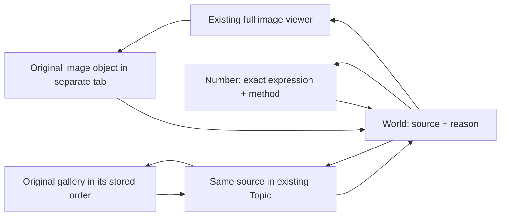

# World — 424 / 1237 / 14–45 / חכמה 73: current review handoff

2026-10-10. Continuation of `ec02509ff50dd076b6bfd6a4c0f7f00579b1708f` and
work_log `2cbd0c8b-6e91-40ad-8d52-4f597d49b552`, including the user's railway/14:45/73 expansion.
Branch: `codex/world-discovery-integrated-20261010` (source slice preserved on `codex/world-1237-clock-discovery-20261010`). Starting main:
`8e939d3b092f267e40d74953b9103711322276d2` (ancestor of ec02509f).
Sole-writer ACK `4173f32c-66f5-4b85-8ca8-9305cb7de81f`; supplemental coordination ACK
`1248a7ad-6993-4ca2-a864-8d7fa478d684`. Same canonical owners, no replacement registry.
Final SHA and exact-head receipts are in the accompanying review package, not inferred
from this document's earlier validation commands.

## Shared-depth integration received during verification

Coordinator handoff `4d820d3f-bc5e-417b-8fc5-4f7995313166` was read and ACKed by
`c63861fb-2c81-4dfd-83f9-d096d4f0db11`. PR1016's exact `60e0a84242c08ea93516ce8e4abdc164d4e2ef53`
was cherry-picked without conflicts as `8f2592fc` onto source head
`a823fd2720b6d1d83a75e2fe676178aa1ac5c9df` in a second isolated worktree. The three helper
files and one owner test file are byte-identical to the delivered patch; no free edits or
canonical-owner replacement. It preserves Human Diamond/Gold identity, null versus actual
zero, explicit relation dedup and unknown independence. It does not implement an autonomous
quality score. Plan PR1013 §8A additions at `e6755bcb289dfc598fe2387b026cbb57ce965127` were read,
not imported as another roadmap. The Include/Publish development guard remains.

The final package identifies ONE combined SHA for rerun source/Topic/Number/Path/return,
mobile and desktop checks, including the existing isolated PostgreSQL journey harness when
available. Source-only receipts are retained separately and are not labeled combined tests.
Palette `b5bbd120` / handoff94def6e6 is not present in this environment or remotely delivered;
its announced local tests are not claimed here. Shared ELS/security scopes remain untouched.

## Implemented review behavior and publication boundary

Three explicit connected readings, 21 reading placements, **19 source identities**:

1. Wall photo → live clock rule 424 → Trump / regular and atbash → **2016 Republican
   nomination threshold of 1,237 delegates** → historical author collage → “וראית את אחרי”
   → “התגלות” / mistater → distinct 2020 coronavirus report → David railway caption.
2. David railway caption → Israel Railways budget collage → red line 45 trains / 450
   passengers → separate 14 billion cost claim → **a scheduled government meeting at
   14:45** → Jerusalem cable car → existing India 140/450 → water train 216/2160.
3. Cable car → חכמה's seven methods → proposed 1230 method comparison with סלחתי כדברך
   → explicit רשת האינטרנט / שער נון cross-checks → Jerusalem's 730m source.

The user-selected development direction is **not blanket Include/Publish or Gold approval**.
The new World/Topic mounts and proposed Topic intros are guarded by `import.meta.env.DEV`:
they work in isolated Vite review and are absent from production builds. Existing approved
readers and the prior ec02509f behavior remain available. This is deliberately **not release
ready** until the existing human selection/publication path approves each proposed lead.
No new feature flag service, approval workflow, data table, tag store or score is introduced.
Do not remove this guard merely because a source is readable or its calculation matches.
This reconciles `signal_vs_curation v2` and coordinator `267437a3`.

The existing Topic identities are unchanged: `1237` (96885dc7-b6a4-43b1-8d64-b4ceac4e899b),
`424-mashiach-ben-david` (61e35e2f-4774-4733-a370-0f8093324507), and `trump`
(90751f1a-14bc-4637-8ef8-433a4663717c). Their original summary, sources and branches remain.
New intros separate delegates from Electoral College electors; the stored summary remains
available verbatim. Proposed links are explicitly distinguished from stored membership.
India/Hodu links reopen already-stored source occurrences, without adding another Topic.
No approved Topic listing 73 was found; 73 opens the existing Number/method reader.
Approved `45-frequency`, `gapfill-1234`, `gapfill-676` were inspected but their existence
alone does not justify adding these sources to them.

World presents “רמזי גאולה”, one full source at a time, a short documented reason and an
explicit next step. Original captions/credits/placements, exact extracted passage, method
trace and clock provenance open progressively; the existing number expression reader and
Spatial stage carry the research continuation. No calculation engine is reimplemented.
There is no automatic Path creation, save or publication.



Source selection/hash and the existing Research Context preserve the exact reading and
source through Number/Topic and reload. The Archive reader currently opens a **whole gallery**;
its exact image ID and ordering are retained alongside the link, not advertised as a working
Archive image anchor. Generic HTML Post sources reopen the exact image or whole Post;
visible in-Post image focus remains a Posts owner dependency.

## Scan coverage and limits

The targeted public gallery union contains **367 distinct rows / 349 exact image URLs**.
It combines 349 rows from 1237/424 numeric indexes, full galleries 29/81/39 and relevant text,
48 train/cable/14:45/14.45 and 73-with-14/45 rows, plus three focused supplemental sources
(overlap removed). These are index/scan counts, **not independent event or evidence counts**.
Same URL = one source object; different URLs are not assumed independent or silently merged
by visual similarity. The 19 review sources reuse five previously reviewed locators and add
14 gallery/Post locators. Public India source `6232be42` is reused from the prior mapping and
revalidated by the runtime reader, outside the new gallery census.

131 public Posts were read, including their HTML rather than only `image_ids`; 297 relevant
text windows and 3,889 HTML href/src references were extracted. Twenty-one Posts received
additional passage review, plus the explicit Posts 83 / 1182 / 1222 and prior plane handoff.
Post1544 and gallery links were considered as entry points, not evidence of every linked event.
Post1794's archive index was inspected where its content matched; this is not a claim to have
read every linked lecture or the entire corpus. Existing OCR was used and checked visually on
the selected new image sources; no bulk OCR or ingestion was run.

Public video/transcript targeted text search returned no additional eligible matching witness.
Prior video83's proposed 02:40–03:08 and the separate 73-second cut were **not re-played** and
remain with Posts; no timestamp/first-touch claim is promoted from them. Research Object status
coverage was checked; no eligible public objects were available for this topic expansion.
Private/public-candidate bodies were not exported. Public Number readings, approved Topics,
Registry and current rule versions were read through their existing contracts.

No exact railway photo at **14:45** was found in this bounded search. The actual 14:45 source
is a scheduled meeting notice. Train 14/45 counts and costs, cable-car 1.4km / 4.5min, and
clock 14:45 are explicitly different observations. Decimal stripping is not the zero law.

## Canonical verification and historical controls

- Every displayed calculation requests `gematria_method_trace` and requires public active
  Registry admission, matching method version and `verification.parity=true`. No local sums,
  substituted methods, alternative spellings chosen to fit, or author interpretation asserted
  by arithmetic. The receipt lists all 47 method applications across the three readings
  (including repeated expressions); these are not 47 independent sources.
- Wall original **4:24 PM** is preserved. The existing clock owner receives its explicit
  24-hour normalization 16:24 and documented Jerusalem context. `moment_clock_law v2`
  produces `CLOCK_12H_CONCAT=424`; this is a representation of one clock occurrence,
  not gematria or an additional independent witness. 1:28 and 7:24 MT are different clocks.
  The exact instant of first physical contact has not been verified from video.
- Meeting 14:45 → `CLOCK_24H_CONCAT=1445`. Existing approved reading
  `1f655830-0554-448d-b1da-e0ade0483de8` supplies **14|45 / דוד|גאולה** separately.
  That reading is withheld when the clock rule cannot be verified. No date/UTC offset invented.
- `התגלות / מסתתר = 1237`; its regular value is 844. `התגלות השכינה / רגיל = 1234`
  is a distinct expression. `וראית את אחרי / רגיל = 1237`.
- חכמה: רגיל73, קדמי271, מילוי613, מילוי גדול1893, **מילוי בלבד גדול1820 = 1893−73**,
  מילוי דמילוי1230, מסתתר67. Composite components and dependencies remain visible.
- סלחתי כדברך: מסתתר1230, גדול1234. רֶשֶׁת הָאִינְטֶרְנֶט (source vowels preserved):
  רגיל1234, מסתתר676; שער נון: מילוי1234, רגיל676, קדמי2626. The connection via1230
  from wisdom is a proposed cross-method reading, while internet/gate is the author's comparison.
- Original spelling **דולנד טראמפ** in the gallery collage and **דונאלד טרמפ** in Post1222
  are preserved and separately checked; neither is silently normalized into another quote.
- A separate documentary chronology is built only from guarded source date text or explicit
  Post publication dates. Event dates, upload dates and folder paths are not substituted.
  Undated material stays undated. The original gallery ordering is never changed.
- The 2018-path “וראית את אחרי” object has three historical placements, not three evidences.
  A 2024 gallery collage depicting 2016 delegates does not date the event to2024. A Post's
  original publication date does not prove the image was present in that initial revision.
- The light-rail caption says45 carriages/45 passengers; the image says45 trains, two cars each,
  450 passengers. Both the original caption and the separately attributed correction survive.
  Gallery95/order20 is a Channel14 war screenshot; its **caption**, not the pictured event,
  supplies the railway/1873 connection. The quoted 14bn claim is attributed to Yaron Zelekha.

## Exact source map (proposed explanations; unchanged source records)

### india-health — ״קודם 140 עכשיו 450״

Source `gallery_images:6232be42-82a3-41ac-b4d3-004a21e48c7f` · WP2609 · gallery **61**, stored ordering **3**. [Original image](https://linswmnnkjxvweumprav.supabase.co/storage/v1/object/public/media/uploads/2020/12/hvdv-450.jpg).

Stored Topic memberships in the inspected set: `india-axis`. The proposed reading does not write membership.

Type: `documented_source_mention`. צילום היסטורי מהודו, עם שני המספרים מפורשים. זיקת האפסים מחברת ל־14 ול־45; דוד וגאולה מחושבים בנפרד. טענות הבריאות שבכיתוב הן תיעוד ופרשנות מן העבר.

Source admission quotes: “קודם 140” · “עכשיו 450”.

Canonical requests: דוד / רגיל → 14 · גאולה / רגיל → 45.

Existing law requests: [{"from": 140, "to": 14, "ruleId": "zero_scale_law"}, {"from": 450, "to": 45, "ruleId": "zero_scale_law"}].

### water-train — רכבת המים — 216 ו־2160

Source `gallery_images:8940efb2-8423-4a27-a10a-d3fdd07cf595` · WP1516 · gallery **28**, stored ordering **0**. [Original image](https://linswmnnkjxvweumprav.supabase.co/storage/v1/object/public/media/uploads/2019/08/rkbt-216.jpg).

Stored Topic memberships in the inspected set: `hodu`, `india-axis`. The proposed reading does not write membership.

Type: `author_interpretation`. מרחק הרכבת ותמונות המחשבון מופיעים באותו מקור. 216 הוא יראה ברגיל; 2160 הוא משיח יהוה במילוי גדול. זיקת האפסים מחברת ביניהם כרמז, עם שתי שיטות נפרדות.

Source admission quotes: “216 ק"מ” · “גדול 2160” · “יראה”.

Canonical requests: יראה / רגיל → 216 · משיח יהוה / מילוי גדול → 2160 · משיח יהוה / מילוי → 950.

Existing law requests: [{"from": 216, "to": 2160, "ruleId": "zero_scale_law"}].

### wisdom-methods — חכמה — מה נפתח באותיות?

Source `gallery_images:c502fa89-96f1-495b-aeb7-b16deaaa96b3` · WP1463 · gallery **39**, stored ordering **29**. [Original image](https://linswmnnkjxvweumprav.supabase.co/storage/v1/object/public/media/uploads/2019/07/chkmh.jpg).

Stored Topic memberships in the inspected set: none. The proposed reading does not write membership.

Type: `documented_source_mention`. המחשבון ההיסטורי מציג כמה שיטות לאותו ביטוי. 1820 שייך למילוי בלבד גדול: מילוי גדול 1893 פחות האותיות המקוריות שערכן 73. הכיתוב ההיסטורי נשמר גם כשניסוחו מקוצר.

Source admission quotes: “חכמה” · “רגיל 73” · “מילוי בלבד גדול 1820”.

Canonical requests: חכמה / רגיל → 73 · חכמה / מילוי בלבד גדול → 1820 · חכמה / קדמי → 271 · חכמה / מילוי → 613 · חכמה / מילוי גדול → 1893 · חכמה / מילוי דמילוי → 1230 · חכמה / מסתתר → 67.

### jerusalem-gate — 730 מטרים — שער לירושלים

Source `gallery_images:5dfe5a87-702c-42da-aa36-46351dd70c4e` · WP3083 · gallery **39**, stored ordering **4**. [Original image](https://linswmnnkjxvweumprav.supabase.co/storage/v1/object/public/media/uploads/2023/09/Screenshot_2023-09-28-21-28-37-67_40deb401b9ffe8e1df2f1cc5ba480b12.jpg).

Stored Topic memberships in the inspected set: none. The proposed reading does not write membership.

Type: `author_interpretation`. כיתוב המחבר מחבר את שער ירושלים לחכמה. הידיעה המצולמת היא מ־28.9.2023; ״היום״ בכותרתה שייך לאותו פרסום. 730 מטרים נפתחים ל־73 דרך זיקת האפסים.

Source admission quotes: “730 מטרים” · “28/09/2023”.

Canonical requests: חכמה / רגיל → 73.

Existing law requests: [{"from": 730, "to": 73, "ruleId": "zero_scale_law"}].

### jerusalem-cable — 73 קרונות — באותה גלריה

Source `gallery_images:46987aba-4da8-4b57-bef8-3ed5bef0e48d` · WP1464 · gallery **39**, stored ordering **19**. [Original image](https://linswmnnkjxvweumprav.supabase.co/storage/v1/object/public/media/uploads/2019/07/rkbl-kvtl.jpg).

Stored Topic memberships in the inspected set: none. The proposed reading does not write membership.

Type: `author_interpretation`. הכיתוב מחבר את הרכבל לחכמה. בצילום: 73 קרונות, 1.4 ק״מ וכ־4.5 דקות. אין בו 450 נוסעים; אזכור כזה בכיתוב מאוחר אינו מאמת אותו. שיתוף הגלריה אינו זהות אירוע.

Source admission quotes: “73 קרונות” · “1.4 ק"מ”.

Canonical requests: חכמה / רגיל → 73.

### wall-clock — הכותל, ירושלים, 4:24 PM

Source `gallery_images:62ffc447-fd91-4027-9fe9-4a19d09679fd` · WP668 · gallery **25**, stored ordering **2**. [Original image](https://linswmnnkjxvweumprav.supabase.co/storage/v1/object/public/media/uploads/2017/05/hnshya-bkvtl-b-424.jpeg).

Stored Topic memberships in the inspected set: none. The proposed reading does not write membership.

Type: `author_interpretation`. בצילום השידור מופיע שעון ירושלים 4:24 PM. חוק השעון מחבר את התצוגה ל־424; השם דונלד טראמפ והביטוי משיח בן דוד נבדקים כל אחד בשיטה הרגילה. המשמעות המשיחית היא פרשנות המחבר.

1:28 בראש הטלפון ו־7:24 MT בתחתית הם שעונים אחרים. התמונה מתעדת את השעה על המסך; רגע המגע הראשון המדויק לא אומת בווידאו.

Source admission quotes: “JERUSALEM” · “4:24 PM” · “PRES TRUMP VISITS THE WESTERN WALL”.

Canonical requests: דונלד טראמפ / רגיל → 424 · משיח בן דוד / רגיל → 424.

### trump-methods — אותו שם, שתי שיטות

Source `gallery_images:00edc0d8-b792-45d9-aa86-d04b44600a3f` · WP675 · gallery **20**, stored ordering **76**. [Original image](https://linswmnnkjxvweumprav.supabase.co/storage/v1/object/public/media/uploads/2017/06/tramp-gymtryh.png).

Stored Topic memberships in the inspected set: `424-mashiach-ben-david`, `trump`. The proposed reading does not write membership.

Type: `documented_source_mention`. השם המדויק דונלד טראמפ נותן 424 ברגיל ו־778 באתבש. צילום המחשבון נמצא כבר בטופיקים טראמפ ו־424. שני החישובים תלויים באותו ביטוי ואינם שני מקורות עצמאיים.

הכיתוב ההיסטורי מציע גם חיבור ל־1202. הוא נשמר כלשונו; המסלול הנוכחי ממשיך דרך האדם אל סיפור המועמדות.

Source admission quotes: “דונלד טראמפ” · “רגיל 424” · “778”.

Canonical requests: דונלד טראמפ / רגיל → 424 · דונלד טראמפ / אתבש → 778.

### delegates-1237 — מה פירוש 1,237 צירים?

Post `1222`, exact HTML `` [image](https://linswmnnkjxvweumprav.supabase.co/storage/v1/object/public/media/uploads/2016/05/503f09f92c9d6e15.jpg); heading locator guarded by ['למספר הקסם 1237']. [Historical Post](https://sod1820.co.il/9495-2/).

Type: `documented_source_mention`. התמונה בפוסט מסבירה: 1,237 הוא מספר הצירים הדרוש לקבלת המינוי הרפובליקני בסיבוב הראשון. עוברים מהאדם שבצילום הכותל אל אירוע אחר בחייו.

זהו סף צירים למועמדות, לא מספר האלקטורים בבחירות הכלליות ולא תוצאה סופית של הצבעה. ניסוחים היסטוריים אחרים נשמרים בנפרד.

Source admission quotes: “למספר הקסם 1237”.

Canonical requests: דונאלד טרמפ / רגיל → 424.

### delegates-revelation — המחבר מציב את התגלות לצד הצירים

Source `gallery_images:9e2a32a1-82aa-49d8-9823-e8b7fc2a8c59` · WP3244 · gallery **92**, stored ordering **13**. [Original image](https://linswmnnkjxvweumprav.supabase.co/storage/v1/object/public/media/uploads/2016/07/dvnld-trmp-htglvt.png).

Stored Topic memberships in the inspected set: none. The proposed reading does not write membership.

Type: `author_comparison`. בקולאז׳ מופיעים יחד דיווח המועמדות, התגלות במסתתר, משיח בן דוד והכתיב דולנד טראמפ. זהו חיבור מפורש של המחבר. שם הגלריה 2024 אינו מתארך מחדש את אירוע המועמדות.

הכתיב דולנד טראמפ נשמר כפי שהוא בצילום; אין להחליפו בשקט. הקולאז׳ חוזר על תוכן המועמדות ואינו אימות חדשותי עצמאי נוסף.

Source admission quotes: “1,237 הצירים” · “התגלות” · “מסתתר רגיל 1237” · “דולנד טראמפ”.

Canonical requests: התגלות / מסתתר → 1237 · דולנד טראמפ / רגיל → 424 · משיח בן דוד / רגיל → 424.

### see-my-back — ״וראית את אחרי״

Source `gallery_images:d9842a5a-5313-4d32-8e58-5f07fa29b887` · WP2650 · gallery **29**, stored ordering **1**. [Original image](https://linswmnnkjxvweumprav.supabase.co/storage/v1/object/public/media/uploads/2018/10/vrayt-at.png).

Stored Topic memberships in the inspected set: none. The proposed reading does not write membership.

Type: `author_interpretation`. הביטוי המצולם נותן 1237 בשיטה הרגילה. הכיתוב מחבר אותו במפורש להתגלות בתוך ההסתרה ומזכיר את תרומת עמיחי. זהו פירוש המחבר לצד חישוב שאפשר לפתוח.

Source admission quotes: “וראית את אחרי” · “רגיל 1237”.

Canonical requests: וראית את אחרי / רגיל → 1237.

### revelation-hidden — התגלות — דרך שיטת מסתתר

Source `gallery_images:c22b5594-0e1d-4f9a-ba38-d30f598fec1d` · WP1477 · gallery **29**, stored ordering **54**. [Original image](https://linswmnnkjxvweumprav.supabase.co/storage/v1/object/public/media/uploads/2019/07/htglvt.jpg).

Stored Topic memberships in the inspected set: none. The proposed reading does not write membership.

Type: `author_interpretation`. התגלות נותנת 1237 במסתתר, ואילו ברגיל ערכה 844. הקשר ל״וראית את אחרי״ עובר בין שני ביטויים ובין שתי שיטות מפורשות.

התגלות השכינה = 1234 ברגיל שייכת לענף אחר. היא אינה אותו ביטוי ואינה תוצאת 1237.

Source admission quotes: “התגלות” · “מסתתר רגיל 1237” · “רגיל 844”.

Canonical requests: התגלות / מסתתר → 1237 · התגלות / רגיל → 844.

### covid-1237 — ענף הקורונה נשאר במקומו

Source `gallery_images:84d4f578-0269-4b96-b0c0-1b1810d6847e` · WP2541 · gallery **29**, stored ordering **12**. [Original image](https://linswmnnkjxvweumprav.supabase.co/storage/v1/object/public/media/uploads/2020/10/1237-chyylym.jpg).

Stored Topic memberships in the inspected set: `1237`. The proposed reading does not write membership.

Type: `author_comparison`. הידיעה מדווחת על 1,237 ממשרתי צה״ל שחלו בקורונה. הכיתוב מ־4.10.2020 מחבר במפורש לטראמפ, ל״וראית את אחרי״ ולהתגלות במסתתר. זהו אירוע נפרד מן המועמדות ומן הביקור בכותל.

Source admission quotes: “1,237 ממשרתי” · “02/10/2020”.

Canonical requests: וראית את אחרי / רגיל → 1237 · התגלות / מסתתר → 1237.

### david-rail-caption — מסילות דוד המלך — גשר בכיתוב

Source `gallery_images:563069a0-8f0c-46ee-94a1-6085b36c9339` · WP3335 · gallery **95**, stored ordering **20**. [Original image](https://linswmnnkjxvweumprav.supabase.co/storage/v1/object/public/media/uploads/2024/06/IMG-20240605-WA0027.jpg).

Stored Topic memberships in the inspected set: none. The proposed reading does not write membership.

Type: `author_comparison`. שחר קנדרו מוזכר בכיתוב שמחבר את ״מסילות רכבת דוד המלך ירושלים״ ברגיל ל״אחת שתים שלוש שבע״ במסתתר — שניהם 1873. כך שם המספר 1237 מוביל לנושא המסילות.

הקשר למסילות כתוב בכיתוב ההיסטורי. התמונה עצמה מציגה דיווח על לבנון; היא אינה צילום של רכבת או אישור לפרויקט המסילות.

Source admission quotes: “14 אלף מבנים” · “05.06.24”.

Exact occurrence caption guard: “מסילות רכבת דוד המלך ירושלים=1873” · “אחת שתים שלוש שבע=1873 מסתתר”.

Canonical requests: מסילות רכבת דוד המלך ירושלים / רגיל → 1873 · אחת שתים שלוש שבע / מסתתר → 1873.

### rail-budget — 45 מיליון, 140 מיליון — ברכבת ישראל

Source `gallery_images:4f7a5ea1-7ff4-4a53-a28f-74f5617f8c68` · WP2471 · gallery **59**, stored ordering **1**. [Original image](https://linswmnnkjxvweumprav.supabase.co/storage/v1/object/public/media/uploads/2020/07/rmzy-rkbt.jpg).

Stored Topic memberships in the inspected set: none. The proposed reading does not write membership.

Type: `author_comparison`. בדיווח המצולם על רכבת ישראל: כ־45 מיליון שקל הפסד תפעולי ו־140 מיליון שקל לחודש במסגרת הסיכום המתואר. המחבר מציב לידם את רמזי דוד וגאולה. יחידת מיליון השקלים נשמרת.

14 ו־45 כאן הם קריאה במספרי סכומים; זו אינה שעה 14:45. הידיעות הנוספות בקולאז׳ אינן אותו אירוע.

Source admission quotes: “45 מיליון שקל” · “140 מיליון שקל”.

Canonical requests: דוד / רגיל → 14 · גאולה / רגיל → 45.

Existing law requests: [{"from": 140, "to": 14, "ruleId": "zero_scale_law"}].

### light-rail-45 — 45 רכבות, 450 נוסעים

Source `gallery_images:36f64c4f-9231-4f4c-9afd-33abf7e275ee` · WP3062 · gallery **84**, stored ordering **3**. [Original image](https://linswmnnkjxvweumprav.supabase.co/storage/v1/object/public/media/uploads/2023/08/Screenshot_2023-08-18-07-11-42-49_40deb401b9ffe8e1df2f1cc5ba480b12.jpg).

Stored Topic memberships in the inspected set: none. The proposed reading does not write membership.

Type: `author_interpretation`. צילום תוצאות החיפוש אומר: 45 רכבות, כל אחת משני קרונות, ו־450 נוסעים. חוק האפס מסביר את הזיקה 450↔45. גאולה מחושבת בנפרד בשיטה הרגילה.

הכיתוב ההיסטורי אומר 45 קרונות ו־45 נוסעים. הוא נשמר בשלמותו, ולצדו מוצגת הקריאה המדויקת מן הצילום. אזכור שעת הפתיחה בכיתוב לא מאומת בצילום הזה.

Source admission quotes: “רכבות 45” · “450 נוסעים”.

Canonical requests: גאולה / רגיל → 45.

Existing law requests: [{"from": 450, "to": 45, "ruleId": "zero_scale_law"}].

### light-rail-14 — 14 מיליארד — טענה על עלות הקו האדום

Source `gallery_images:8cfa5f55-2c42-48d9-866a-180ae2ffe3de` · WP3063 · gallery **84**, stored ordering **2**. [Original image](https://linswmnnkjxvweumprav.supabase.co/storage/v1/object/public/media/uploads/2023/08/14-rkbt.png).

Stored Topic memberships in the inspected set: none. The proposed reading does not write membership.

Type: `proposed_source_connection`. הכתבה מביאה טענה של ירון זליכה על עלות עודפת של 14 מיליארד שקל. זהו תיעוד נוסף של הקו האדום, לצד צילום 45 הרכבות; מדובר בהיבטים שונים של הפרויקט.

הטענה מיוחסת למרואיין בכתבה; איננו מאמתים כאן את החשבון התקציבי.

Source admission quotes: “14 מיליארד” · “ירון זליכה” · “18/8/2023”.

Canonical requests: דוד / רגיל → 14.

### clock-1445 — וכאן 14:45 היא באמת שעה

Source `gallery_images:4d01baa6-3d63-41b7-be1b-c31ea66b3498` · WP2624 · gallery **69**, stored ordering **23**. [Original image](https://linswmnnkjxvweumprav.supabase.co/storage/v1/object/public/media/uploads/2021/01/1414.png).

Stored Topic memberships in the inspected set: none. The proposed reading does not write membership.

Type: `author_interpretation`. בקטע המצולם נאמר שהממשלה תתכנס בשעה 14:45. חוק השעון מפיק את הייצוג 1445; הקריאה הקיימת של 1445 כ־14|45 מחברת לדוד ולגאולה.

זו ידיעה על ישיבה מתוכננת, לא הוכחה שהישיבה התקיימה בדקה הזו. בסריקה הממוקדת לא נמצא צילום רכבת שמציג שעה 14:45.

Source admission quotes: “14:45” · “נחמן אש” · “שתתכנס היום בשעה”.

Canonical requests: דוד / רגיל → 14 · גאולה / רגיל → 45.

### forgiveness-bridge — מחכמה אל ״סלחתי כדברך״

Source `gallery_images:4de128e1-7609-406c-b692-7d9b2f9ffec1` · WP3179 · gallery **67**, stored ordering **4**. [Original image](https://linswmnnkjxvweumprav.supabase.co/storage/v1/object/public/media/uploads/2024/01/slchty-kdbrk.jpg).

Stored Topic memberships in the inspected set: none. The proposed reading does not write membership.

Type: `proposed_method_connection`. חכמה במילוי דמילוי וסלחתי כדברך במסתתר נפגשים ב־1230. באותו צילום, סלחתי כדברך בשיטת גדול נותן 1234. המעבר משנה ביטוי ואז שיטה, ושני הצעדים גלויים.

הכיתוב מחבר לענג בכתיב חסר. החיבור לחכמה הוא הצעת קריאה לבדיקה על בסיס החישובים; אין כאן שוויון בין 1230 ל־1234.

Source admission quotes: “סלחתי” · “כדברך” · “מסתתר רגיל 1230” · “גדול 1234”.

Canonical requests: סלחתי כדברך / מסתתר → 1230 · סלחתי כדברך / גדול → 1234 · ענג / רגיל → 123 · התגלות השכינה / רגיל → 1234.

Existing law requests: [{"from": 1230, "to": 123, "ruleId": "zero_scale_law"}].

### internet-gate — רשת האינטרנט ושער נון

Source `gallery_images:fe9f458e-364c-4462-8a57-94f57a96ec65` · WP2584 · gallery **67**, stored ordering **1**. [Original image](https://linswmnnkjxvweumprav.supabase.co/storage/v1/object/public/media/uploads/2018/08/rsht-hayntrnt.jpg).

Stored Topic memberships in the inspected set: none. The proposed reading does not write membership.

Type: `author_comparison`. הכיתוב מחבר במפורש את רשת האינטרנט לשער נון. ברשת האינטרנט: 1234 ברגיל ו־676 במסתתר. בשער נון: 1234 במילוי ו־676 ברגיל. ארבעה חישובים, צילום אחד עם פירוש המחבר.

הכיתוב ההיסטורי מפרש את תפקיד האינטרנט בגאולה. אימות החישובים אינו אימות של הפרשנות.

Source admission quotes: “רֶשֶׁת הָאִינְטֶרְנֶט” · “רגיל 1234” · “מסתתר רגיל 676”.

Canonical requests: רֶשֶׁת הָאִינְטֶרְנֶט / רגיל → 1234 · שער נון / מילוי → 1234 · רֶשֶׁת הָאִינְטֶרְנֶט / מסתתר → 676 · שער נון / רגיל → 676 · שער נון / קדמי → 2626.

## Existing branches retained and remaining implementation owners

The six stored1237 sources remain readable in the original Topic section, including:
`467caeeb-85d9-40f8-acc5-3cb25c6ba873` (g29/order47, עמיחי/coronavirus/repentance/David);
`98d32015-00e3-46ea-8260-5b72bd124301` (g29/order14, exact תשפב spelling comparison);
`c63c64fa-944b-4e4d-884a-8f9fc806b903` (g54/order18, distinct9/3/2020 quarantine report);
`84d4f578` (g29/order12,2/10/2020 report);
`5579cca1-ff12-4a9a-87ee-e32e89ca9af3` (g70/order23, Indian variant/2021/450);
and `3fbb81ba-002f-417b-be1b-6eed1feba3c8` (g29/order37, historical experimental medicine
report/אלוסטרה). Stored health claims and interpretations remain attributed historical content.
They were not turned into medical guidance or merged into the2016/2017 events.

| Area | Works in this review | Remaining owner / acceptance |
|---|---|---|
| World/Topic sources | Three connected readings; whole image; original placements; reason for each transition; guarded chronology | Existing human Include/Publish decision before enabling production mounts |
| Existing Topics | Proposed expansions of1237/424/trump; stored India/Hodu source links | Source/Topic owner approves candidate links via existing path; no live tags written |
| Number/clock | Canonical expression, method and live rule; exact return snapshot | Number's first entry still loses top-level sourceRef; returnTo retains it. Number owner |
| Spatial | Existing stage plus truthful composite components | Unavailable `af970703` artifact was not imported; unsupported large/composite visualization remains Spatial owner |
| Posts/video/elections | Exact1222 HTML image and preserved historical context | Posts handoff `bdb7caba-3f10-48d0-ab29-4b67e150097a`: visible native image/region, verified video range and5107 publication gate |
| Gallery | Whole original gallery, all known placements/captions/order, precise return to review | Archive image-level anchor is unsupported; Archive owner |
| Shared context/depth | Exact source passed through existing Context; unknown independence stays unknown | Frame image-to0 display remains outside scope; shared-depth owner47baa5fa supplied PR1016/60e0a842; imported under ACK c63861fb; Frame remains separate |
| Path save/publication | No implicit Path or product write | Prior adf isolated save/resume evidence retained; public Path/G4 not closed here |

Execution order: (1) review this complete end-to-end slice in Vite; (2) validate the imported shared-depth
owner's PR1016 patch on the combined SHA; (3) choose source connections through existing
human curation/publication, with Posts/Archive/Spatial dependencies assigned to current owners;
(4) repeat route/access/duplicate/method/return tests on that exact combined head before any
separately authorized release. No merge, remote branch push or deployment is performed here.

## Reproducible validation

Use Node24 and the existing dependencies; start Vite on4176. `scripts/test-world-source-story-1237.mjs`
uses real anonymous public reads, blocks remote mutations, walks all21 steps at1440/390 in
night/day/parchment, opens the actual image, checks Number/three Topic return and reload,
three historical placements as one source, and controlled missing/changed/hidden-source and
clock-law failure. Negative fixtures are captured public responses, never production changes.
The receipt records the exact commit and live source/method versions. Run the existing
`test-world-source-connections.mjs`, `test-world-source-story.mjs` (including878), and
`test-topic-source-context-browser.mjs` regressions; both product builds and isolation gates.

`RESULTS.md`, `versions.json`, screenshots and receipts in the review package state actual
PASS/FAIL and exact tested SHA. This document does not predeclare tests that have not finished.
PLANNED/IMPLEMENTED/TESTED/PR_READY/MERGED/LIVE are reported separately there.

---

The following is the prior plane/India handoff, retained as historical integration context;
its “unchanged files” and earlier test descriptions apply to that earlier slice.

# World: plane → India → exact source

Continuation of integration `adf67448c2e94590e85ee9d129e5adc5bb88ae60` and coordinator
`9fe7678c-12f1-4f75-b70e-ccbeb40eb50f`. World ACK:
`b412558b-1f15-41a0-bc76-b89277637a06`. Existing Experience / Source / Workspace owners
retained. Local branch `codex/world-source-story-20261009`; final HEAD and test
receipts accompany the review bundle. No push, main merge, deployment or live
product writes. This document is an implementation handoff, not another plan.

## Delivered interaction

`/world` presents the existing plane Post as a bounded discovery invitation.
The reader explicitly opens its India connection at `/world#world-plane-india`.
The original captain image opens through `CanonicalMediaFigure2029` and the
existing Lightbox. “פתח מקור” opens the exact storage object in another tab;
closing it and the Lightbox preserves the selected image and reader position.
The next action opens the same image at
`/topic/india-axis#topic-source-media-post-5112-source-region-smit-machchhar`.
The existing exact-return control restores the World source, including after
reload, on desktop and mobile. This ordinary discovery does not start a Path.

Data comes solely from the Source owner's `fetchTopicSourceContext` in Entity Hub,
including the existing `galleryMediaEnvelope`, public access checks, historical
occurrences and source-native reopen fields. World does not query source tables,
create a new mapping registry, change tags, calculate a number or duplicate media.
The World helper preserves the envelope by reference. Missing/changed/unavailable
public witness means no story/image, with an explicit retry.

The documented reason is the Post's explicit “אזרח הודי” description. Injury and
rescue remain claims of the photographed source. Neither 1237 nor another shared
number proves this connection. Original caption and credit are available separately
from the contextual explanation. World uses “רמזי גאולה”; tools and detailed research
remain in their existing deeper destinations. Design V2 tokens and shared chrome
are preserved; the World intro is compact, with one selected source at a time.

## Source and return identity

- Post: `5112`, `flydubai-fz1073-363-14000-remzei-geula`.
- Media: `media:post:5112:source-region-smit-machchhar`.
- Source ref: `post:flydubai-fz1073-363-14000-remzei-geula#source-region-smit-machchhar`.
- Storage: `https://linswmnnkjxvweumprav.supabase.co/storage/v1/object/public/gallery/sod1820/posts/fz1073/smit-machchhar-source-20261001.jpg`.
- Selection retains the Source owner's Topic locator; the World viewport href is
  kept separately in the existing Context `returnTo`. No second return store.

World supplies the destination subject before navigation and calls the existing
shell with `preserve:false` because it has already composed the precise return
snapshot. Otherwise the destination's first-entry Context initialization discards
the subject-less return, or shell navigation replaces it with stale selection.
Topic, ResearchProvider and SystemFrame are unchanged.

## Verification

Run from this branch with Node24 and installed product dependencies:

```sh
node --test src/lib/research/world2029Presentation.test.js src/lib/research/worldDiscoveryStream.test.js src/lib/research/worldGroupSource.test.js src/lib/research/topicSourceContext.test.js src/lib/research/galleryMediaEnvelope.test.js src/lib/research/journeySourceReturn.test.js src/lib/research/researchPathContinuity.test.js src/lib/research/researchSyncRuntime.test.js src/lib/research/researchSyncRecovery.test.js
node scripts/test-2029-world-surface.mjs
node scripts/test-2029-isolation.mjs
npm run build
```

Start Vite on `127.0.0.1:4175`, then run `scripts/test-world-source-story.mjs` with
`PLAYWRIGHT_MODULE` and `CHROMIUM_PATH` for the local installation. The script uses
real anonymous public reads, blocks remote mutations, opens the actual original
image, checks World/Topic identity and exact return, reload, unavailable source and
retry, 1440/390px and all three presets. It also checks the existing 878 explicit
Path entry and guest save rejection in both widths. `browser-receipt.json` records
the exact tested commit; screenshots are actual UI, not a concept rendering.
The unchanged Source owner's browser suite additionally covers India, Hodu's one
image/two historical placements, and 1237. The prior adf integration receipt remains
the evidence for actual isolated PostgreSQL save/resume/RLS, not a production test.

## Reconciliation and dependencies

- Main at start: `8e939d3b092f267e40d74953b9103711322276d2`.
- PR1014 `f76a7b8b1621198dcc5078f170ff94ecd877978e`, PR1015
  `95483de55e65f6fa1a09300dfa65ca733fbdcb4e`, and standalone ELS CI commit
  `1800c3d07d36b5e52dee74a95be050dd24e4bb90` are already in the adf composition.
- PR1010 `ef086b8e4e7b9876d8f0d692661f1ae124628423` reviewed separately, **not imported**.
  It improves existing Home/World source arrivals and overlaps this branch in
  World2029Page/world2029-human.css. Reconcile those two diffs under the existing
  owner before any future release. No automatic PR1009/997 import.
- **Posts still open:** native `source-region-smit-machchhar` exists in the Post
  but is hidden by its current presentation. Opening the original image and
  returning to World/Topic works; exact visible return *inside that Post region*
  is not certified. Browser receipts record the observed visibility.
- Posts handoff `49b4cf27-ba0b-489f-aff7-90772d6d7cfc` consumes `c2487f41`:
  extended video `or-geula:b9be2ae0-1d08-40a2-bdcf-346ea7ffbbbb`, transcript83,
  proposed 02:40–03:08 requires playback confirmation; separate 73-second cut is
  not interchangeable. Elections5107 publication/visibility and exact contextual
  links remain with Posts/Source. No fabricated Bennett1820 or tag-based segment
  evidence. Local method fix980e83a2 is not imported. No recipient activation claimed.
- Archive still opens a whole gallery, not a precise image. Public Path reader /
  publication and G4 remain open. No Source/Topic/Posts/ELS/NumberCore/Frame/rail edits.

## Integration package transport

Original integration ZIP SHA256:
`0652d860b3c9bd60cffc6f252cd66d056cc9f8817aeb8611d4b292b8ebeabb6a`.
The local ZIP/bundle and adf receipts were rechecked before this implementation.
A repository draft-asset upload returned HTTP401 on uploads.github.com. The empty
draft was removed (readback404); no tag/ref, publication or deployment was created.
Remote delivery must be established separately and recorded with a retrievable
link and byte verification; a local workspace path alone is not cross-session proof.

## Continuation: source-backed numeric connections (9 October 2026)

User resumed coordinator instruction `0584504f-2b45-4f39-874b-42f8d7da41be`.
The coordinator independently downloaded and verified the adf/b442 remote draft
transfer packages; the earlier delivery dependency above is resolved. No public
Preview, merge or deployment follows from that acknowledgment.

Bounded ACK `e55ed207-ad45-4dc3-aea6-c59d390c7ba6`, branch
`codex/world-source-laws-20261009`, base `b442bd663961c92967e5834335311c8f06dcae6a`.
Main remains `8e939d3b092f267e40d74953b9103711322276d2`. This continuation extends
World and the existing Source/Entity Hub readers; the previous paragraph's
no-Source-edit statement describes b442 only. Topic UI, Posts, Number/Spatial,
Journey/Provider, SystemFrame/rails, ELS, engine and product data remain unchanged.

Three explicit World directions now read bounded reviewed witnesses, not a new
per-Post card registry or stored tags. The annotations retain source IDs, exact
quotation guards, units, expression/method, relationship class and mapping memo.
Each opening rechecks public admission and source text. Generic rendering consumes
those witnesses plus live `numberSystemMethods`/W2 and canonical Gematria traces.
No local numeric transformation or Gematria formula is introduced. The live method
Registry must admit an active, executable public method and match its trace version.
Missing methods/laws remain unavailable; source readings and captions survive.

- **7 October:** `posts:5112#data-fz1073-718-axis`: both exact Hebrew date
  expressions → regular1718 → One-law v1 →718, with שביעי באוקטובר/regular718.
  Calendar correctness is a separate claim. `data-fz1073-1073-shachar` supplies1073;
  1073→1000+73 is explicitly a proposed governed connection, separate from10|7|3.
  `data-video-spoken-hints-718` retains1202 mixed-method and Ofer631/1820 branches.
  No video timestamp is advertised as playback-confirmed and no draft election Post
  gains publication through this projection.
- **India:** source6232be42 (WP2609,g61/order3),140→14 and450→45; train8940efb2
  (WP1516,g28/order0 and WP2298,g54/order6), one source/two appearances,216↔2160,
  יראה/regular216 and משיח יהוה/MiluyBig2160; ordinary Miluy950 stays distinct.
  Supporting96207e5d distinguishes image41workers/14days from Amichai caption4.5km;
  fcbcfb23 distinguishes generation4.5, investment1.4billionUSD and engineGE414.
  No decimal removal, clock conversion or digit reversal is passed to the zero RPC.
- **Wisdom:** c502fa89 (WP1463,g39/order29) exposes regular73, קדמי271, Miluy613,
  MiluyBig1893, MiluyOnlyBig1820, MiluyDeMiluy1230, Mistater67. The composite is
  displayed from canonical nested traces1893−73, never ordinary Miluy. Gate5dfe5a87
  (WP3083,g39/order4) preserves article28.9.2023 and730metres→73. Supporting
  cablecar46987aba (WP1464,g39/order19) preserves73cars,1.4km,~4.5minutes and the
  missing450passenger claim. Wisdom has no approved Topic membership in the bounded
  check; the UI offers its original galleries rather than inventing a Topic.

All images use the existing CanonicalMediaFigure/Lightbox and galleryMediaEnvelope.
Exact-object dedup runs before presentation. Captions/credits/names/order remain
verbatim for every historical appearance; numeric derivations are not independent
evidence. Supporting material is collapsed, not deleted. World hashes retain the
chosen direction and exact witness after reload. Number focus URLs retain the exact
expression and method; World return uses the existing Context snapshot. Selecting
or opening a source does not start a Path or write product rows.

### Shared method presentation and remaining dependencies

World reuses the unchanged main `SpatialMethodStage2029` for supported S2 methods.
Ordinary Miluy still declares `ui_transitional_unverified` spellings; canonical
values do not certify the display spellings. Big/composite variants do not render
as ordinary Miluy. Their result, operands and full canonical trace are available;
physical rendering awaits the active Spatial owner, requested in `e52fa5d3`.
No second letter renderer, scene compiler or method engine was created.

Browser reproduction `412a7408-23c5-49a1-bb1b-2a992ef10fed` was sent through work_log
for the active Number owner: Number's first mount resets top-level selection.sourceRef
while initializing URL focus. The exact source remains in `returnTo.selection` and
World return passes. Receipt records `numberSelectionSourceRetained:false` separately;
this is not complete selection propagation or a closed Journey acceptance. Number
files are not edited. Posts request `80e7b74c` follows49b4cf27 for visible native
regions, confirmed extended-video ranges and election publication handling. No owner
response/session activation is assumed. Archive remains gallery-only, public Path
publication and G4 remain open.

Run the additional focused tests with:

```sh
node --test src/lib/research/worldSourceConnections.test.js src/lib/research/topicSourceContext.test.js src/lib/research/world2029Presentation.test.js src/lib/research/galleryMediaEnvelope.test.js src/lib/research/eventSystemMethodRuntime.test.js src/lib/research/journeySourceReturn.test.js src/lib/research/researchPathContinuity.test.js
node scripts/test-world-source-connections.mjs
```

The new browser suite uses real anonymous reads, blocks all remote mutations,
checks all three directions, live law versions, original image loading, exact
Number/Topic/World return, reload, composite method identity and a law-outage
negative fixture. Final commit, receipts, screenshots and package digest accompany
the work_log AFTER; no production test is implied by local browser evidence.
